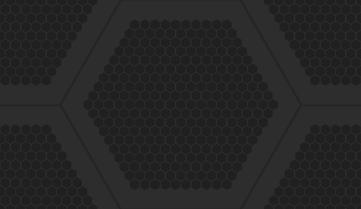

Unity Editor Built-in Icons
==============================
Icons what can load using `EditorGUIUtility.IconContent`

| Icon | Name |
|------|------|
|   | `_help.png` |
|   | `_popup.png` |
|   | `aboutwindow.mainheader.png` |
|   | `ageialogo.png` |
|   | `alphabeticalsorting.png` |
|   | `animation.addevent.png` |
|   | `animation.addkeyframe.png` |
|   | `animation.eventmarker.png` |
|   | `animation.firstkey.png` |
|   | `animation.lastkey.png` |
|   | `animation.nextkey.png` |
|   | `animation.play.png` |
|   | `animation.prevkey.png` |
|   | `animation.record.png` |
|   | `animation.sequencerlink.png` |
|   | `animationanimated.png` |
|   | `animationdopesheetkeyframe.png` |
|   | `animationkeyframe.png` |
|   | `animationnocurve.png` |
|   | `animationvisibilitytoggleoff.png` |
|   | `animationvisibilitytoggleon.png` |
|   | `animationwrapmodemenu.png` |
|   | `asset store.png` |
|   | `audio mixer.png` |
|   | `avatarcompass.png` |
|   | `avatarcontroller.layer.png` |
|   | `avatarcontroller.layerhover.png` |
|   | `avatarcontroller.layerselected.png` |
|   | `avatarinspector/bodypartpicker.png` |
|   | `avatarinspector/bodysilhouette.png` |
|   | `avatarinspector/dotfill.png` |
|   | `avatarinspector/dotframe.png` |
|   | `avatarinspector/dotframedotted.png` |
|   | `avatarinspector/dotselection.png` |
|   | `avatarinspector/head.png` |
|   | `avatarinspector/headik.png` |
|   | `avatarinspector/headzoom.png` |
|   | `avatarinspector/headzoomsilhouette.png` |
|   | `avatarinspector/leftarm.png` |
|   | `avatarinspector/leftfeetik.png` |
|   | `avatarinspector/leftfingers.png` |
|   | `avatarinspector/leftfingersik.png` |
|   | `avatarinspector/lefthandzoom.png` |
|   | `avatarinspector/lefthandzoomsilhouette.png` |
|   | `avatarinspector/leftleg.png` |
|   | `avatarinspector/maskeditor_root.png` |
|   | `avatarinspector/rightarm.png` |
|   | `avatarinspector/rightfeetik.png` |
|   | `avatarinspector/rightfingers.png` |
|   | `avatarinspector/rightfingersik.png` |
|   | `avatarinspector/righthandzoom.png` |
|   | `avatarinspector/righthandzoomsilhouette.png` |
|   | `avatarinspector/rightleg.png` |
|   | `avatarinspector/torso.png` |
|   | `avatarpivot.png` |
|   | `beginbutton-on.png` |
|   | `beginbutton.png` |
|   | `blendkey.png` |
|   | `blendkeyoverlay.png` |
|   | `blendkeyselected.png` |
|   | `blendsampler.png` |
|   | `bluegroove.png` |
|   | `buildsettings.android.png` |
|   | `buildsettings.android.small.png` |
|   | `buildsettings.blackberry.png` |
|   | `buildsettings.blackberry.small.png` |
|   | `buildsettings.broadcom.png` |
|   | `buildsettings.editor.png` |
|   | `buildsettings.editor.small.png` |
|   | `buildsettings.facebook.png` |
|   | `buildsettings.facebook.small.png` |
|   | `buildsettings.flashplayer.png` |
|   | `buildsettings.flashplayer.small.png` |
|   | `buildsettings.iphone.png` |
|   | `buildsettings.iphone.small.png` |
|   | `buildsettings.metro.png` |
|   | `buildsettings.metro.small.png` |
|   | `buildsettings.n3ds.png` |
|   | `buildsettings.n3ds.small.png` |
|   | `buildsettings.ps4.png` |
|   | `buildsettings.ps4.small.png` |
|   | `buildsettings.psm.png` |
|   | `buildsettings.psm.small.png` |
|   | `buildsettings.psp2.png` |
|   | `buildsettings.psp2.small.png` |
|   | `buildsettings.samsungtv.png` |
|   | `buildsettings.samsungtv.small.png` |
|   | `buildsettings.selectedicon.png` |
|   | `buildsettings.standalone.png` |
|   | `buildsettings.standalone.small.png` |
|   | `buildsettings.standalonebroadcom.small.png` |
|   | `buildsettings.standalonegles20emu.small.png` |
|   | `buildsettings.standaloneglesemu.png` |
|   | `buildsettings.standaloneglesemu.small.png` |
|   | `buildsettings.tizen.png` |
|   | `buildsettings.tizen.small.png` |
|   | `buildsettings.tvos.png` |
|   | `buildsettings.tvos.small.png` |
|   | `buildsettings.web.png` |
|   | `buildsettings.web.small.png` |
|   | `buildsettings.webgl.png` |
|   | `buildsettings.webgl.small.png` |
|   | `buildsettings.wiiu.png` |
|   | `buildsettings.wiiu.small.png` |
|   | `buildsettings.wp8.png` |
|   | `buildsettings.wp8.small.png` |
|   | `buildsettings.xbox360.png` |
|   | `buildsettings.xbox360.small.png` |
|   | `buildsettings.xboxone.png` |
|   | `buildsettings.xboxone.small.png` |
|   | `buildsettings.xiaomi.png` |
|   | `camera gizmo.png` |
|   | `checkerfloor.png` |
|   | `clipboard.png` |
|   | `clothinspector.painttool.png` |
|   | `clothinspector.paintvalue.png` |
|   | `clothinspector.selecttool.png` |
|   | `clothinspector.settingstool.png` |
|   | `clothinspector.viewvalue.png` |
|   | `cloudconnect.png` |
|   | `collab.png` |
|   | `collabconflict.png` |
|   | `collaberror.png` |
|   | `collabnew.png` |
|   | `collabprogress.png` |
|   | `collabpull.png` |
|   | `collabpush.png` |
|   | `colorpicker.colorcycle.png` |
|   | `colorpicker.cyclecolor.png` |
|   | `colorpicker.cycleslider.png` |
|   | `colorpicker.slidercycle.png` |
|   | `console.erroricon.inactive.sml.png` |
|   | `console.erroricon.png` |
|   | `console.erroricon.sml.png` |
|   | `console.infoicon.png` |
|   | `console.infoicon.sml.png` |
|   | `console.warnicon.inactive.sml.png` |
|   | `console.warnicon.png` |
|   | `console.warnicon.sml.png` |
|   | `curvekeyframe.png` |
|   | `curvekeyframeselected.png` |
|   | `curvekeyframeselectedoverlay.png` |
|   | `curvekeyframesemiselectedoverlay.png` |
|   | `customsorting.png` |
|   | `d__popup.png` |
|   | `d_aboutwindow.mainheader.png` |
|   | `d_ageialogo.png` |
|   | `d_alphabeticalsorting.png` |
|   | `d_animation.addevent.png` |
|   | `d_animation.addkeyframe.png` |
|   | `d_animation.eventmarker.png` |
|   | `d_animation.firstkey.png` |
|   | `d_animation.lastkey.png` |
|   | `d_animation.nextkey.png` |
|   | `d_animation.play.png` |
|   | `d_animation.prevkey.png` |
|   | `d_animation.record.png` |
|   | `d_animation.sequencerlink.png` |
|   | `d_animationanimated.png` |
|   | `d_animationkeyframe.png` |
|   | `d_animationnocurve.png` |
|   | `d_animationvisibilitytoggleoff.png` |
|   | `d_animationvisibilitytoggleon.png` |
|   | `d_animationwrapmodemenu.png` |
|   | `d_as badge delete.png` |
|   | `d_as badge new.png` |
|   | `d_asset store.png` |
|   | `d_audio mixer.png` |
|   | `d_avatarblendbackground.png` |
|   | `d_avatarblendleft.png` |
|   | `d_avatarblendlefta.png` |
|   | `d_avatarblendright.png` |
|   | `d_avatarblendrighta.png` |
|   | `d_avatarcompass.png` |
|   | `d_avatarpivot.png` |
|   | `d_beginbutton-on.png` |
|   | `d_beginbutton.png` |
|   | `d_bluegroove.png` |
|   | `d_buildsettings.android.png` |
|   | `d_buildsettings.android.small.png` |
|   | `d_buildsettings.broadcom.png` |
|   | `d_buildsettings.flashplayer.png` |
|   | `d_buildsettings.flashplayer.small.png` |
|   | `d_buildsettings.iphone.png` |
|   | `d_buildsettings.iphone.small.png` |
|   | `d_buildsettings.ps4.png` |
|   | `d_buildsettings.ps4.small.png` |
|   | `d_buildsettings.psp2.png` |
|   | `d_buildsettings.psp2.small.png` |
|   | `d_buildsettings.selectedicon.png` |
|   | `d_buildsettings.standalone.png` |
|   | `d_buildsettings.standalone.small.png` |
|   | `d_buildsettings.tizen.png` |
|   | `d_buildsettings.tizen.small.png` |
|   | `d_buildsettings.tvos.png` |
|   | `d_buildsettings.tvos.small.png` |
|   | `d_buildsettings.web.png` |
|   | `d_buildsettings.web.small.png` |
|   | `d_buildsettings.webgl.png` |
|   | `d_buildsettings.webgl.small.png` |
|   | `d_buildsettings.xbox360.png` |
|   | `d_buildsettings.xbox360.small.png` |
|   | `d_buildsettings.xboxone.png` |
|   | `d_buildsettings.xboxone.small.png` |
|   | `d_checkerfloor.png` |
|   | `d_cloudconnect.png` |
|   | `d_colorpicker.cyclecolor.png` |
|   | `d_colorpicker.cycleslider.png` |
|   | `d_console.erroricon.png` |
|   | `d_console.erroricon.sml.png` |
|   | `d_console.infoicon.png` |
|   | `d_console.infoicon.sml.png` |
|   | `d_console.warnicon.png` |
|   | `d_console.warnicon.sml.png` |
|   | `d_curvekeyframe.png` |
|   | `d_curvekeyframeselected.png` |
|   | `d_curvekeyframeselectedoverlay.png` |
|   | `d_curvekeyframesemiselectedoverlay.png` |
|   | `d_customsorting.png` |
|   | `d_defaultsorting.png` |
|   | `d_editcollider.png` |
|   | `d_editicon.sml.png` |
|   | `d_endbutton-on.png` |
|   | `d_endbutton.png` |
|   | `d_eyedropper.large.png` |
|   | `d_eyedropper.sml.png` |
|   | `d_favorite.png` |
|   | `d_filterbylabel.png` |
|   | `d_filterbytype.png` |
|   | `d_gear.png` |
|   | `d_groove.png` |
|   | `d_horizontalsplit.png` |
|   | `d_icon dropdown.png` |
|   | `d_in-addcomponentleft.png` |
|   | `d_in-addcomponentright.png` |
|   | `d_inspectorlock.png` |
|   | `d_leftbracket.png` |
|   | `d_lighting.png` |
|   | `d_lightmapeditor.windowtitle.png` |
|   | `d_lookdevcenterlight.png` |
|   | `d_lookdevcenterlight@2x.png` |
|   | `d_lookdevclose.png` |
|   | `d_lookdevclose@2x.png` |
|   | `d_lookdevenvrotation.png` |
|   | `d_lookdevenvrotation@2x.png` |
|   | `d_lookdevmirrorviews.png` |
|   | `d_lookdevmirrorviews@2x.png` |
|   | `d_lookdevmirrorviewsactive.png` |
|   | `d_lookdevmirrorviewsactive@2x.png` |
|   | `d_lookdevmirrorviewsinactive.png` |
|   | `d_lookdevmirrorviewsinactive@2x.png` |
|   | `d_lookdevobjrotation.png` |
|   | `d_lookdevobjrotation@2x.png` |
|   | `d_lookdevpaneoption.png` |
|   | `d_lookdevpaneoption@2x.png` |
|   | `d_lookdevresetenv.png` |
|   | `d_lookdevresetenv@2x.png` |
|   | `d_lookdevshadow.png` |
|   | `d_lookdevshadow@2x.png` |
|   | `d_lookdevsidebyside.png` |
|   | `d_lookdevsidebyside@2x.png` |
|   | `d_lookdevsingle1.png` |
|   | `d_lookdevsingle1@2x.png` |
|   | `d_lookdevsingle2.png` |
|   | `d_lookdevsingle2@2x.png` |
|   | `d_lookdevsplit.png` |
|   | `d_lookdevsplit@2x.png` |
|   | `d_lookdevzone.png` |
|   | `d_lookdevzone@2x.png` |
|   | `d_mirror.png` |
|   | `d_model large.png` |
|   | `d_monologo.png` |
|   | `d_movetool on.png` |
|   | `d_movetool.png` |
|   | `d_navigation.png` |
|   | `d_occlusion.png` |
|   | `d_p4_addedlocal.png` |
|   | `d_p4_addedremote.png` |
|   | `d_p4_checkoutlocal.png` |
|   | `d_p4_checkoutremote.png` |
|   | `d_p4_conflicted.png` |
|   | `d_p4_deletedlocal.png` |
|   | `d_p4_deletedremote.png` |
|   | `d_p4_local.png` |
|   | `d_p4_lockedlocal.png` |
|   | `d_p4_lockedremote.png` |
|   | `d_p4_outofsync.png` |
|   | `d_particle effect.png` |
|   | `d_pausebutton on.png` |
|   | `d_pausebutton.png` |
|   | `d_playbutton on.png` |
|   | `d_playbutton.png` |
|   | `d_playbuttonprofile on.png` |
|   | `d_playbuttonprofile.png` |
|   | `d_playloopoff.png` |
|   | `d_playloopon.png` |
|   | `d_preaudioautoplayoff.png` |
|   | `d_preaudioautoplayon.png` |
|   | `d_preaudioloopoff.png` |
|   | `d_preaudioloopon.png` |
|   | `d_preaudioplayoff.png` |
|   | `d_preaudioplayon.png` |
|   | `d_prematcube.png` |
|   | `d_prematcylinder.png` |
|   | `d_prematlight0.png` |
|   | `d_prematlight1.png` |
|   | `d_prematsphere.png` |
|   | `d_premattorus.png` |
|   | `d_pretexturealpha.png` |
|   | `d_pretexturemipmaphigh.png` |
|   | `d_pretexturemipmaplow.png` |
|   | `d_pretexturergb.png` |
|   | `d_profiler.audio.png` |
|   | `d_profiler.cpu.png` |
|   | `d_profiler.firstframe.png` |
|   | `d_profiler.gpu.png` |
|   | `d_profiler.lastframe.png` |
|   | `d_profiler.memory.png` |
|   | `d_profiler.network.png` |
|   | `d_profiler.nextframe.png` |
|   | `d_profiler.physics.png` |
|   | `d_profiler.prevframe.png` |
|   | `d_profiler.record.png` |
|   | `d_profiler.rendering.png` |
|   | `d_profiler.video.png` |
|   | `d_profilercolumn.warningcount.png` |
|   | `d_project.png` |
|   | `d_recttool on.png` |
|   | `d_recttool.png` |
|   | `d_recttransformblueprint.png` |
|   | `d_recttransformraw.png` |
|   | `d_redgroove.png` |
|   | `d_refresh.png` |
|   | `d_renderdoc.png` |
|   | `d_rightbracket.png` |
|   | `d_rotatetool on.png` |
|   | `d_rotatetool.png` |
|   | `d_scaletool on.png` |
|   | `d_scaletool.png` |
|   | `d_sceneviewalpha.png` |
|   | `d_sceneviewaudio.png` |
|   | `d_sceneviewfx.png` |
|   | `d_sceneviewlighting.png` |
|   | `d_sceneviewortho.png` |
|   | `d_sceneviewrgb.png` |
|   | `d_scrollshadow.png` |
|   | `d_settingsicon.png` |
|   | `d_socialnetworks.facebookshare.png` |
|   | `d_socialnetworks.linkedinshare.png` |
|   | `d_socialnetworks.tweet.png` |
|   | `d_socialnetworks.udnopen.png` |
|   | `d_speedscale.png` |
|   | `d_stepbutton on.png` |
|   | `d_stepbutton.png` |
|   | `d_stepleftbutton-on.png` |
|   | `d_stepleftbutton.png` |
|   | `d_svn_addedlocal.png` |
|   | `d_svn_conflicted.png` |
|   | `d_svn_deletedlocal.png` |
|   | `d_svn_local.png` |
|   | `d_svn_lockedlocal.png` |
|   | `d_svn_outofsync.png` |
|   | `d_terraininspector.terraintoollower on.png` |
|   | `d_terraininspector.terraintoolloweralt.png` |
|   | `d_terraininspector.terraintoolplants on.png` |
|   | `d_terraininspector.terraintoolplants.png` |
|   | `d_terraininspector.terraintoolplantsalt on.png` |
|   | `d_terraininspector.terraintoolplantsalt.png` |
|   | `d_terraininspector.terraintoolraise on.png` |
|   | `d_terraininspector.terraintoolraise.png` |
|   | `d_terraininspector.terraintoolsetheight on.png` |
|   | `d_terraininspector.terraintoolsetheight.png` |
|   | `d_terraininspector.terraintoolsetheightalt on.png` |
|   | `d_terraininspector.terraintoolsetheightalt.png` |
|   | `d_terraininspector.terraintoolsettings on.png` |
|   | `d_terraininspector.terraintoolsettings.png` |
|   | `d_terraininspector.terraintoolsmoothheight on.png` |
|   | `d_terraininspector.terraintoolsmoothheight.png` |
|   | `d_terraininspector.terraintoolsplat on.png` |
|   | `d_terraininspector.terraintoolsplat.png` |
|   | `d_terraininspector.terraintoolsplatalt on.png` |
|   | `d_terraininspector.terraintoolsplatalt.png` |
|   | `d_terraininspector.terraintooltrees on.png` |
|   | `d_terraininspector.terraintooltrees.png` |
|   | `d_terraininspector.terraintooltreesalt on.png` |
|   | `d_terraininspector.terraintooltreesalt.png` |
|   | `d_timelineselector.png` |
|   | `d_toolbar minus.png` |
|   | `d_toolbar plus more.png` |
|   | `d_toolbar plus.png` |
|   | `d_toolhandlecenter.png` |
|   | `d_toolhandleglobal.png` |
|   | `d_toolhandlelocal.png` |
|   | `d_toolhandlepivot.png` |
|   | `d_tranp.png` |
|   | `d_tree_icon.png` |
|   | `d_tree_icon_branch.png` |
|   | `d_tree_icon_branch_frond.png` |
|   | `d_tree_icon_frond.png` |
|   | `d_tree_icon_leaf.png` |
|   | `d_treeeditor.addbranches.png` |
|   | `d_treeeditor.addleaves.png` |
|   | `d_treeeditor.branch on.png` |
|   | `d_treeeditor.branch.png` |
|   | `d_treeeditor.branchfreehand on.png` |
|   | `d_treeeditor.branchfreehand.png` |
|   | `d_treeeditor.branchrotate on.png` |
|   | `d_treeeditor.branchrotate.png` |
|   | `d_treeeditor.branchscale on.png` |
|   | `d_treeeditor.branchscale.png` |
|   | `d_treeeditor.branchtranslate on.png` |
|   | `d_treeeditor.branchtranslate.png` |
|   | `d_treeeditor.distribution on.png` |
|   | `d_treeeditor.distribution.png` |
|   | `d_treeeditor.duplicate.png` |
|   | `d_treeeditor.geometry on.png` |
|   | `d_treeeditor.geometry.png` |
|   | `d_treeeditor.leaf on.png` |
|   | `d_treeeditor.leaf.png` |
|   | `d_treeeditor.leaffreehand on.png` |
|   | `d_treeeditor.leaffreehand.png` |
|   | `d_treeeditor.leafrotate on.png` |
|   | `d_treeeditor.leafrotate.png` |
|   | `d_treeeditor.leafscale on.png` |
|   | `d_treeeditor.leafscale.png` |
|   | `d_treeeditor.leaftranslate on.png` |
|   | `d_treeeditor.leaftranslate.png` |
|   | `d_treeeditor.material on.png` |
|   | `d_treeeditor.material.png` |
|   | `d_treeeditor.refresh.png` |
|   | `d_treeeditor.trash.png` |
|   | `d_treeeditor.wind on.png` |
|   | `d_treeeditor.wind.png` |
|   | `d_unityeditor.animationwindow.png` |
|   | `d_unityeditor.consolewindow.png` |
|   | `d_unityeditor.debuginspectorwindow.png` |
|   | `d_unityeditor.finddependencies.png` |
|   | `d_unityeditor.gameview.png` |
|   | `d_unityeditor.hierarchywindow.png` |
|   | `d_unityeditor.inspectorwindow.png` |
|   | `d_unityeditor.lookdevview.png` |
|   | `d_unityeditor.profilerwindow.png` |
|   | `d_unityeditor.scenehierarchywindow.png` |
|   | `d_unityeditor.sceneview.png` |
|   | `d_unityeditor.versioncontrol.png` |
|   | `d_unitylogo.png` |
|   | `d_verticalsplit.png` |
|   | `d_viewtoolmove on.png` |
|   | `d_viewtoolmove.png` |
|   | `d_viewtoolorbit on.png` |
|   | `d_viewtoolorbit.png` |
|   | `d_viewtoolzoom on.png` |
|   | `d_viewtoolzoom.png` |
|   | `d_visibilityoff.png` |
|   | `d_visibilityon.png` |
|   | `d_vumetertexturehorizontal.png` |
|   | `d_vumetertexturevertical.png` |
|   | `d_waitspin00.png` |
|   | `d_waitspin01.png` |
|   | `d_waitspin02.png` |
|   | `d_waitspin03.png` |
|   | `d_waitspin04.png` |
|   | `d_waitspin05.png` |
|   | `d_waitspin06.png` |
|   | `d_waitspin07.png` |
|   | `d_waitspin08.png` |
|   | `d_waitspin09.png` |
|   | `d_waitspin10.png` |
|   | `d_waitspin11.png` |
|   | `d_welcomescreen.assetstorelogo.png` |
|   | `d_winbtn_graph.png` |
|   | `d_winbtn_graph_close_h.png` |
|   | `d_winbtn_graph_max_h.png` |
|   | `d_winbtn_graph_min_h.png` |
|   | `d_winbtn_mac_close.png` |
|   | `d_winbtn_mac_close_a.png` |
|   | `d_winbtn_mac_close_h.png` |
|   | `d_winbtn_mac_inact.png` |
|   | `d_winbtn_mac_max.png` |
|   | `d_winbtn_mac_max_a.png` |
|   | `d_winbtn_mac_max_h.png` |
|   | `d_winbtn_mac_min.png` |
|   | `d_winbtn_mac_min_a.png` |
|   | `d_winbtn_mac_min_h.png` |
|   | `d_winbtn_win_close.png` |
|   | `d_winbtn_win_close_a.png` |
|   | `d_winbtn_win_close_h.png` |
|   | `d_winbtn_win_max.png` |
|   | `d_winbtn_win_max_a.png` |
|   | `d_winbtn_win_max_h.png` |
|   | `d_winbtn_win_min.png` |
|   | `d_winbtn_win_min_a.png` |
|   | `d_winbtn_win_min_h.png` |
|   | `d_winbtn_win_rest.png` |
|   | `d_winbtn_win_rest_a.png` |
|   | `d_winbtn_win_rest_h.png` |
|   | `defaultsorting.png` |
|   | `editcollider.png` |
|   | `editicon.sml.png` |
|   | `endbutton-on.png` |
|   | `endbutton.png` |
|   | `eyedropper.large.png` |
|   | `eyedropper.sml.png` |
|   | `favorite.png` |
|   | `filterbylabel.png` |
|   | `filterbytype.png` |
|   | `gear.png` |
|   | `groove.png` |
|   | `guisystem/align_horizontally.png` |
|   | `guisystem/align_horizontally_center.png` |
|   | `guisystem/align_horizontally_center_active.png` |
|   | `guisystem/align_horizontally_left.png` |
|   | `guisystem/align_horizontally_left_active.png` |
|   | `guisystem/align_horizontally_right.png` |
|   | `guisystem/align_horizontally_right_active.png` |
|   | `guisystem/align_vertically.png` |
|   | `guisystem/align_vertically_bottom.png` |
|   | `guisystem/align_vertically_bottom_active.png` |
|   | `guisystem/align_vertically_center.png` |
|   | `guisystem/align_vertically_center_active.png` |
|   | `guisystem/align_vertically_top.png` |
|   | `guisystem/align_vertically_top_active.png` |
|   | `guisystem/d_align_horizontally.png` |
|   | `guisystem/d_align_horizontally_center.png` |
|   | `guisystem/d_align_horizontally_center_active.png` |
|   | `guisystem/d_align_horizontally_left.png` |
|   | `guisystem/d_align_horizontally_left_active.png` |
|   | `guisystem/d_align_horizontally_right.png` |
|   | `guisystem/d_align_horizontally_right_active.png` |
|   | `guisystem/d_align_vertically.png` |
|   | `guisystem/d_align_vertically_bottom.png` |
|   | `guisystem/d_align_vertically_bottom_active.png` |
|   | `guisystem/d_align_vertically_center.png` |
|   | `guisystem/d_align_vertically_center_active.png` |
|   | `guisystem/d_align_vertically_top.png` |
|   | `guisystem/d_align_vertically_top_active.png` |
|   | `horizontalsplit.png` |
|   | `icon dropdown.png` |
|   | `in-addcomponentleft.png` |
|   | `in-addcomponentright.png` |
|   | `inspectorlock.png` |
|   | `knobcshape.png` |
|   | `knobcshapemini.png` |
|   | `leftbracket.png` |
|   | `lighting.png` |
|   | `lightmapeditor.windowtitle.png` |
|   | `lightmapping.png` |
|   | `lightmeter/d_greenlight.png` |
|   | `lightmeter/d_lightoff.png` |
|   | `lightmeter/d_lightrim.png` |
|   | `lightmeter/d_orangelight.png` |
|   | `lightmeter/d_redlight.png` |
|   | `lightmeter/greenlight.png` |
|   | `lightmeter/lightoff.png` |
|   | `lightmeter/lightrim.png` |
|   | `lightmeter/orangelight.png` |
|   | `lightmeter/redlight.png` |
|   | `lockicon-on.png` |
|   | `lockicon.png` |
|   | `lookdevcenterlight.png` |
|   | `lookdevcenterlightl@2x.png` |
|   | `lookdevclose.png` |
|   | `lookdevclose@2x.png` |
|   | `lookdevenvrotation.png` |
|   | `lookdevenvrotation@2x.png` |
|   | `lookdeveyedrop.png` |
|   | `lookdevlight.png` |
|   | `lookdevlight@2x.png` |
|   | `lookdevmirrorviewsactive.png` |
|   | `lookdevmirrorviewsactive@2x.png` |
|   | `lookdevmirrorviewsinactive.png` |
|   | `lookdevmirrorviewsinactive@2x.png` |
|   | `lookdevobjrotation.png` |
|   | `lookdevobjrotation@2x.png` |
|   | `lookdevpaneoption.png` |
|   | `lookdevpaneoption@2x.png` |
|   | `lookdevresetenv.png` |
|   | `lookdevresetenv@2x.png` |
|   | `lookdevshadow.png` |
|   | `lookdevshadow@2x.png` |
|   | `lookdevshadowframe.png` |
|   | `lookdevshadowframe@2x.png` |
|   | `lookdevsidebyside.png` |
|   | `lookdevsidebyside@2x.png` |
|   | `lookdevsingle1.png` |
|   | `lookdevsingle1@2x.png` |
|   | `lookdevsingle2.png` |
|   | `lookdevsingle2@2x.png` |
|   | `lookdevsplit.png` |
|   | `lookdevsplit@2x.png` |
|   | `lookdevzone.png` |
|   | `lookdevzone@2x.png` |
|   | `loop.png` |
|   | `mirror.png` |
|   | `monologo.png` |
|   | `movetool on.png` |
|   | `movetool.png` |
|   | `navigation.png` |
|   | `occlusion.png` |
|   | `p4_addedlocal.png` |
|   | `p4_addedremote.png` |
|   | `p4_blueleftparenthesis.png` |
|   | `p4_bluerightparenthesis.png` |
|   | `p4_checkoutlocal.png` |
|   | `p4_checkoutremote.png` |
|   | `p4_conflicted.png` |
|   | `p4_deletedlocal.png` |
|   | `p4_deletedremote.png` |
|   | `p4_local.png` |
|   | `p4_lockedlocal.png` |
|   | `p4_lockedremote.png` |
|   | `p4_outofsync.png` |
|   | `p4_redleftparenthesis.png` |
|   | `p4_redrightparenthesis.png` |
|   | `packagebadgedelete.png` |
|   | `packagebadgenew.png` |
|   | `particle effect.png` |
|   | `pausebutton on.png` |
|   | `pausebutton.png` |
|   | `playbutton on.png` |
|   | `playbutton.png` |
|   | `playbuttonprofile on.png` |
|   | `playbuttonprofile.png` |
|   | `playloopoff.png` |
|   | `playloopon.png` |
|   | `playspeed.png` |
|   | `preaudioautoplayoff.png` |
|   | `preaudioautoplayon.png` |
|   | `preaudioloopoff.png` |
|   | `preaudioloopon.png` |
|   | `preaudioplayoff.png` |
|   | `preaudioplayon.png` |
|   | `prematcube.png` |
|   | `prematcylinder.png` |
|   | `prematlight0.png` |
|   | `prematlight1.png` |
|   | `prematquad.png` |
|   | `prematsphere.png` |
|   | `premattorus.png` |
|   | `pretexturealpha.png` |
|   | `pretexturemipmaphigh.png` |
|   | `pretexturemipmaplow.png` |
|   | `pretexturergb.png` |
|   | `profiler.audio.png` |
|   | `profiler.cpu.png` |
|   | `profiler.firstframe.png` |
|   | `profiler.gpu.png` |
|   | `profiler.instrumentation.png` |
|   | `profiler.lastframe.png` |
|   | `profiler.memory.png` |
|   | `profiler.networkmessages.png` |
|   | `profiler.networkoperations.png` |
|   | `profiler.nextframe.png` |
|   | `profiler.physics.png` |
|   | `profiler.physics2d.png` |
|   | `profiler.prevframe.png` |
|   | `profiler.record.png` |
|   | `profiler.rendering.png` |
|   | `profiler.video.png` |
|   | `profilercolumn.warningcount.png` |
|   | `project.png` |
|   | `recttool on.png` |
|   | `recttool.png` |
|   | `recttransformblueprint.png` |
|   | `recttransformraw.png` |
|   | `redgroove.png` |
|   | `refresh.png` |
|   | `renderdoc.png` |
|   | `rightbracket.png` |
|   | `rotatetool on.png` |
|   | `rotatetool.png` |
|   | `saveactive.png` |
|   | `savefromplay.png` |
|   | `savepassive.png` |
|   | `scaletool on.png` |
|   | `scaletool.png` |
|   | `sceneloadin.png` |
|   | `sceneloadout.png` |
|   | `scenesave.png` |
|   | `scenesavegrey.png` |
|   | `sceneviewalpha.png` |
|   | `sceneviewaudio.png` |
|   | `sceneviewfx.png` |
|   | `sceneviewlighting.png` |
|   | `sceneviewortho.png` |
|   | `sceneviewrgb.png` |
|   | `scrollshadow.png` |
|   | `settingsicon.png` |
|   | `socialnetworks.facebookshare.png` |
|   | `socialnetworks.linkedinshare.png` |
|   | `socialnetworks.tweet.png` |
|   | `socialnetworks.udnlogo.png` |
|   | `socialnetworks.udnopen.png` |
|   | `softlockinline.png` |
|   | `speedscale.png` |
|   | `statemachineeditor.arrowtip.png` |
|   | `statemachineeditor.arrowtipselected.png` |
|   | `statemachineeditor.background.png` |
|   | `statemachineeditor.state.png` |
|   | `statemachineeditor.statehover.png` |
|   | `statemachineeditor.stateselected.png` |
|   | `statemachineeditor.statesub.png` |
|   | `statemachineeditor.statesubhover.png` |
|   | `statemachineeditor.statesubselected.png` |
|   | `statemachineeditor.upbutton.png` |
|   | `statemachineeditor.upbuttonhover.png` |
|   | `stepbutton on.png` |
|   | `stepbutton.png` |
|   | `stepleftbutton-on.png` |
|   | `stepleftbutton.png` |
|   | `sticky_arrow.png` |
|   | `sticky_p4.png` |
|   | `sticky_skin.png` |
|   | `sv_icon_dot0_sml.png` |
|   | `sv_icon_dot10_sml.png` |
|   | `sv_icon_dot11_sml.png` |
|   | `sv_icon_dot12_sml.png` |
|   | `sv_icon_dot13_sml.png` |
|   | `sv_icon_dot14_sml.png` |
|   | `sv_icon_dot15_sml.png` |
|   | `sv_icon_dot1_sml.png` |
|   | `sv_icon_dot2_sml.png` |
|   | `sv_icon_dot3_sml.png` |
|   | `sv_icon_dot4_sml.png` |
|   | `sv_icon_dot5_sml.png` |
|   | `sv_icon_dot6_sml.png` |
|   | `sv_icon_dot7_sml.png` |
|   | `sv_icon_dot8_sml.png` |
|   | `sv_icon_dot9_sml.png` |
|   | `sv_icon_name0.png` |
|   | `sv_icon_name1.png` |
|   | `sv_icon_name2.png` |
|   | `sv_icon_name3.png` |
|   | `sv_icon_name4.png` |
|   | `sv_icon_name5.png` |
|   | `sv_icon_name6.png` |
|   | `sv_icon_name7.png` |
|   | `sv_icon_none.png` |
|   | `sv_label_0.png` |
|   | `sv_label_1.png` |
|   | `sv_label_2.png` |
|   | `sv_label_3.png` |
|   | `sv_label_4.png` |
|   | `sv_label_5.png` |
|   | `sv_label_6.png` |
|   | `sv_label_7.png` |
|   | `svn_addedlocal.png` |
|   | `svn_conflicted.png` |
|   | `svn_deletedlocal.png` |
|   | `svn_local.png` |
|   | `svn_lockedlocal.png` |
|   | `svn_outofsync.png` |
|   | `terraininspector.terraintoollower on.png` |
|   | `terraininspector.terraintoollower.png` |
|   | `terraininspector.terraintoolloweralt.png` |
|   | `terraininspector.terraintoolplants on.png` |
|   | `terraininspector.terraintoolplants.png` |
|   | `terraininspector.terraintoolplantsalt on.png` |
|   | `terraininspector.terraintoolplantsalt.png` |
|   | `terraininspector.terraintoolraise on.png` |
|   | `terraininspector.terraintoolraise.png` |
|   | `terraininspector.terraintoolsetheight on.png` |
|   | `terraininspector.terraintoolsetheight.png` |
|   | `terraininspector.terraintoolsetheightalt on.png` |
|   | `terraininspector.terraintoolsetheightalt.png` |
|   | `terraininspector.terraintoolsettings on.png` |
|   | `terraininspector.terraintoolsettings.png` |
|   | `terraininspector.terraintoolsmoothheight on.png` |
|   | `terraininspector.terraintoolsmoothheight.png` |
|   | `terraininspector.terraintoolsplat on.png` |
|   | `terraininspector.terraintoolsplat.png` |
|   | `terraininspector.terraintoolsplatalt on.png` |
|   | `terraininspector.terraintoolsplatalt.png` |
|   | `terraininspector.terraintooltrees on.png` |
|   | `terraininspector.terraintooltrees.png` |
|   | `terraininspector.terraintooltreesalt on.png` |
|   | `terraininspector.terraintooltreesalt.png` |
|   | `testfailed.png` |
|   | `testignored.png` |
|   | `testinconclusive.png` |
|   | `testnormal.png` |
|   | `testpassed.png` |
|   | `teststopwatch.png` |
|   | `timelineselector.png` |
|   | `toolbar minus.png` |
|   | `toolbar plus more.png` |
|   | `toolbar plus.png` |
|   | `toolhandlecenter.png` |
|   | `toolhandleglobal.png` |
|   | `toolhandlelocal.png` |
|   | `toolhandlepivot.png` |
|   | `tranp.png` |
|   | `tree_icon.png` |
|   | `tree_icon_branch.png` |
|   | `tree_icon_branch_frond.png` |
|   | `tree_icon_frond.png` |
|   | `tree_icon_leaf.png` |
|   | `treeeditor.addbranches.png` |
|   | `treeeditor.addleaves.png` |
|   | `treeeditor.branch on.png` |
|   | `treeeditor.branch.png` |
|   | `treeeditor.branchfreehand on.png` |
|   | `treeeditor.branchfreehand.png` |
|   | `treeeditor.branchrotate on.png` |
|   | `treeeditor.branchrotate.png` |
|   | `treeeditor.branchscale on.png` |
|   | `treeeditor.branchscale.png` |
|   | `treeeditor.branchtranslate on.png` |
|   | `treeeditor.branchtranslate.png` |
|   | `treeeditor.distribution on.png` |
|   | `treeeditor.distribution.png` |
|   | `treeeditor.duplicate.png` |
|   | `treeeditor.geometry on.png` |
|   | `treeeditor.geometry.png` |
|   | `treeeditor.leaf on.png` |
|   | `treeeditor.leaf.png` |
|   | `treeeditor.leaffreehand on.png` |
|   | `treeeditor.leaffreehand.png` |
|   | `treeeditor.leafrotate on.png` |
|   | `treeeditor.leafrotate.png` |
|   | `treeeditor.leafscale on.png` |
|   | `treeeditor.leafscale.png` |
|   | `treeeditor.leaftranslate on.png` |
|   | `treeeditor.leaftranslate.png` |
|   | `treeeditor.material on.png` |
|   | `treeeditor.material.png` |
|   | `treeeditor.refresh.png` |
|   | `treeeditor.trash.png` |
|   | `treeeditor.wind on.png` |
|   | `treeeditor.wind.png` |
|   | `unityeditor.animationwindow.png` |
|   | `unityeditor.consolewindow.png` |
|   | `unityeditor.debuginspectorwindow.png` |
|   | `unityeditor.finddependencies.png` |
|   | `unityeditor.gameview.png` |
|   | `unityeditor.graphs.animatorcontrollertool.png` |
|   | `unityeditor.hierarchywindow.png` |
|   | `unityeditor.inspectorwindow.png` |
|   | `unityeditor.lookdevview.png` |
|   | `unityeditor.profilerwindow.png` |
|   | `unityeditor.scenehierarchywindow.png` |
|   | `unityeditor.sceneview.png` |
|   | `unityeditor.versioncontrol.png` |
|   | `unityengine/timeline/d_timelineasset icon.png` |
|   | `unityengine/timeline/timelineasset icon.png` |
|   | `unitylogo.png` |
|   | `unitylogolarge.png` |
|   | `uparrow.png` |
|   | `vcs_add.png` |
|   | `vcs_branch.png` |
|   | `vcs_change.png` |
|   | `vcs_check.png` |
|   | `vcs_delete.png` |
|   | `vcs_document.png` |
|   | `vcs_edit.png` |
|   | `vcs_incoming.png` |
|   | `vcs_integrate.png` |
|   | `vcs_local.png` |
|   | `vcs_lock.png` |
|   | `vcs_refresh.png` |
|   | `vcs_sync.png` |
|   | `vcs_unresolved.png` |
|   | `vcs_update.png` |
|   | `verticalsplit.png` |
|   | `viewtoolmove on.png` |
|   | `viewtoolmove.png` |
|   | `viewtoolorbit on.png` |
|   | `viewtoolorbit.png` |
|   | `viewtoolzoom on.png` |
|   | `viewtoolzoom.png` |
|   | `visibilityoff.png` |
|   | `visibilityon.png` |
|   | `vumetertexturehorizontal.png` |
|   | `vumetertexturevertical.png` |
|   | `waitspin00.png` |
|   | `waitspin01.png` |
|   | `waitspin02.png` |
|   | `waitspin03.png` |
|   | `waitspin04.png` |
|   | `waitspin05.png` |
|   | `waitspin06.png` |
|   | `waitspin07.png` |
|   | `waitspin08.png` |
|   | `waitspin09.png` |
|   | `waitspin10.png` |
|   | `waitspin11.png` |
|   | `welcomescreen.assetstorelogo.png` |
|   | `winbtn_graph.png` |
|   | `winbtn_graph_close_h.png` |
|   | `winbtn_graph_max_h.png` |
|   | `winbtn_graph_min_h.png` |
|   | `winbtn_mac_close.png` |
|   | `winbtn_mac_close_a.png` |
|   | `winbtn_mac_close_h.png` |
|   | `winbtn_mac_inact.png` |
|   | `winbtn_mac_max.png` |
|   | `winbtn_mac_max_a.png` |
|   | `winbtn_mac_max_h.png` |
|   | `winbtn_mac_min.png` |
|   | `winbtn_mac_min_a.png` |
|   | `winbtn_mac_min_h.png` |
|   | `winbtn_win_close.png` |
|   | `winbtn_win_close_a.png` |
|   | `winbtn_win_close_h.png` |
|   | `winbtn_win_max.png` |
|   | `winbtn_win_max_a.png` |
|   | `winbtn_win_max_h.png` |
|   | `winbtn_win_min.png` |
|   | `winbtn_win_min_a.png` |
|   | `winbtn_win_min_h.png` |
|   | `winbtn_win_rest.png` |
|   | `winbtn_win_rest_a.png` |
|   | `winbtn_win_rest_h.png` |
