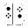

Unity Editor Built-in Icons
==============================
Unity version: 2018.3.0f2
Icons what can load using `EditorGUIUtility.IconContent`

File ID
-------------
You can change script icon by file id
1. Open `*.cs.meta` in Text Editor
2. Modify line `icon: {instanceID: 0}` to `icon: {fileID: <FILE ID>, guid: 0000000000000000d000000000000000, type: 0}`
3. Save and focus Unity Editor

| Icon | Name | File ID |
|------|------|---------|
|  | `_Help` | `6012202242263741038` |
|  | `_Popup` | `-1238941053918525804` |
|  | `aboutwindow.mainheader` | `7413624039758100214` |
|  | `ageialogo` | `142239856772769874` |
|  | `AlphabeticalSorting` | `385791893351368358` |
|  | `Animation.AddEvent` | `4137659740751492990` |
|  | `Animation.AddKeyframe` | `1899560698203370934` |
|  | `Animation.EventMarker` | `-9093604829510332455` |
|  | `Animation.FirstKey` | `3024128271444096090` |
|  | `Animation.LastKey` | `-891300260708246628` |
|  | `Animation.NextKey` | `-4388512538784373571` |
|  | `Animation.Play` | `-5044339833078438672` |
|  | `Animation.PrevKey` | `2990535490684037521` |
|  | `Animation.Record` | `3223261772366079321` |
|  | `Animation.SequencerLink` | `4724545919325408663` |
|  | `animationanimated` | `3991419891476851759` |
|  | `animationdopesheetkeyframe` | `-726526387389776670` |
|  | `animationkeyframe` | `-129130776268707423` |
|  | `animationnocurve` | `-6874279867631124203` |
|  | `animationvisibilitytoggleoff` | `-8612809770818944968` |
|  | `animationvisibilitytoggleon` | `-7566948067701445177` |
|  | `AnimationWrapModeMenu` | `-811430376147227483` |
|  | `AssemblyLock` | `-7772047616066763351` |
|  | `Asset Store` | `357073275683767465` |
|  | `Audio Mixer` | `5436946869657106676` |
|  | `AvatarCompass` | `-4187170121413361579` |
|  | `AvatarController.Layer` | `-7416910222760410010` |
|  | `AvatarController.LayerHover` | `1060193532816808308` |
|  | `AvatarController.LayerSelected` | `3582037340827626199` |
|  | `BodyPartPicker` | `-3590433989099234366` |
|  | `BodySilhouette` | `-4451312289517108567` |
|  | `DotFill` | `-8233242210051104170` |
|  | `DotFrame` | `7869005827914783879` |
|  | `DotFrameDotted` | `-3148911654985173949` |
|  | `DotSelection` | `-3482997569041162315` |
|  | `Head` | `3170944555394327123` |
|  | `HeadIk` | `-1140323874079327623` |
|  | `HeadZoom` | `5257450994311700591` |
|  | `HeadZoomSilhouette` | `7762936895225980166` |
|  | `LeftArm` | `6123190672307434784` |
|  | `LeftFeetIk` | `7545747472747947336` |
|  | `LeftFingers` | `-1642451135284037380` |
|  | `LeftFingersIk` | `1748729859595675987` |
|  | `LeftHandZoom` | `1621456644947490004` |
|  | `LeftHandZoomSilhouette` | `8384039629936793124` |
|  | `LeftLeg` | `4921818627043158325` |
|  | `MaskEditor_Root` | `4804520092827026396` |
|  | `RightArm` | `1833656670869755110` |
|  | `RightFeetIk` | `3710563382436173543` |
|  | `RightFingers` | `-3389118511690339839` |
|  | `RightFingersIk` | `3975814432022212013` |
|  | `RightHandZoom` | `1596608304540055736` |
|  | `RightHandZoomSilhouette` | `4529296075431145259` |
|  | `RightLeg` | `-1476864603792500380` |
|  | `Torso` | `-8990505202146232379` |
|  | `AvatarPivot` | `-4773557929347618964` |
|  | `back` | `320677636847005385` |
|  | `back@2x` | `-7499749373794679393` |
|  | `beginButton-On` | `-4324571489063779742` |
|  | `beginButton` | `-7576460149459046898` |
|  | `blendKey` | `6036928476410329760` |
|  | `blendKeyOverlay` | `4617552029562368530` |
|  | `blendKeySelected` | `-1506858753398121587` |
|  | `blendSampler` | `7624220810582456138` |
|  | `blueGroove` | `-1206214115408343928` |
|  | `BuildSettings.Android` | `-3225301215205586114` |
|  | `BuildSettings.Android.Small` | `-1166641788184234255` |
|  | `BuildSettings.Broadcom` | `-2611540343518146177` |
|  | `BuildSettings.Editor` | `8400232691031406736` |
|  | `BuildSettings.Editor.Small` | `-6908710258048083175` |
|  | `BuildSettings.Facebook` | `-5485581235442607191` |
|  | `BuildSettings.Facebook.Small` | `5439670708184688316` |
|  | `BuildSettings.FlashPlayer` | `466988226579792567` |
|  | `BuildSettings.FlashPlayer.Small` | `4366120842335875659` |
|  | `BuildSettings.iPhone` | `3079519598310828125` |
|  | `BuildSettings.iPhone.Small` | `4345870033486632634` |
|  | `BuildSettings.Lumin` | `-5215224591671759445` |
|  | `BuildSettings.Lumin.small` | `8979687790990599924` |
|  | `BuildSettings.Metro` | `-4021004726003450232` |
|  | `BuildSettings.Metro.Small` | `8056438331138731872` |
|  | `BuildSettings.N3DS` | `-5908170440005314456` |
|  | `BuildSettings.N3DS.Small` | `-6066799282333214607` |
|  | `BuildSettings.PS4` | `55494050528514414` |
|  | `BuildSettings.PS4.Small` | `2298978507677022530` |
|  | `BuildSettings.PSM` | `-98090470861308492` |
|  | `BuildSettings.PSM.Small` | `-715787968158446526` |
|  | `BuildSettings.PSP2` | `9006858688270511880` |
|  | `BuildSettings.PSP2.Small` | `-2257309162268670159` |
|  | `BuildSettings.SelectedIcon` | `5429131508570928718` |
|  | `BuildSettings.Standalone` | `-9041251142560793768` |
|  | `BuildSettings.Standalone.Small` | `4297135980918140731` |
|  | `BuildSettings.StandaloneBroadcom.Small` | `-8905343430035773069` |
|  | `BuildSettings.StandaloneGLES20Emu.Small` | `2723429009875258330` |
|  | `BuildSettings.StandaloneGLESEmu` | `-1310285349776098935` |
|  | `BuildSettings.StandaloneGLESEmu.Small` | `6677928742535971017` |
|  | `BuildSettings.Switch` | `5517785097875794962` |
|  | `BuildSettings.Switch.Small` | `8765560747129780117` |
|  | `BuildSettings.tvOS` | `-2604507406547028008` |
|  | `BuildSettings.tvOS.Small` | `2324412021468308913` |
|  | `BuildSettings.Web` | `-8073681927563260479` |
|  | `BuildSettings.Web.Small` | `-8502616656149400873` |
|  | `BuildSettings.WebGL` | `-4911556789970686505` |
|  | `BuildSettings.WebGL.Small` | `-3267170773426585699` |
|  | `BuildSettings.WP8` | `8103707556279304917` |
|  | `BuildSettings.WP8.Small` | `-1021178350218690989` |
|  | `BuildSettings.Xbox360` | `-3037193308305438414` |
|  | `BuildSettings.Xbox360.Small` | `-1179187124510255440` |
|  | `BuildSettings.XboxOne` | `5149289017103940624` |
|  | `BuildSettings.XboxOne.Small` | `-245827484132217333` |
|  | `BuildSettings.Xiaomi` | `7753788985247617910` |
|  | `Camera Gizmo` | `-2718852975875110509` |
|  | `CheckerFloor` | `-7297968518591046888` |
|  | `Clipboard` | `6367713590482950888` |
|  | `ClothInspector.PaintTool` | `1624265540036763281` |
|  | `ClothInspector.PaintValue` | `2134799571607069742` |
|  | `ClothInspector.SelectTool` | `9194464402604369906` |
|  | `ClothInspector.SettingsTool` | `-5509047954332065865` |
|  | `ClothInspector.ViewValue` | `-8688548480094122452` |
|  | `CloudConnect` | `1796978947134172663` |
|  | `Collab.Build` | `-6191915706818861775` |
|  | `Collab.BuildFailed` | `-5437438620272192643` |
|  | `Collab.BuildSucceeded` | `5057284793689411865` |
|  | `Collab.FileAdded` | `6445321136183198910` |
|  | `Collab.FileConflict` | `4336985247694938811` |
|  | `Collab.FileDeleted` | `6324715908799697015` |
|  | `Collab.FileIgnored` | `5400097563507297522` |
|  | `Collab.FileMoved` | `-2730299386048139239` |
|  | `Collab.FileUpdated` | `1417162553530547262` |
|  | `Collab.FolderAdded` | `-1210278254150948088` |
|  | `Collab.FolderConflict` | `8903646916365696551` |
|  | `Collab.FolderDeleted` | `735796692002808257` |
|  | `Collab.FolderIgnored` | `-1970951285390588327` |
|  | `Collab.FolderMoved` | `8020716426326303056` |
|  | `Collab.FolderUpdated` | `-8335063640492715981` |
|  | `Collab.NoInternet` | `-6607641266460543220` |
|  | `Collab` | `-6158769726174120613` |
|  | `Collab.Warning` | `-7186489016682460555` |
|  | `CollabConflict` | `7544789595935200320` |
|  | `CollabError` | `-8234132648094580814` |
|  | `CollabNew` | `-8705029441204933142` |
|  | `CollabOffline` | `8796122042331125716` |
|  | `CollabProgress` | `-5136566985977948126` |
|  | `CollabPull` | `-8487449939106475213` |
|  | `CollabPush` | `-4221040498047746133` |
|  | `ColorPicker.ColorCycle` | `886907316228417740` |
|  | `ColorPicker.CycleColor` | `-3564112748134886232` |
|  | `ColorPicker.CycleSlider` | `-3513833679861578334` |
|  | `ColorPicker.SliderCycle` | `-7083475956794908383` |
|  | `console.erroricon.inactive.sml` | `3590839462479323251` |
|  | `console.erroricon` | `1715859669443758926` |
|  | `console.erroricon.sml` | `-2005373149481181617` |
|  | `console.infoicon` | `-7150409940516424707` |
|  | `console.infoicon.sml` | `5425037494185492166` |
|  | `console.warnicon.inactive.sml` | `2636775829707929427` |
|  | `console.warnicon` | `2655493458141633029` |
|  | `console.warnicon.sml` | `-5763820162405496800` |
|  | `curvekeyframe` | `-5735313763964030175` |
|  | `curvekeyframeselected` | `8557251948433319039` |
|  | `curvekeyframeselectedoverlay` | `4691473716350331671` |
|  | `curvekeyframesemiselectedoverlay` | `-752352312952114710` |
|  | `curvekeyframeweighted` | `2608427245204659800` |
|  | `CustomSorting` | `1223667551903327650` |
|  | `d__Popup` | `5527209713546761551` |
|  | `d_aboutwindow.mainheader` | `-5261814007879969666` |
|  | `d_ageialogo` | `-4074805018749045636` |
|  | `d_AlphabeticalSorting` | `4704375340429805257` |
|  | `d_Animation.AddEvent` | `5580871185958974552` |
|  | `d_Animation.AddKeyframe` | `-5868239735812553188` |
|  | `d_Animation.EventMarker` | `4865330878740040390` |
|  | `d_Animation.FirstKey` | `3960224646933354229` |
|  | `d_Animation.LastKey` | `-4115714495813998023` |
|  | `d_Animation.NextKey` | `5594613797062276571` |
|  | `d_Animation.Play` | `-8660489847922084980` |
|  | `d_Animation.PrevKey` | `7684763639276239761` |
|  | `d_Animation.Record` | `6569083827624595240` |
|  | `d_Animation.SequencerLink` | `1211459679570569961` |
|  | `d_animationanimated` | `-7467828229802735559` |
|  | `d_animationkeyframe` | `4997269261844303601` |
|  | `d_animationnocurve` | `7669471596081897553` |
|  | `d_animationvisibilitytoggleoff` | `4907371712499317586` |
|  | `d_animationvisibilitytoggleon` | `-4628323394505387389` |
|  | `d_AnimationWrapModeMenu` | `5158551771503169309` |
|  | `d_AS Badge Delete` | `301681052602819724` |
|  | `d_AS Badge New` | `-7220028169341326075` |
|  | `d_AssemblyLock` | `1997798467560094451` |
|  | `d_Asset Store` | `-8693916549880196297` |
|  | `d_Audio Mixer` | `2344599766593239149` |
|  | `d_AvatarBlendBackground` | `-7740670662150012262` |
|  | `d_AvatarBlendLeft` | `6392251390363527398` |
|  | `d_AvatarBlendLeftA` | `1513400179016092070` |
|  | `d_AvatarBlendRight` | `-437346551407802260` |
|  | `d_AvatarBlendRightA` | `-6342677975472070947` |
|  | `d_AvatarCompass` | `9167206752844903456` |
|  | `d_AvatarPivot` | `2269904091327538262` |
|  | `d_back` | `7491503434607560644` |
|  | `d_back@2x` | `9130732976430192545` |
|  | `d_beginButton-On` | `-1541906980972628192` |
|  | `d_beginButton` | `-8634218779858824612` |
|  | `d_blueGroove` | `3958074764286187482` |
|  | `d_BuildSettings.Android` | `-3446736307351038430` |
|  | `d_BuildSettings.Android.Small` | `6296815224293940132` |
|  | `d_BuildSettings.Broadcom` | `-9008726449081888597` |
|  | `d_BuildSettings.FlashPlayer` | `-2305605046842453662` |
|  | `d_BuildSettings.FlashPlayer.Small` | `731514638995218830` |
|  | `d_BuildSettings.iPhone` | `-6259517079827926906` |
|  | `d_BuildSettings.iPhone.Small` | `-1080992744858828460` |
|  | `d_BuildSettings.Lumin` | `6535942805984192183` |
|  | `d_BuildSettings.Lumin.small` | `-2841579067038442323` |
|  | `d_BuildSettings.PS4` | `9035645644763246296` |
|  | `d_BuildSettings.PS4.Small` | `-1326778436304736038` |
|  | `d_BuildSettings.PSP2` | `672497611671670674` |
|  | `d_BuildSettings.PSP2.Small` | `-5490013650174253100` |
|  | `d_BuildSettings.SelectedIcon` | `3534508272096420358` |
|  | `d_BuildSettings.Standalone` | `-3581297997062639961` |
|  | `d_BuildSettings.Standalone.Small` | `382013416940812573` |
|  | `d_BuildSettings.tvOS` | `3261360856959884992` |
|  | `d_BuildSettings.tvOS.Small` | `-4229590885225958408` |
|  | `d_BuildSettings.Web` | `169656382621208501` |
|  | `d_BuildSettings.Web.Small` | `-3074397474341108136` |
|  | `d_BuildSettings.WebGL` | `-4805328497058567814` |
|  | `d_BuildSettings.WebGL.Small` | `3315521960194682417` |
|  | `d_BuildSettings.Xbox360` | `-2043457658809275335` |
|  | `d_BuildSettings.Xbox360.Small` | `3510589587984622768` |
|  | `d_BuildSettings.XboxOne` | `8529469165666183730` |
|  | `d_BuildSettings.XboxOne.Small` | `8220482464425789369` |
|  | `d_CheckerFloor` | `3488054696338013110` |
|  | `d_CloudConnect` | `2461709212557881423` |
|  | `d_Collab.FileAdded` | `-6257073720136177559` |
|  | `d_Collab.FileConflict` | `7902632807435868239` |
|  | `d_Collab.FileDeleted` | `6049887228244754300` |
|  | `d_Collab.FileIgnored` | `-3716117597818073499` |
|  | `d_Collab.FileMoved` | `8389502801107628237` |
|  | `d_Collab.FileUpdated` | `-4535590531064895163` |
|  | `d_Collab.FolderAdded` | `8235436423499093705` |
|  | `d_Collab.FolderConflict` | `6781191672715281524` |
|  | `d_Collab.FolderDeleted` | `3132797155617530135` |
|  | `d_Collab.FolderIgnored` | `4476748674792936110` |
|  | `d_Collab.FolderMoved` | `-143210653946747314` |
|  | `d_Collab.FolderUpdated` | `2222360239620688078` |
|  | `d_ColorPicker.CycleColor` | `-4438168099941589078` |
|  | `d_ColorPicker.CycleSlider` | `-6127063465635223028` |
|  | `d_console.erroricon` | `-9048625076807369346` |
|  | `d_console.erroricon.sml` | `8521385900707336378` |
|  | `d_console.infoicon` | `-8466309453026419660` |
|  | `d_console.infoicon.sml` | `786882066299589297` |
|  | `d_console.warnicon` | `8881090524650496746` |
|  | `d_console.warnicon.sml` | `-4166112459083603383` |
|  | `d_curvekeyframe` | `5342509488035076654` |
|  | `d_curvekeyframeselected` | `4350979343334187468` |
|  | `d_curvekeyframeselectedoverlay` | `7588837242874043407` |
|  | `d_curvekeyframesemiselectedoverlay` | `-6530874666569833345` |
|  | `d_curvekeyframeweighted` | `8905559942646768812` |
|  | `d_CustomSorting` | `395480234370563609` |
|  | `d_DefaultSorting` | `-7007298182136219932` |
|  | `d_EditCollider` | `-560221908340507589` |
|  | `d_editcollision_16` | `-6557626779103690695` |
|  | `d_editconstraints_16` | `-3693818722149281418` |
|  | `d_editicon.sml` | `-1241212020868663418` |
|  | `d_endButton-On` | `3810875022365821714` |
|  | `d_endButton` | `-6462869565880638227` |
|  | `d_eyeDropper.Large` | `2093162046483104582` |
|  | `d_eyeDropper.sml` | `5535293865780846947` |
|  | `d_Favorite` | `6403350156513638414` |
|  | `d_FilterByLabel` | `-9055196687221778681` |
|  | `d_FilterByType` | `3147778976006948682` |
|  | `d_FilterSelectedOnly` | `-6516198459129062285` |
|  | `d_FilterSelectedOnly@2x` | `1418106307674997700` |
|  | `d_forward` | `-9064726536009358814` |
|  | `d_forward@2x` | `7538205741505319679` |
|  | `d_GEAR` | `-5036357898621054360` |
|  | `d_Groove` | `-5628198530706764212` |
|  | `d_HorizontalSplit` | `6300538257523189164` |
|  | `d_icon dropdown` | `-8803814024050117606` |
|  | `d_InspectorLock` | `-2287267532218988703` |
|  | `d_JointAngularLimits` | `2055165929574443600` |
|  | `d_leftBracket` | `7767883810485083697` |
|  | `d_Lighting` | `-1347227620855488341` |
|  | `d_LightmapEditor.WindowTitle` | `-9217767230680498827` |
|  | `d_LookDevCenterLight` | `112029066913759099` |
|  | `d_LookDevCenterLight@2x` | `-9216232119354429195` |
|  | `d_LookDevClose` | `4049772223011606867` |
|  | `d_LookDevClose@2x` | `-5517877349683897139` |
|  | `d_LookDevEnvRotation` | `-6988440755910560197` |
|  | `d_LookDevEnvRotation@2x` | `-8314765511078771279` |
|  | `d_LookDevMirrorViews` | `-1823377236024801609` |
|  | `d_LookDevMirrorViews@2x` | `5085679371293142250` |
|  | `d_LookDevMirrorViewsActive` | `3639533569234319243` |
|  | `d_LookDevMirrorViewsActive@2x` | `6871554275269332771` |
|  | `d_LookDevMirrorViewsInactive` | `1842019009557341002` |
|  | `d_LookDevMirrorViewsInactive@2x` | `-7676511673017051474` |
|  | `d_LookDevObjRotation` | `-8158095022712232918` |
|  | `d_LookDevObjRotation@2x` | `-1890366659966235109` |
|  | `d_LookDevPaneOption` | `-2463479836911949929` |
|  | `d_LookDevPaneOption@2x` | `-5561501157293105594` |
|  | `d_LookDevResetEnv` | `-3110748654525125849` |
|  | `d_LookDevResetEnv@2x` | `4818178759824599648` |
|  | `d_LookDevShadow` | `2757590796772004135` |
|  | `d_LookDevShadow@2x` | `8321167859963620681` |
|  | `d_LookDevSideBySide` | `-5246578367642693988` |
|  | `d_LookDevSideBySide@2x` | `8448796918083265475` |
|  | `d_LookDevSingle1` | `6154851149831569157` |
|  | `d_LookDevSingle1@2x` | `5118724251647377095` |
|  | `d_LookDevSingle2` | `-8584003526712732095` |
|  | `d_LookDevSingle2@2x` | `6397383170484631365` |
|  | `d_LookDevSplit` | `-5624538417352156887` |
|  | `d_LookDevSplit@2x` | `5871873657285460058` |
|  | `d_LookDevZone` | `5855201919683575927` |
|  | `d_LookDevZone@2x` | `-262202336201111314` |
|  | `d_Mirror` | `1200669419913028060` |
|  | `d_model large` | `-4151579237291548445` |
|  | `d_monologo` | `2024370742291596448` |
|  | `d_MoveTool on` | `1097061428838518575` |
|  | `d_MoveTool` | `887304518092530642` |
|  | `d_Navigation` | `1087843850482249999` |
|  | `d_Occlusion` | `-3571815596324412722` |
|  | `d_P4_AddedLocal` | `-1164081031299073311` |
|  | `d_P4_AddedRemote` | `2240319338147834469` |
|  | `d_P4_CheckOutLocal` | `1918817858584836961` |
|  | `d_P4_CheckOutRemote` | `3073277663828828392` |
|  | `d_P4_Conflicted` | `6492566685320240511` |
|  | `d_P4_DeletedLocal` | `-7388515556772886425` |
|  | `d_P4_DeletedRemote` | `-836222135063526625` |
|  | `d_P4_Local` | `-2310038924291245928` |
|  | `d_P4_LockedLocal` | `7736116418617991640` |
|  | `d_P4_LockedRemote` | `8515951460256047252` |
|  | `d_P4_OutOfSync` | `-4036251656328996868` |
|  | `d_Particle Effect` | `5771782372421417087` |
|  | `d_PauseButton On` | `-973498369591615148` |
|  | `d_PauseButton` | `-157328457287382343` |
|  | `d_PlayButton On` | `-3809874325970553086` |
|  | `d_PlayButton` | `8119404038100594556` |
|  | `d_PlayButtonProfile On` | `1257828600702360869` |
|  | `d_PlayButtonProfile` | `-8046626215917028164` |
|  | `d_playLoopOff` | `318665147316921697` |
|  | `d_playLoopOn` | `6659501543657729554` |
|  | `d_preAudioAutoPlayOff` | `-789892869308303679` |
|  | `d_preAudioAutoPlayOn` | `6992124700896504965` |
|  | `d_preAudioLoopOff` | `4177878259298178914` |
|  | `d_preAudioLoopOn` | `-8448322007878352887` |
|  | `d_preAudioPlayOff` | `-4940265039149199715` |
|  | `d_preAudioPlayOn` | `6330601433602270759` |
|  | `d_PreMatCube` | `4963668328950458727` |
|  | `d_PreMatCylinder` | `-7226617611154474229` |
|  | `d_PreMatLight0` | `-1945259441751596937` |
|  | `d_PreMatLight1` | `-380625847890886982` |
|  | `d_PreMatSphere` | `252860475409480837` |
|  | `d_PreMatTorus` | `4683423234777854641` |
|  | `d_Preset.Context` | `-7987359591204857063` |
|  | `d_PreTextureAlpha` | `-3157848010053115858` |
|  | `d_PreTextureMipMapHigh` | `3543029727608300790` |
|  | `d_PreTextureMipMapLow` | `8854688391959382100` |
|  | `d_PreTextureRGB` | `-7366084334261073295` |
|  | `d_Profiler.Audio` | `-562467101068280041` |
|  | `d_Profiler.CPU` | `6318610627759634659` |
|  | `d_Profiler.FirstFrame` | `3362450475174513823` |
|  | `d_Profiler.GPU` | `-4509557850814624509` |
|  | `d_Profiler.LastFrame` | `1156741976402795997` |
|  | `d_Profiler.Memory` | `-4451796808612405346` |
|  | `d_Profiler.Network` | `5938926803166097124` |
|  | `d_Profiler.NextFrame` | `-7433698056413564813` |
|  | `d_Profiler.Physics` | `-14112535770407334` |
|  | `d_Profiler.PrevFrame` | `1189885843623048564` |
|  | `d_Profiler.Record` | `5014591224172978528` |
|  | `d_Profiler.Rendering` | `-1121320922046616461` |
|  | `d_Profiler.Video` | `3536098652246358673` |
|  | `d_ProfilerColumn.WarningCount` | `-5161429177145976760` |
|  | `d_Project` | `-5467254957812901981` |
|  | `d_RectTool On` | `-1184618488162704965` |
|  | `d_RectTool` | `-4775378067382821976` |
|  | `d_RectTransformBlueprint` | `-7092392679310191003` |
|  | `d_RectTransformRaw` | `261028769251843280` |
|  | `d_redGroove` | `5972235673456810952` |
|  | `d_Refresh` | `5313143563260175306` |
|  | `d_renderdoc` | `3470062119339016806` |
|  | `d_rightBracket` | `-4916741683038362039` |
|  | `d_RotateTool On` | `-5784064337410130985` |
|  | `d_RotateTool` | `-884787280140238455` |
|  | `d_ScaleTool On` | `8127765477191694456` |
|  | `d_ScaleTool` | `-8309042981607308294` |
|  | `d_SceneViewAlpha` | `5852310185524866069` |
|  | `d_SceneViewAudio` | `-8037652478462006305` |
|  | `d_SceneViewFx` | `3532715005281723249` |
|  | `d_SceneViewLighting` | `2712172045923128961` |
|  | `d_SceneViewOrtho` | `5153128777763766899` |
|  | `d_SceneViewRGB` | `-4395245879842824607` |
|  | `d_ScrollShadow` | `1763600831050966060` |
|  | `d_Settings` | `-5712115415447495865` |
|  | `d_SettingsIcon` | `5381480092998778614` |
|  | `d_SocialNetworks.FacebookShare` | `2049154809568945525` |
|  | `d_SocialNetworks.LinkedInShare` | `-4940098468753614169` |
|  | `d_SocialNetworks.Tweet` | `2360951554312685488` |
|  | `d_SocialNetworks.UDNOpen` | `6139137094072441570` |
|  | `d_SpeedScale` | `4653327244346953892` |
|  | `d_StepButton On` | `4014904564705991832` |
|  | `d_StepButton` | `7606677459205826508` |
|  | `d_StepLeftButton-On` | `-3932087793021272969` |
|  | `d_StepLeftButton` | `8785071916037024806` |
|  | `d_SVN_AddedLocal` | `3081962155272136937` |
|  | `d_SVN_Conflicted` | `2998955871159663067` |
|  | `d_SVN_DeletedLocal` | `-1696879485358702984` |
|  | `d_SVN_Local` | `-9203860878928650092` |
|  | `d_SVN_LockedLocal` | `-6693329132815056584` |
|  | `d_SVN_OutOfSync` | `-3505508858940065999` |
|  | `d_tab_next` | `-6574784532474579880` |
|  | `d_tab_next@2x` | `730228441494581919` |
|  | `d_tab_prev` | `1520363512747001854` |
|  | `d_tab_prev@2x` | `-2565729208000026050` |
|  | `d_TerrainInspector.TerrainToolLower On` | `-7018870706256041083` |
|  | `d_TerrainInspector.TerrainToolLowerAlt` | `-8280841837321782853` |
|  | `d_TerrainInspector.TerrainToolPlants On` | `7964355670572157738` |
|  | `d_TerrainInspector.TerrainToolPlants` | `-1025051059034027230` |
|  | `d_TerrainInspector.TerrainToolPlantsAlt On` | `695185396480600495` |
|  | `d_TerrainInspector.TerrainToolPlantsAlt` | `9102541166709075363` |
|  | `d_TerrainInspector.TerrainToolRaise On` | `-7101164592867190886` |
|  | `d_TerrainInspector.TerrainToolRaise` | `-8105909042350411446` |
|  | `d_TerrainInspector.TerrainToolSetheight On` | `-8900889475685537841` |
|  | `d_TerrainInspector.TerrainToolSetheight` | `-4890987159883832499` |
|  | `d_TerrainInspector.TerrainToolSetheightAlt On` | `7248580639401813216` |
|  | `d_TerrainInspector.TerrainToolSetheightAlt` | `8467571569567794528` |
|  | `d_TerrainInspector.TerrainToolSettings On` | `4049206959827259428` |
|  | `d_TerrainInspector.TerrainToolSettings` | `-6973837421056443143` |
|  | `d_TerrainInspector.TerrainToolSmoothHeight On` | `6590753734117813735` |
|  | `d_TerrainInspector.TerrainToolSmoothHeight` | `-6913608102063742031` |
|  | `d_TerrainInspector.TerrainToolSplat On` | `-5494605685755294509` |
|  | `d_TerrainInspector.TerrainToolSplat` | `7491197737728525215` |
|  | `d_TerrainInspector.TerrainToolSplatAlt On` | `-548509776208534379` |
|  | `d_TerrainInspector.TerrainToolSplatAlt` | `5474546866240586385` |
|  | `d_TerrainInspector.TerrainToolTrees On` | `-4674422272229835484` |
|  | `d_TerrainInspector.TerrainToolTrees` | `9144015468752333222` |
|  | `d_TerrainInspector.TerrainToolTreesAlt On` | `-7485767978317427188` |
|  | `d_TerrainInspector.TerrainToolTreesAlt` | `-8995306044925429599` |
|  | `d_TimelineDigIn` | `-8264402322996771409` |
|  | `d_TimelineEditModeMixOFF` | `442599969989953650` |
|  | `d_TimelineEditModeMixON` | `8857301711431874617` |
|  | `d_TimelineEditModeReplaceOFF` | `1876605286355128056` |
|  | `d_TimelineEditModeReplaceON` | `2220447222625301781` |
|  | `d_TimelineEditModeRippleOFF` | `-6607588308998735756` |
|  | `d_TimelineEditModeRippleON` | `-5126430855780767223` |
|  | `d_TimelineSelector` | `-2782176777738335796` |
|  | `d_Toolbar Minus` | `-8887860103969893004` |
|  | `d_Toolbar Plus More` | `-2213165035764607753` |
|  | `d_Toolbar Plus` | `-2898646326628310891` |
|  | `d_ToolHandleCenter` | `-8217431242342725957` |
|  | `d_ToolHandleGlobal` | `-8756003553683572175` |
|  | `d_ToolHandleLocal` | `-7099525877738355008` |
|  | `d_ToolHandlePivot` | `-1006384048708293121` |
|  | `d_tranp` | `3696117970163896625` |
|  | `d_TransformTool On` | `6919197376143957669` |
|  | `d_TransformTool` | `-8640484275250894197` |
|  | `d_tree_icon` | `-3389468806786834333` |
|  | `d_tree_icon_branch` | `3140734145585297598` |
|  | `d_tree_icon_branch_frond` | `1245402215010373504` |
|  | `d_tree_icon_frond` | `4397212793807811582` |
|  | `d_tree_icon_leaf` | `-6339206214482627575` |
|  | `d_TreeEditor.AddBranches` | `-3161676579122055006` |
|  | `d_TreeEditor.AddLeaves` | `-970854246939229116` |
|  | `d_TreeEditor.Branch On` | `-8853154858397655543` |
|  | `d_TreeEditor.Branch` | `-8722198914562977115` |
|  | `d_TreeEditor.BranchFreeHand On` | `7618930606506348096` |
|  | `d_TreeEditor.BranchFreeHand` | `-6128833036810023724` |
|  | `d_TreeEditor.BranchRotate On` | `735432558237851804` |
|  | `d_TreeEditor.BranchRotate` | `5194201409507740346` |
|  | `d_TreeEditor.BranchScale On` | `-2929725025985644648` |
|  | `d_TreeEditor.BranchScale` | `-50002816216971943` |
|  | `d_TreeEditor.BranchTranslate On` | `3602842976205812021` |
|  | `d_TreeEditor.BranchTranslate` | `-2433709507772431412` |
|  | `d_TreeEditor.Distribution On` | `-1041983670440554654` |
|  | `d_TreeEditor.Distribution` | `-6209399669475687377` |
|  | `d_TreeEditor.Duplicate` | `-6233489530057464607` |
|  | `d_TreeEditor.Geometry On` | `-3451546583001403165` |
|  | `d_TreeEditor.Geometry` | `4033106655989306628` |
|  | `d_TreeEditor.Leaf On` | `-8926089315991301564` |
|  | `d_TreeEditor.Leaf` | `1380581288001008139` |
|  | `d_TreeEditor.LeafFreeHand On` | `-2138146232929022181` |
|  | `d_TreeEditor.LeafFreeHand` | `1704694028236549567` |
|  | `d_TreeEditor.LeafRotate On` | `-6419064971963233203` |
|  | `d_TreeEditor.LeafRotate` | `5652028150649124548` |
|  | `d_TreeEditor.LeafScale On` | `-2491663927799231673` |
|  | `d_TreeEditor.LeafScale` | `-5262619807025421859` |
|  | `d_TreeEditor.LeafTranslate On` | `8873277973026539042` |
|  | `d_TreeEditor.LeafTranslate` | `-7970162492754696072` |
|  | `d_TreeEditor.Material On` | `5185264627557807277` |
|  | `d_TreeEditor.Material` | `7462113005024948280` |
|  | `d_TreeEditor.Refresh` | `-8645155574314553585` |
|  | `d_TreeEditor.Trash` | `-513469070796835333` |
|  | `d_TreeEditor.Wind On` | `-5948080704082544443` |
|  | `d_TreeEditor.Wind` | `-6605443991349060836` |
|  | `d_UnityEditor.AnimationWindow` | `-8166618308981325432` |
|  | `d_UnityEditor.ConsoleWindow` | `-4327648978806127646` |
|  | `d_UnityEditor.DebugInspectorWindow` | `-3941822883218600027` |
|  | `d_UnityEditor.FindDependencies` | `7216898103529819720` |
|  | `d_UnityEditor.GameView` | `-6423792434712278376` |
|  | `d_UnityEditor.HierarchyWindow` | `4110793017640982004` |
|  | `d_UnityEditor.InspectorWindow` | `-2667387946076563598` |
|  | `d_UnityEditor.LookDevView` | `8432421442712342059` |
|  | `d_UnityEditor.ProfilerWindow` | `-1089619856830078684` |
|  | `d_UnityEditor.SceneHierarchyWindow` | `7966133145522015247` |
|  | `d_UnityEditor.SceneView` | `2593428753322112591` |
|  | `d_UnityEditor.Timeline.TimelineWindow` | `-9173288242387172643` |
|  | `d_UnityEditor.VersionControl` | `1103693779275574025` |
|  | `d_UnityLogo` | `7123690520299862052` |
|  | `d_VerticalSplit` | `5489641135604499956` |
|  | `d_ViewToolMove On` | `2212978449242124751` |
|  | `d_ViewToolMove` | `1675631543789428847` |
|  | `d_ViewToolOrbit On` | `7706891218075793074` |
|  | `d_ViewToolOrbit` | `-516446903078688516` |
|  | `d_ViewToolZoom On` | `-1051375143800908876` |
|  | `d_ViewToolZoom` | `-5345237920460187022` |
|  | `d_VisibilityOff` | `3795127435614206635` |
|  | `d_VisibilityOn` | `-7094240123405023973` |
|  | `d_VUMeterTextureHorizontal` | `-5604046849013387335` |
|  | `d_VUMeterTextureVertical` | `-2600449814269487935` |
|  | `d_WaitSpin00` | `-3701465445597994196` |
|  | `d_WaitSpin01` | `3487487167340928589` |
|  | `d_WaitSpin02` | `3994821228243246118` |
|  | `d_WaitSpin03` | `2445815309160976959` |
|  | `d_WaitSpin04` | `5630226589167411438` |
|  | `d_WaitSpin05` | `1942373528053885550` |
|  | `d_WaitSpin06` | `7988277252511183877` |
|  | `d_WaitSpin07` | `8337090045493876137` |
|  | `d_WaitSpin08` | `-3293272779344301347` |
|  | `d_WaitSpin09` | `6775081708837701133` |
|  | `d_WaitSpin10` | `-6684797453558232295` |
|  | `d_WaitSpin11` | `-3409402888062814874` |
|  | `d_WelcomeScreen.AssetStoreLogo` | `-1267765922707722170` |
|  | `d_winbtn_graph` | `-1439542687132942355` |
|  | `d_winbtn_graph_close_h` | `7776592995050265503` |
|  | `d_winbtn_graph_max_h` | `-5514221545814077692` |
|  | `d_winbtn_graph_min_h` | `-5882145016691025815` |
|  | `d_winbtn_mac_close` | `3678389013930215374` |
|  | `d_winbtn_mac_close_a` | `-3419918338035193121` |
|  | `d_winbtn_mac_close_h` | `-1784904896016990627` |
|  | `d_winbtn_mac_inact` | `-1264402055048774367` |
|  | `d_winbtn_mac_max` | `-4603091085154494538` |
|  | `d_winbtn_mac_max_a` | `-3239566959505666115` |
|  | `d_winbtn_mac_max_h` | `-765815425439167122` |
|  | `d_winbtn_mac_min` | `-2599742679246014366` |
|  | `d_winbtn_mac_min_a` | `-1015464695701247494` |
|  | `d_winbtn_mac_min_h` | `4861383281978811999` |
|  | `d_winbtn_win_close` | `-8821531954670160345` |
|  | `d_winbtn_win_close_a` | `-8774013062699000440` |
|  | `d_winbtn_win_close_h` | `6294861487111759252` |
|  | `d_winbtn_win_max` | `-3967505837208059917` |
|  | `d_winbtn_win_max_a` | `-6152097538558009164` |
|  | `d_winbtn_win_max_h` | `6736861501064453716` |
|  | `d_winbtn_win_min` | `6526218710746035121` |
|  | `d_winbtn_win_min_a` | `-5394976062888765721` |
|  | `d_winbtn_win_min_h` | `6090924663360798466` |
|  | `d_winbtn_win_rest` | `8432667383545876044` |
|  | `d_winbtn_win_rest_a` | `7404350904221215148` |
|  | `d_winbtn_win_rest_h` | `7380522951247917617` |
|  | `DefaultSorting` | `6248398737729433369` |
|  | `EditCollider` | `3062233825073640527` |
|  | `editcollision_16` | `5799996980918471266` |
|  | `editconstraints_16` | `-3670145392805940398` |
|  | `editicon.sml` | `-3595506641705146835` |
|  | `endButton-On` | `7333210581000447131` |
|  | `endButton` | `-3723338368306162341` |
|  | `eyeDropper.Large` | `-8510552059963263117` |
|  | `eyeDropper.sml` | `-5323962665676680884` |
|  | `Favorite` | `-175816127591506612` |
|  | `FilterByLabel` | `-8291520698594614439` |
|  | `FilterByType` | `-7425893098507633474` |
|  | `FilterSelectedOnly` | `-1326304706695572111` |
|  | `FilterSelectedOnly@2x` | `4255200989265145760` |
|  | `forward` | `-6568470661219336839` |
|  | `forward@2x` | `-6511785837501005249` |
|  | `GEAR` | `-2604678844943948956` |
|  | `Grid.BoxTool` | `-5470262736211965078` |
|  | `Grid.Default` | `-7036483092075925500` |
|  | `Grid.EraserTool` | `-2230402226522707323` |
|  | `Grid.FillTool` | `4459545966167170145` |
|  | `Grid.MoveTool` | `3938945288623598814` |
|  | `Grid.PaintTool` | `4311092434086980044` |
|  | `Grid.PickingTool` | `-2181022926894969760` |
|  | `Grid.SelectTool` | `-7388431523304509963` |
|  | `Groove` | `2929066317406839552` |
|  | `align_horizontally` | `-8205893325853371123` |
|  | `align_horizontally_center` | `1239805442360563159` |
|  | `align_horizontally_center_active` | `5354474306189974614` |
|  | `align_horizontally_left` | `-3615912257155059854` |
|  | `align_horizontally_left_active` | `8575156096697886247` |
|  | `align_horizontally_right` | `-1365039562544946640` |
|  | `align_horizontally_right_active` | `1772206217235000161` |
|  | `align_vertically` | `5248561625420407272` |
|  | `align_vertically_bottom` | `1312695177700740348` |
|  | `align_vertically_bottom_active` | `6407092635398360469` |
|  | `align_vertically_center` | `-1707639690392287884` |
|  | `align_vertically_center_active` | `-1320261786938130832` |
|  | `align_vertically_top` | `-8550469583405674909` |
|  | `align_vertically_top_active` | `-8790467300232962722` |
|  | `d_align_horizontally` | `6383862883606243145` |
|  | `d_align_horizontally_center` | `-2775737829945577630` |
|  | `d_align_horizontally_center_active` | `-6349957642079964836` |
|  | `d_align_horizontally_left` | `-6355841540353639021` |
|  | `d_align_horizontally_left_active` | `-730693292407146041` |
|  | `d_align_horizontally_right` | `-5255287662862396319` |
|  | `d_align_horizontally_right_active` | `6914772228775924292` |
|  | `d_align_vertically` | `-4604239600133596583` |
|  | `d_align_vertically_bottom` | `2643638410002921691` |
|  | `d_align_vertically_bottom_active` | `6924616339316597485` |
|  | `d_align_vertically_center` | `-919638550638716555` |
|  | `d_align_vertically_center_active` | `-8802132952529447826` |
|  | `d_align_vertically_top` | `384705459098737317` |
|  | `d_align_vertically_top_active` | `1464074894016521029` |
|  | `HorizontalSplit` | `-4435309529036413705` |
|  | `icon dropdown` | `3330941069740306283` |
|  | `InspectorLock` | `-8729048956793927418` |
|  | `JointAngularLimits` | `1169701992620337331` |
|  | `KnobCShape` | `6104152958405969099` |
|  | `KnobCShapeMini` | `-5536043694101708221` |
|  | `leftBracket` | `-175689630301374587` |
|  | `Lighting` | `8394858894532624064` |
|  | `LightmapEditor.WindowTitle` | `6532003565976252547` |
|  | `Lightmapping` | `-3351127871323511696` |
|  | `d_greenLight` | `2158857582549356844` |
|  | `d_lightOff` | `-8764360548624135429` |
|  | `d_lightRim` | `8245576631637741613` |
|  | `d_orangeLight` | `-8167136607454143530` |
|  | `d_redLight` | `-3646618881647911098` |
|  | `greenLight` | `-4352610217062901812` |
|  | `lightOff` | `5681784110904456585` |
|  | `lightRim` | `2228402035362692230` |
|  | `orangeLight` | `-4922244468336006861` |
|  | `redLight` | `-678386006895754224` |
|  | `LockIcon-On` | `-6794972709259673207` |
|  | `LockIcon` | `4182018128144966475` |
|  | `LookDevCenterLight` | `-4291668383800856360` |
|  | `LookDevCenterLightl@2x` | `-1721931861935531021` |
|  | `LookDevClose` | `-1959293443643528559` |
|  | `LookDevClose@2x` | `5622592647421123978` |
|  | `LookDevEnvRotation` | `-1037925727419756872` |
|  | `LookDevEnvRotation@2x` | `1126705742384090276` |
|  | `LookDevEyedrop` | `8833481666217670995` |
|  | `LookDevLight` | `-7010502392828152297` |
|  | `LookDevLight@2x` | `-348077020895130743` |
|  | `LookDevMirrorViewsActive` | `-5591058611188471755` |
|  | `LookDevMirrorViewsActive@2x` | `-7050912251045955416` |
|  | `LookDevMirrorViewsInactive` | `5309250849598946978` |
|  | `LookDevMirrorViewsInactive@2x` | `-5264122520638559062` |
|  | `LookDevObjRotation` | `-6835337548787278123` |
|  | `LookDevObjRotation@2x` | `-6183088218512006653` |
|  | `LookDevPaneOption` | `8191346576775645612` |
|  | `LookDevPaneOption@2x` | `-4000024016575989730` |
|  | `LookDevResetEnv` | `8740302469402903591` |
|  | `LookDevResetEnv@2x` | `707816079541073371` |
|  | `LookDevShadow` | `-5706249645657995883` |
|  | `LookDevShadow@2x` | `-3730212682839810794` |
|  | `LookDevShadowFrame` | `5898900717156921665` |
|  | `LookDevShadowFrame@2x` | `-1897808191166540629` |
|  | `LookDevSideBySide` | `779791899812099158` |
|  | `LookDevSideBySide@2x` | `6575157799724515863` |
|  | `LookDevSingle1` | `3292303630097182963` |
|  | `LookDevSingle1@2x` | `5308969971307712525` |
|  | `LookDevSingle2` | `-6453549171217661241` |
|  | `LookDevSingle2@2x` | `7581226250285450395` |
|  | `LookDevSplit` | `-2272743249842850077` |
|  | `LookDevSplit@2x` | `834930271387926441` |
|  | `LookDevZone` | `353766853799936727` |
|  | `LookDevZone@2x` | `5520224348563272699` |
|  | `loop` | `-2200085055269470160` |
|  | `Mirror` | `-1939442913395969536` |
|  | `monologo` | `7143736379703623404` |
|  | `MoveTool on` | `-2322508416891747092` |
|  | `MoveTool` | `-195777091071594156` |
|  | `Navigation` | `7874161543223113035` |
|  | `Occlusion` | `-2243944637213960084` |
|  | `P4_AddedLocal` | `4765303998412163880` |
|  | `P4_AddedRemote` | `-1823805025174069233` |
|  | `P4_BlueLeftParenthesis` | `3671266808051621922` |
|  | `P4_BlueRightParenthesis` | `9221719683936078042` |
|  | `P4_CheckOutLocal` | `-7000818116428710010` |
|  | `P4_CheckOutRemote` | `-3985908577969031525` |
|  | `P4_Conflicted` | `-3935018159260607434` |
|  | `P4_DeletedLocal` | `4924442353259380349` |
|  | `P4_DeletedRemote` | `-5312117956536942440` |
|  | `P4_Local` | `-9156365771431448045` |
|  | `P4_LockedLocal` | `1533564877825707700` |
|  | `P4_LockedRemote` | `1354922076438937704` |
|  | `P4_OutOfSync` | `5493248104964016461` |
|  | `P4_RedLeftParenthesis` | `4771119153046814134` |
|  | `P4_RedRightParenthesis` | `5321997505704549116` |
|  | `P4_Updating` | `8394483602546222157` |
|  | `PackageBadgeDelete` | `-2798753978473889812` |
|  | `PackageBadgeNew` | `4733447884700736996` |
|  | `Particle Effect` | `-3708470382322310263` |
|  | `PauseButton On` | `2393772363912626266` |
|  | `PauseButton` | `461084198665957024` |
|  | `PlayButton On` | `6800979619225139861` |
|  | `PlayButton` | `-6456408286484392453` |
|  | `PlayButtonProfile On` | `7440788987092985216` |
|  | `PlayButtonProfile` | `-6646970236458273354` |
|  | `playLoopOff` | `-3242863084168820064` |
|  | `playLoopOn` | `-8704230745159471572` |
|  | `playSpeed` | `-8353139027405236758` |
|  | `preAudioAutoPlayOff` | `-1657305085237661301` |
|  | `preAudioAutoPlayOn` | `2311378828796091682` |
|  | `preAudioLoopOff` | `8374986689902457806` |
|  | `preAudioLoopOn` | `-8442295984470096286` |
|  | `preAudioPlayOff` | `-1164700616123813223` |
|  | `preAudioPlayOn` | `4799295070752914978` |
|  | `PreMatCube` | `-4176855899218501181` |
|  | `PreMatCylinder` | `-5761841381980235979` |
|  | `PreMatLight0` | `3364532926769606096` |
|  | `PreMatLight1` | `-2496858024509757497` |
|  | `PreMatQuad` | `4703181895710152794` |
|  | `PreMatSphere` | `3303841103410983472` |
|  | `PreMatTorus` | `8224787959106745992` |
|  | `Preset.Context` | `-2114209684518766023` |
|  | `PreTextureAlpha` | `1483695743490325179` |
|  | `PreTextureArrayFirstSlice` | `7396426441817864781` |
|  | `PreTextureArrayLastSlice` | `-2860003758114304722` |
|  | `PreTextureMipMapHigh` | `-623722872190889328` |
|  | `PreTextureMipMapLow` | `6692696569407264862` |
|  | `PreTextureRGB` | `-8226932071337485379` |
|  | `AreaLight Gizmo` | `-2573216478758362733` |
|  | `AreaLight Icon` | `-4194169916671584015` |
|  | `Assembly Icon` | `8837923381442833745` |
|  | `AssetStore Icon` | `6635635470466451846` |
|  | `AudioMixerView Icon` | `-3835914084241576571` |
|  | `AudioSource Gizmo` | `-6468954903327631397` |
|  | `Camera Gizmo` | `-9002153236391373477` |
|  | `CGProgram Icon` | `-6603036978392797848` |
|  | `ChorusFilter Icon` | `3893684679439407891` |
|  | `CollabChanges Icon` | `5187983385517473621` |
|  | `CollabChangesConflict Icon` | `-265852191932686208` |
|  | `CollabChangesDeleted Icon` | `3381995709097239257` |
|  | `CollabConflict Icon` | `2604151647233808468` |
|  | `CollabCreate Icon` | `-2372696830806711602` |
|  | `CollabDeleted Icon` | `-9089933133884277664` |
|  | `CollabEdit Icon` | `6085536064946281551` |
|  | `CollabExclude Icon` | `4174785850088061828` |
|  | `CollabMoved Icon` | `-6089022396039802066` |
|  | `cs Script Icon` | `8647890191352912404` |
|  | `d_AudioMixerView Icon` | `-249489971731125324` |
|  | `d_CollabChanges Icon` | `-2382690059879092655` |
|  | `d_CollabChangesConflict Icon` | `6115135379033539657` |
|  | `d_CollabChangesDeleted Icon` | `-403734839009078261` |
|  | `d_CollabConflict Icon` | `-2970941187324684125` |
|  | `d_CollabCreate Icon` | `-1048323504863061434` |
|  | `d_CollabDeleted Icon` | `-2741389331091330280` |
|  | `d_CollabEdit Icon` | `5842349693460343841` |
|  | `d_CollabExclude Icon` | `-487018736972462228` |
|  | `d_CollabMoved Icon` | `6342948363972431474` |
|  | `d_GridLayoutGroup Icon` | `2056358806909196784` |
|  | `d_HorizontalLayoutGroup Icon` | `-390021763743789519` |
|  | `d_Prefab Icon` | `4243055727395723483` |
|  | `d_PrefabModel Icon` | `4867530315991793141` |
|  | `d_PrefabVariant Icon` | `8597360482269930223` |
|  | `d_VerticalLayoutGroup Icon` | `-5624943568508024518` |
|  | `DefaultSlate Icon` | `5517444954225309242` |
|  | `DirectionalLight Gizmo` | `-2108776713216651144` |
|  | `DirectionalLight Icon` | `-791439193150167295` |
|  | `DiscLight Gizmo` | `-3204273358697481177` |
|  | `DiscLight Icon` | `4811048563826522785` |
|  | `dll Script Icon` | `-7543127908959577191` |
|  | `EchoFilter Icon` | `1065156068217698526` |
|  | `Favorite Icon` | `-7038881719495870386` |
|  | `Folder Icon` | `-1463847995985908582` |
|  | `FolderEmpty Icon` | `-4754548720146850911` |
|  | `FolderFavorite Icon` | `-6501989091332931580` |
|  | `GameManager Icon` | `8872333681490167307` |
|  | `GridBrush Icon` | `-2732163608369849191` |
|  | `HighPassFilter Icon` | `-4751106719705251448` |
|  | `HorizontalLayoutGroup Icon` | `-5236986556230904095` |
|  | `LensFlare Gizmo` | `-1857618895025058835` |
|  | `LightingDataAssetParent Icon` | `-7437585863220954093` |
|  | `LightProbeGroup Gizmo` | `8637817332950654064` |
|  | `LightProbeProxyVolume Gizmo` | `6344356362672100751` |
|  | `LowPassFilter Icon` | `814636869089941991` |
|  | `Main Light Gizmo` | `-8968581649184562224` |
|  | `MetaFile Icon` | `4439639508505168805` |
|  | `Microphone Icon` | `2898133194146117804` |
|  | `MuscleClip Icon` | `-10527802030364122` |
|  | `ParticleSystem Gizmo` | `7081114796348156166` |
|  | `PointLight Gizmo` | `5814078034323187814` |
|  | `Prefab Icon` | `-6840528455795640641` |
|  | `PrefabModel Icon` | `2654186429131687520` |
|  | `PrefabOverlayAdded Icon` | `-639656901546412945` |
|  | `PrefabOverlayModified Icon` | `1380900709905499297` |
|  | `PrefabOverlayRemoved Icon` | `-3867367055818222277` |
|  | `PrefabVariant Icon` | `484455839441822243` |
|  | `Projector Gizmo` | `6930349229683914701` |
|  | `RaycastCollider Icon` | `1448756166716794280` |
|  | `ReflectionProbe Gizmo` | `-2889492238381746287` |
|  | `ReverbFilter Icon` | `410458467150176819` |
|  | `SceneSet Icon` | `5498606499726036565` |
|  | `Search Icon` | `-8633937305663748817` |
|  | `SoftlockProjectBrowser Icon` | `-8060569002003055703` |
|  | `SpeedTreeModel Icon` | `-8238028006302236665` |
|  | `SpotLight Gizmo` | `6898835964336841926` |
|  | `Spotlight Icon` | `-6481134315813425601` |
|  | `SpriteCollider Icon` | `-9198082872582506341` |
|  | `sv_icon_dot0_pix16_gizmo` | `7866945982896999795` |
|  | `sv_icon_dot10_pix16_gizmo` | `8418204508859773708` |
|  | `sv_icon_dot11_pix16_gizmo` | `-5487077368411116049` |
|  | `sv_icon_dot12_pix16_gizmo` | `1206586993520771344` |
|  | `sv_icon_dot13_pix16_gizmo` | `2488908585195742037` |
|  | `sv_icon_dot14_pix16_gizmo` | `7174288486110832750` |
|  | `sv_icon_dot15_pix16_gizmo` | `6519382022992737161` |
|  | `sv_icon_dot1_pix16_gizmo` | `4422084297763085224` |
|  | `sv_icon_dot2_pix16_gizmo` | `7422848464349959988` |
|  | `sv_icon_dot3_pix16_gizmo` | `3306451490063965843` |
|  | `sv_icon_dot4_pix16_gizmo` | `3443629218296621865` |
|  | `sv_icon_dot5_pix16_gizmo` | `7148428337604731935` |
|  | `sv_icon_dot6_pix16_gizmo` | `-5442936267250999957` |
|  | `sv_icon_dot7_pix16_gizmo` | `-5938655980376293919` |
|  | `sv_icon_dot8_pix16_gizmo` | `4162164826716764455` |
|  | `sv_icon_dot9_pix16_gizmo` | `-5397416234189338067` |
|  | `AnimatorController Icon` | `7898662586513280550` |
|  | `AnimatorState Icon` | `5097474569951106133` |
|  | `AnimatorStateMachine Icon` | `-7997457369567893724` |
|  | `AnimatorStateTransition Icon` | `4404973977065508142` |
|  | `BlendTree Icon` | `2102892506424248975` |
|  | `AnimationWindowEvent Icon` | `5147616647799805467` |
|  | `AudioMixerController Icon` | `6744158477067907578` |
|  | `DefaultAsset Icon` | `8719354022047557850` |
|  | `EditorSettings Icon` | `555089729179892492` |
|  | `AnyStateNode Icon` | `-7283136511196215611` |
|  | `HumanTemplate Icon` | `2078995878536835517` |
|  | `LightingDataAsset Icon` | `-6779083353247404643` |
|  | `LightmapParameters Icon` | `4013884910206294973` |
|  | `Preset Icon` | `-794394174736493003` |
|  | `SceneAsset Icon` | `-4890957673588117743` |
|  | `SubstanceArchive Icon` | `-4584988995237359071` |
|  | `AssemblyDefinitionAsset Icon` | `-5767812303953593571` |
|  | `NavMeshAgent Icon` | `-129792923033476268` |
|  | `NavMeshData Icon` | `6619040034916734573` |
|  | `NavMeshObstacle Icon` | `5909026947298629088` |
|  | `OffMeshLink Icon` | `8983077705596183227` |
|  | `AnalyticsTracker Icon` | `-2954336186880279871` |
|  | `Animation Icon` | `-2455898091624290219` |
|  | `AnimationClip Icon` | `4551485860617614474` |
|  | `AimConstraint Icon` | `-6936120004838481029` |
|  | `d_AimConstraint Icon` | `1499262648515748108` |
|  | `d_LookAtConstraint Icon` | `369954582749368496` |
|  | `d_ParentConstraint Icon` | `581906182735090199` |
|  | `d_PositionConstraint Icon` | `-7343420614739014117` |
|  | `d_RotationConstraint Icon` | `-7485488908267385562` |
|  | `d_ScaleConstraint Icon` | `5163284692623341358` |
|  | `LookAtConstraint Icon` | `7593723892036308658` |
|  | `ParentConstraint Icon` | `-7720822084779754186` |
|  | `PositionConstraint Icon` | `5858363638836017136` |
|  | `RotationConstraint Icon` | `5090713146915199189` |
|  | `ScaleConstraint Icon` | `1503343693133474942` |
|  | `Animator Icon` | `-1152793010576909465` |
|  | `AnimatorOverrideController Icon` | `-8484931351154235993` |
|  | `AreaEffector2D Icon` | `3769282528709171822` |
|  | `AudioMixerGroup Icon` | `-8434901110682651104` |
|  | `AudioMixerSnapshot Icon` | `6371941889199318621` |
|  | `AudioSpatializerMicrosoft Icon` | `-1329997003893270728` |
|  | `AudioChorusFilter Icon` | `-8645521606511801614` |
|  | `AudioClip Icon` | `6209032750877799845` |
|  | `AudioDistortionFilter Icon` | `5450634392104148629` |
|  | `AudioEchoFilter Icon` | `-1134031616354535451` |
|  | `AudioHighPassFilter Icon` | `-5445590352378728594` |
|  | `AudioListener Icon` | `-5004290452012795762` |
|  | `AudioLowPassFilter Icon` | `7044192529978410414` |
|  | `AudioReverbFilter Icon` | `6351911890074273382` |
|  | `AudioReverbZone Icon` | `-3084292971091638358` |
|  | `AudioSource Icon` | `-8414379710084360250` |
|  | `Avatar Icon` | `-1841772380485182325` |
|  | `AvatarMask Icon` | `-1123978968931220871` |
|  | `BillboardAsset Icon` | `1891557530211960592` |
|  | `BillboardRenderer Icon` | `4178672035153780976` |
|  | `BoxCollider Icon` | `-7623331114112058359` |
|  | `BoxCollider2D Icon` | `1706795317245217625` |
|  | `BuoyancyEffector2D Icon` | `-6898902690099029743` |
|  | `Camera Icon` | `6338563257489195420` |
|  | `Canvas Icon` | `6306084427664839857` |
|  | `CanvasGroup Icon` | `8297801400378968857` |
|  | `CanvasRenderer Icon` | `3999945985152639599` |
|  | `CapsuleCollider Icon` | `4594085694400661279` |
|  | `CapsuleCollider2D Icon` | `8554585349213561080` |
|  | `CharacterController Icon` | `5046000976985291195` |
|  | `CharacterJoint Icon` | `4305743021053951431` |
|  | `CircleCollider2D Icon` | `-3132178102796813455` |
|  | `Cloth Icon` | `4028416209732898687` |
|  | `CompositeCollider2D Icon` | `-3267281512571320770` |
|  | `ComputeShader Icon` | `-5220361967728829550` |
|  | `ConfigurableJoint Icon` | `4991140454903510664` |
|  | `ConstantForce Icon` | `-801216066870577310` |
|  | `ConstantForce2D Icon` | `-4699259778804629707` |
|  | `Cubemap Icon` | `-4862932982434963122` |
|  | `d_Canvas Icon` | `6918890264710435130` |
|  | `d_CanvasGroup Icon` | `5779557562189929939` |
|  | `d_CanvasRenderer Icon` | `-3593279590788295529` |
|  | `d_GameObject Icon` | `1552388299854064841` |
|  | `d_LightProbeProxyVolume Icon` | `2525626458380159087` |
|  | `d_ParticleSystem Icon` | `5776347336122012858` |
|  | `d_ParticleSystemForceField Icon` | `-1815927437859194943` |
|  | `d_RectTransform Icon` | `-1575620288787673585` |
|  | `d_StreamingController Icon` | `415356531041165513` |
|  | `DistanceJoint2D Icon` | `-8288645575784615157` |
|  | `EdgeCollider2D Icon` | `-498268397035745762` |
|  | `d_EventSystem Icon` | `-4387529911086606607` |
|  | `d_EventTrigger Icon` | `4845907150990230842` |
|  | `d_Physics2DRaycaster Icon` | `8958925463535290616` |
|  | `d_PhysicsRaycaster Icon` | `1529634331152352985` |
|  | `d_StandaloneInputModule Icon` | `8653171293167480952` |
|  | `d_TouchInputModule Icon` | `3692903559170857379` |
|  | `EventSystem Icon` | `8243625018350272124` |
|  | `EventTrigger Icon` | `-4695386353926679422` |
|  | `HoloLensInputModule Icon` | `1796364527556711725` |
|  | `Physics2DRaycaster Icon` | `-2741236321553841809` |
|  | `PhysicsRaycaster Icon` | `-6497842815594163040` |
|  | `StandaloneInputModule Icon` | `-542281249927820872` |
|  | `TouchInputModule Icon` | `-8184303886447460516` |
|  | `SpriteShapeRenderer Icon` | `-3480873383210167810` |
|  | `VisualTreeAsset Icon` | `-1113042662600692791` |
|  | `d_VisualEffect Icon` | `-3348444960227508024` |
|  | `d_VisualEffectAsset Icon` | `-2188985500900811719` |
|  | `VisualEffect Icon` | `-4948905422494596884` |
|  | `VisualEffectAsset Icon` | `1959221459709369685` |
|  | `FixedJoint Icon` | `-2830969579504933425` |
|  | `FixedJoint2D Icon` | `8963634120372581356` |
|  | `Flare Icon` | `-1825006340795800494` |
|  | `FlareLayer Icon` | `3273132064349067909` |
|  | `Font Icon` | `1623537155730312880` |
|  | `FrictionJoint2D Icon` | `2132736810685111631` |
|  | `GameObject Icon` | `5203165878028906046` |
|  | `Grid Icon` | `-6189111279697128761` |
|  | `GUILayer Icon` | `-8989577626867943746` |
|  | `GUISkin Icon` | `8094543333924179240` |
|  | `GUIText Icon` | `521260042654867974` |
|  | `GUITexture Icon` | `2087722127769867499` |
|  | `Halo Icon` | `-7825213776457033889` |
|  | `HingeJoint Icon` | `-4500897216260885023` |
|  | `HingeJoint2D Icon` | `-8158877947750718090` |
|  | `LensFlare Icon` | `7794051059240042548` |
|  | `Light Icon` | `-6398683131212242302` |
|  | `LightProbeGroup Icon` | `221059808270465561` |
|  | `LightProbeProxyVolume Icon` | `8983092018639339818` |
|  | `LightProbes Icon` | `-4113687293306332832` |
|  | `LineRenderer Icon` | `-3392925548217032927` |
|  | `LODGroup Icon` | `7693131001325658024` |
|  | `Material Icon` | `6121920372263969469` |
|  | `Mesh Icon` | `6390435935779439466` |
|  | `MeshCollider Icon` | `5751836871710099725` |
|  | `MeshFilter Icon` | `6874961550238867527` |
|  | `MeshRenderer Icon` | `4397238243149536692` |
|  | `Motion Icon` | `-6202094893148056794` |
|  | `MovieTexture Icon` | `-9214130649181184212` |
|  | `NetworkAnimator Icon` | `1788530897942679062` |
|  | `NetworkDiscovery Icon` | `-5816082511156025716` |
|  | `NetworkIdentity Icon` | `-6712587550163671158` |
|  | `NetworkLobbyManager Icon` | `2503657223658808397` |
|  | `NetworkLobbyPlayer Icon` | `8470211802447199141` |
|  | `NetworkManager Icon` | `-7485273014078501068` |
|  | `NetworkManagerHUD Icon` | `-5781802289224155397` |
|  | `NetworkMigrationManager Icon` | `-1150161563826500304` |
|  | `NetworkProximityChecker Icon` | `-3855380401853643883` |
|  | `NetworkStartPosition Icon` | `-7156414087385811704` |
|  | `NetworkTransform Icon` | `4983861924774258628` |
|  | `NetworkTransformChild Icon` | `-6141017820154370073` |
|  | `NetworkTransformVisualizer Icon` | `-8577261112403451339` |
|  | `NetworkView Icon` | `4848012447929653673` |
|  | `OcclusionArea Icon` | `8659041198154485960` |
|  | `OcclusionPortal Icon` | `-5782365924120474625` |
|  | `ParticleSystem Icon` | `3605962843800585900` |
|  | `ParticleSystemForceField Icon` | `1767418240525480930` |
|  | `PhysicMaterial Icon` | `-7604889123351049638` |
|  | `PhysicsMaterial2D Icon` | `2478309920755340106` |
|  | `PlatformEffector2D Icon` | `201999883758500202` |
|  | `d_PlayableDirector Icon` | `-803061714574223827` |
|  | `PlayableDirector Icon` | `-7419989374102571955` |
|  | `PointEffector2D Icon` | `589648768491136598` |
|  | `PolygonCollider2D Icon` | `5142314164890503837` |
|  | `ProceduralMaterial Icon` | `5262252122280761226` |
|  | `Projector Icon` | `4510377810129717186` |
|  | `RectTransform Icon` | `7455145437453758670` |
|  | `ReflectionProbe Icon` | `-3076085332970660798` |
|  | `RelativeJoint2D Icon` | `-9163754048066453853` |
|  | `d_SortingGroup Icon` | `943103792077196548` |
|  | `SortingGroup Icon` | `-3139516078901744449` |
|  | `RenderTexture Icon` | `5653909352214903723` |
|  | `Rigidbody Icon` | `5326581857693104265` |
|  | `Rigidbody2D Icon` | `8380556064904572528` |
|  | `ScriptableObject Icon` | `-2871447564015461581` |
|  | `Shader Icon` | `8236649756644403728` |
|  | `ShaderVariantCollection Icon` | `-6283853016205586828` |
|  | `SkinnedMeshRenderer Icon` | `-4497036205118453748` |
|  | `Skybox Icon` | `8976915229514748513` |
|  | `SliderJoint2D Icon` | `-8350450766395354914` |
|  | `TrackedPoseDriver Icon` | `3851939743327886901` |
|  | `SphereCollider Icon` | `1840295920753766348` |
|  | `SpringJoint Icon` | `6279872623304165257` |
|  | `SpringJoint2D Icon` | `-7564017252030128846` |
|  | `Sprite Icon` | `4998403706015125745` |
|  | `SpriteMask Icon` | `5750710370767426130` |
|  | `SpriteRenderer Icon` | `4610808305388042383` |
|  | `StreamingController Icon` | `3538215636151026258` |
|  | `StyleSheet Icon` | `5153532147187264368` |
|  | `SurfaceEffector2D Icon` | `-8924908731338389093` |
|  | `TargetJoint2D Icon` | `4837669114309707714` |
|  | `Terrain Icon` | `3099466108739435423` |
|  | `TerrainCollider Icon` | `1751753703425374902` |
|  | `TerrainData Icon` | `656655089447870219` |
|  | `TextAsset Icon` | `1831301468445745894` |
|  | `TextMesh Icon` | `5246181342486455390` |
|  | `Texture Icon` | `4663949997957880924` |
|  | `Texture2D Icon` | `2964569609108149060` |
|  | `Tile Icon` | `1192063019172009464` |
|  | `Tilemap Icon` | `8939985285943990618` |
|  | `TilemapCollider2D Icon` | `1182033840900481947` |
|  | `TilemapRenderer Icon` | `-8893579420449532881` |
|  | `d_TimelineAsset Icon` | `-7883461357976443370` |
|  | `TimelineAsset Icon` | `3293809255816361454` |
|  | `TrailRenderer Icon` | `5133939134348957270` |
|  | `Transform Icon` | `-5978376505060993461` |
|  | `SpriteAtlas Icon` | `-6378924487366744537` |
|  | `AspectRatioFitter Icon` | `-2149385086842617983` |
|  | `Button Icon` | `6355525250253861150` |
|  | `CanvasScaler Icon` | `1430608953724808672` |
|  | `ContentSizeFitter Icon` | `-385548011631775140` |
|  | `d_AspectRatioFitter Icon` | `7654256260859955071` |
|  | `d_CanvasScaler Icon` | `-887349828233423966` |
|  | `d_ContentSizeFitter Icon` | `4969335261883791727` |
|  | `d_FreeformLayoutGroup Icon` | `-2660986596006838811` |
|  | `d_GraphicRaycaster Icon` | `9024548081079956670` |
|  | `d_GridLayoutGroup Icon` | `485006632639120110` |
|  | `d_HorizontalLayoutGroup Icon` | `7334568976493443608` |
|  | `d_LayoutElement Icon` | `-7943610116366264489` |
|  | `d_PhysicalResolution Icon` | `-7120965505878067182` |
|  | `d_ScrollViewArea Icon` | `2122346191443691580` |
|  | `d_SelectionList Icon` | `-7705363290839773873` |
|  | `d_SelectionListItem Icon` | `-9025782951813179121` |
|  | `d_SelectionListTemplate Icon` | `1305597026415055149` |
|  | `d_VerticalLayoutGroup Icon` | `3922097781858013310` |
|  | `Dropdown Icon` | `-6022152695219369192` |
|  | `FreeformLayoutGroup Icon` | `-1465194095038887121` |
|  | `GraphicRaycaster Icon` | `-5517977232949126016` |
|  | `GridLayoutGroup Icon` | `-4744454673356923046` |
|  | `HorizontalLayoutGroup Icon` | `8377579732635165496` |
|  | `Image Icon` | `442822075502377251` |
|  | `InputField Icon` | `3823979315032016401` |
|  | `LayoutElement Icon` | `7518471575754125003` |
|  | `Mask Icon` | `-5557649324293814156` |
|  | `Outline Icon` | `-8876579548772443697` |
|  | `PositionAsUV1 Icon` | `-1996164791951770614` |
|  | `RawImage Icon` | `-6507938474708602768` |
|  | `RectMask2D Icon` | `-8651892580378633289` |
|  | `Scrollbar Icon` | `-423515050303474391` |
|  | `ScrollRect Icon` | `-2272557510330483260` |
|  | `Selectable Icon` | `-958105477048633779` |
|  | `Shadow Icon` | `-2128909984820757557` |
|  | `Slider Icon` | `-632671796230222846` |
|  | `Text Icon` | `-7046665063266895104` |
|  | `Toggle Icon` | `1358287907116865370` |
|  | `ToggleGroup Icon` | `-6311728414725311754` |
|  | `VerticalLayoutGroup Icon` | `5454122261806390073` |
|  | `VideoClip Icon` | `-8462782666828804213` |
|  | `VideoPlayer Icon` | `8975972243180925910` |
|  | `VisualEffect Icon` | `5167932683419749228` |
|  | `VisualEffectAsset Icon` | `1355533134241731086` |
|  | `WheelCollider Icon` | `-929739889217992850` |
|  | `WheelJoint2D Icon` | `1708099298358537599` |
|  | `WindZone Icon` | `4978307288704543194` |
|  | `SpatialMappingCollider Icon` | `-2746038756767647376` |
|  | `SpatialMappingRenderer Icon` | `6697769057954352400` |
|  | `WorldAnchor Icon` | `8372367420045479857` |
|  | `UssScript Icon` | `-5799180857743404268` |
|  | `UxmlScript Icon` | `1987952608867368060` |
|  | `VerticalLayoutGroup Icon` | `-6257839366180883323` |
|  | `VideoEffect Icon` | `-4267639810550178581` |
|  | `VisualEffect Gizmo` | `2220025264489876575` |
|  | `VisualEffectAsset Icon` | `3374781034239659328` |
|  | `AnchorBehaviour Icon` | `5398932018619857494` |
|  | `AnchorInputListenerBehaviour Icon` | `841447785277168090` |
|  | `AnchorStageBehaviour Icon` | `-4096625681662495320` |
|  | `CloudRecoBehaviour Icon` | `-1777711340256158667` |
|  | `ContentPlacementBehaviour Icon` | `7518907233275020598` |
|  | `ContentPositioningBehaviour Icon` | `8094904420108610673` |
|  | `CylinderTargetBehaviour Icon` | `-3981261450824474008` |
|  | `d_AnchorBehaviour Icon` | `-8016441177131743833` |
|  | `d_AnchorInputListenerBehaviour Icon` | `2530555006260464622` |
|  | `d_AnchorStageBehaviour Icon` | `-5513010515697555182` |
|  | `d_CloudRecoBehaviour Icon` | `796888009820242917` |
|  | `d_ContentPlacementBehaviour Icon` | `-189454170443700647` |
|  | `d_ContentPositioningBehaviour Icon` | `3278599455743621946` |
|  | `d_CylinderTargetBehaviour Icon` | `8838250921493600555` |
|  | `d_ImageTargetBehaviour Icon` | `-312805865302234368` |
|  | `d_MidAirPositionerBehaviour Icon` | `-2289250919233691521` |
|  | `d_ModelTargetBehaviour Icon` | `-1371223061327635043` |
|  | `d_MultiTargetBehaviour Icon` | `-415863719322302228` |
|  | `d_ObjectTargetBehaviour Icon` | `-7628911057402052775` |
|  | `d_PlaneFinderBehaviour Icon` | `183976687069378987` |
|  | `d_UserDefinedTargetBuildingBehaviour Icon` | `-7758333445174220437` |
|  | `d_VirtualButtonBehaviour Icon` | `-7959240881571778070` |
|  | `d_VuforiaBehaviour Icon` | `2022056761248097135` |
|  | `d_VuMarkBehaviour Icon` | `-2419388803474606490` |
|  | `d_WireframeBehaviour Icon` | `4236225948071925919` |
|  | `ImageTargetBehaviour Icon` | `-6529549787952244772` |
|  | `MidAirPositionerBehaviour Icon` | `-7968707038012170579` |
|  | `ModelTargetBehaviour Icon` | `-7974958734050661109` |
|  | `MultiTargetBehaviour Icon` | `-5881605243652512563` |
|  | `ObjectTargetBehaviour Icon` | `3247671456123593260` |
|  | `PlaneFinderBehaviour Icon` | `-2874070263248966874` |
|  | `UserDefinedTargetBuildingBehaviour Icon` | `-5001610311859230881` |
|  | `VirtualButtonBehaviour Icon` | `-455264583386981079` |
|  | `VuforiaBehaviour Icon` | `-6757750527496832715` |
|  | `VuMarkBehaviour Icon` | `8903113890297460578` |
|  | `WireframeBehaviour Icon` | `-3609642685450092429` |
|  | `WindZone Gizmo` | `5391742782404463314` |
|  | `Profiler.Audio` | `-3281827571834466372` |
|  | `Profiler.CPU` | `847059877472631423` |
|  | `Profiler.FirstFrame` | `-6675485916173740846` |
|  | `Profiler.GlobalIllumination` | `2747009707081852999` |
|  | `Profiler.GPU` | `-4630950965082138234` |
|  | `Profiler.Instrumentation` | `4325833759877436353` |
|  | `Profiler.LastFrame` | `-2576007357578586329` |
|  | `Profiler.Memory` | `4619991025431214223` |
|  | `Profiler.NetworkMessages` | `3816689439724054780` |
|  | `Profiler.NetworkOperations` | `-8518905245467075094` |
|  | `Profiler.NextFrame` | `-2659894972466941889` |
|  | `Profiler.Physics` | `-7480568322180981302` |
|  | `Profiler.Physics2D` | `-3033950566538932169` |
|  | `Profiler.PrevFrame` | `2022595674726365639` |
|  | `Profiler.Record` | `-2130089168486001092` |
|  | `Profiler.Rendering` | `4482062168134953962` |
|  | `Profiler.UI` | `3850580038410936325` |
|  | `Profiler.UIDetails` | `-7135300958361011667` |
|  | `Profiler.Video` | `-8081596534669742335` |
|  | `ProfilerColumn.WarningCount` | `-8021192726745117861` |
|  | `Project` | `-7501376956915960154` |
|  | `RectTool On` | `-2848812998872186303` |
|  | `RectTool` | `8039183111592521945` |
|  | `RectTransformBlueprint` | `5658267890315449551` |
|  | `RectTransformRaw` | `-3624008667825300195` |
|  | `redGroove` | `-1005785555132408287` |
|  | `Refresh` | `4379493371988143661` |
|  | `renderdoc` | `-7982730211668554496` |
|  | `rightBracket` | `-1696682410296517178` |
|  | `RotateTool On` | `-6515323896029808930` |
|  | `RotateTool` | `3985795808195786511` |
|  | `SaveActive` | `6038088105759262131` |
|  | `SaveFromPlay` | `-4294685355428988184` |
|  | `SavePassive` | `2759555229076241877` |
|  | `ScaleTool On` | `-4055267407992294793` |
|  | `ScaleTool` | `3934544089499413844` |
|  | `SceneLoadIn` | `7570741272064372929` |
|  | `SceneLoadOut` | `6865683272194755403` |
|  | `SceneSave` | `1761094280599554161` |
|  | `SceneSaveGrey` | `7933853465265390049` |
|  | `SceneViewAlpha` | `5689812610135952391` |
|  | `SceneViewAudio` | `2268355880100824816` |
|  | `SceneViewFx` | `-779456391916559304` |
|  | `SceneViewLighting` | `-240671559591263564` |
|  | `SceneViewOrtho` | `5218964644330248966` |
|  | `SceneViewRGB` | `-669422765859573873` |
|  | `ScrollShadow` | `4429385992787889437` |
|  | `Settings` | `8487775502441791945` |
|  | `SettingsIcon` | `-8357550699441550182` |
|  | `SocialNetworks.FacebookShare` | `-4914776468993522805` |
|  | `SocialNetworks.LinkedInShare` | `-4302222837364986894` |
|  | `SocialNetworks.Tweet` | `-5542159704555682732` |
|  | `SocialNetworks.UDNLogo` | `7973869797197511313` |
|  | `SocialNetworks.UDNOpen` | `-8125897408249306263` |
|  | `SoftlockInline` | `-3436628529539616178` |
|  | `SpeedScale` | `-6214210273595407243` |
|  | `StateMachineEditor.ArrowTip` | `7749778010348648036` |
|  | `StateMachineEditor.ArrowTipSelected` | `4700225720483472657` |
|  | `StateMachineEditor.Background` | `1283703306145647540` |
|  | `StateMachineEditor.State` | `-2498257422076009537` |
|  | `StateMachineEditor.StateHover` | `6651725969123511595` |
|  | `StateMachineEditor.StateSelected` | `5504624127996412900` |
|  | `StateMachineEditor.StateSub` | `-6846459076406744578` |
|  | `StateMachineEditor.StateSubHover` | `7968081007673387299` |
|  | `StateMachineEditor.StateSubSelected` | `-2619676175295628718` |
|  | `StateMachineEditor.UpButton` | `7594305862489939688` |
|  | `StateMachineEditor.UpButtonHover` | `1580295123302876717` |
|  | `StepButton On` | `-3124502276902401420` |
|  | `StepButton` | `8058772314410976910` |
|  | `StepLeftButton-On` | `-2011953112110610501` |
|  | `StepLeftButton` | `-8983739182623984941` |
|  | `sticky_arrow` | `-2329137992670565757` |
|  | `sticky_p4` | `-8094030825707286382` |
|  | `sticky_skin` | `1896154900761346321` |
|  | `sv_icon_dot0_sml` | `-1852958945275035103` |
|  | `sv_icon_dot10_sml` | `-7212902865190176595` |
|  | `sv_icon_dot11_sml` | `2222350287466812449` |
|  | `sv_icon_dot12_sml` | `7137473090074043530` |
|  | `sv_icon_dot13_sml` | `408315542758243262` |
|  | `sv_icon_dot14_sml` | `-6468625602989856505` |
|  | `sv_icon_dot15_sml` | `-4788206278268923522` |
|  | `sv_icon_dot1_sml` | `-1072665210962886420` |
|  | `sv_icon_dot2_sml` | `1777224716415355536` |
|  | `sv_icon_dot3_sml` | `4070028476727247493` |
|  | `sv_icon_dot4_sml` | `-6861806574729942327` |
|  | `sv_icon_dot5_sml` | `2860686844604528909` |
|  | `sv_icon_dot6_sml` | `8487625137779298168` |
|  | `sv_icon_dot7_sml` | `-3783406597322001887` |
|  | `sv_icon_dot8_sml` | `6077879297295136865` |
|  | `sv_icon_dot9_sml` | `4067669608263693878` |
|  | `sv_icon_name0` | `4044085125364520688` |
|  | `sv_icon_name1` | `413091808455525890` |
|  | `sv_icon_name2` | `7285742739966276716` |
|  | `sv_icon_name3` | `-2763745338608398711` |
|  | `sv_icon_name4` | `-5739959903446492384` |
|  | `sv_icon_name5` | `7176646197226206351` |
|  | `sv_icon_name6` | `-1282333051292340922` |
|  | `sv_icon_name7` | `6198528111662015703` |
|  | `sv_icon_none` | `6747498294819732817` |
|  | `sv_label_0` | `7250588514170254948` |
|  | `sv_label_1` | `-964228994112308473` |
|  | `sv_label_2` | `419385456094870383` |
|  | `sv_label_3` | `3936346786652291628` |
|  | `sv_label_4` | `5721338939258241955` |
|  | `sv_label_5` | `2974397684917235467` |
|  | `sv_label_6` | `5132851093641282708` |
|  | `sv_label_7` | `-1412012063857583412` |
|  | `SVN_AddedLocal` | `-2219050353928095009` |
|  | `SVN_Conflicted` | `-6887637210941472316` |
|  | `SVN_DeletedLocal` | `-7435501058039166146` |
|  | `SVN_Local` | `6541426888400428480` |
|  | `SVN_LockedLocal` | `-1483653452623371406` |
|  | `SVN_OutOfSync` | `-2981454269929651150` |
|  | `tab_next` | `-3461556652943806375` |
|  | `tab_next@2x` | `6030528346762443643` |
|  | `tab_prev` | `8704490849504006089` |
|  | `tab_prev@2x` | `-159957740310558955` |
|  | `TerrainInspector.TerrainToolLower On` | `-6373790185862407523` |
|  | `TerrainInspector.TerrainToolLower` | `7056494625428851679` |
|  | `TerrainInspector.TerrainToolLowerAlt` | `-3684383560467712795` |
|  | `TerrainInspector.TerrainToolPlants On` | `581467295152286321` |
|  | `TerrainInspector.TerrainToolPlants` | `-541423827089468693` |
|  | `TerrainInspector.TerrainToolPlantsAlt On` | `1031813628663945415` |
|  | `TerrainInspector.TerrainToolPlantsAlt` | `6825263047799482202` |
|  | `TerrainInspector.TerrainToolRaise On` | `7549381679316832558` |
|  | `TerrainInspector.TerrainToolRaise` | `-7499244911019970043` |
|  | `TerrainInspector.TerrainToolSculpt On` | `-4241833168835969722` |
|  | `TerrainInspector.TerrainToolSculpt` | `-2718302962089406407` |
|  | `TerrainInspector.TerrainToolSetheight On` | `3788309337437793877` |
|  | `TerrainInspector.TerrainToolSetheight` | `-557919359683148509` |
|  | `TerrainInspector.TerrainToolSetheightAlt On` | `6817539183589701602` |
|  | `TerrainInspector.TerrainToolSetheightAlt` | `-1137078281275876038` |
|  | `TerrainInspector.TerrainToolSettings On` | `5773048485922427088` |
|  | `TerrainInspector.TerrainToolSettings` | `-2479784359703785162` |
|  | `TerrainInspector.TerrainToolSmoothHeight On` | `-7667889650217292502` |
|  | `TerrainInspector.TerrainToolSmoothHeight` | `620024927150426360` |
|  | `TerrainInspector.TerrainToolSplat On` | `-7624083770623325932` |
|  | `TerrainInspector.TerrainToolSplat` | `9035750095450478374` |
|  | `TerrainInspector.TerrainToolSplatAlt On` | `7274201389689433895` |
|  | `TerrainInspector.TerrainToolSplatAlt` | `438543483212171371` |
|  | `TerrainInspector.TerrainToolTrees On` | `5385273911300107368` |
|  | `TerrainInspector.TerrainToolTrees` | `857182629647394685` |
|  | `TerrainInspector.TerrainToolTreesAlt On` | `-7298128010069352509` |
|  | `TerrainInspector.TerrainToolTreesAlt` | `4970411688533644079` |
|  | `TestFailed` | `-8757205970630009471` |
|  | `TestIgnored` | `-3941378333303756677` |
|  | `TestInconclusive` | `6568026431948285535` |
|  | `TestNormal` | `-8626873277415353341` |
|  | `TestPassed` | `3364580505226664849` |
|  | `TestStopwatch` | `-128826586439827436` |
|  | `TimelineClipBG` | `438417707691775309` |
|  | `TimelineClipFG` | `8826956987896742833` |
|  | `TimelineDigIn` | `-1498862412179320582` |
|  | `TimelineEditModeMixOFF` | `744979492875436230` |
|  | `TimelineEditModeMixON` | `-4249610338878165888` |
|  | `TimelineEditModeReplaceOFF` | `-4758478320791018561` |
|  | `TimelineEditModeReplaceON` | `8545528060812114411` |
|  | `TimelineEditModeRippleOFF` | `-5122841260004855748` |
|  | `TimelineEditModeRippleON` | `5372251767603736203` |
|  | `TimelineSelector` | `-1049392563520075791` |
|  | `Toolbar Minus` | `1349231537942917075` |
|  | `Toolbar Plus More` | `2438583746582323504` |
|  | `Toolbar Plus` | `-6960027283707972181` |
|  | `ToolHandleCenter` | `8279117908398966581` |
|  | `ToolHandleGlobal` | `4791829111723653622` |
|  | `ToolHandleLocal` | `129492653445761205` |
|  | `ToolHandlePivot` | `8334826727641600070` |
|  | `tranp` | `-4811691087537865639` |
|  | `TransformTool On` | `-8507952420120366994` |
|  | `TransformTool` | `-9193019800004332964` |
|  | `tree_icon` | `2721569675949544129` |
|  | `tree_icon_branch` | `668920116080220527` |
|  | `tree_icon_branch_frond` | `-706583213579529426` |
|  | `tree_icon_frond` | `-7550621281397595591` |
|  | `tree_icon_leaf` | `6461588976966412269` |
|  | `TreeEditor.AddBranches` | `-458704950887860461` |
|  | `TreeEditor.AddLeaves` | `8165006297954331976` |
|  | `TreeEditor.Branch On` | `-8387470863034259354` |
|  | `TreeEditor.Branch` | `-6168712821175564165` |
|  | `TreeEditor.BranchFreeHand On` | `-4165606376781383473` |
|  | `TreeEditor.BranchFreeHand` | `6650521074937941036` |
|  | `TreeEditor.BranchRotate On` | `-5784820501234785511` |
|  | `TreeEditor.BranchRotate` | `-3333845361408702179` |
|  | `TreeEditor.BranchScale On` | `6544597199510772669` |
|  | `TreeEditor.BranchScale` | `-191300762515263327` |
|  | `TreeEditor.BranchTranslate On` | `-8506420838141003975` |
|  | `TreeEditor.BranchTranslate` | `-825382362089134608` |
|  | `TreeEditor.Distribution On` | `8347294690994617590` |
|  | `TreeEditor.Distribution` | `6930158366105535527` |
|  | `TreeEditor.Duplicate` | `1888757724751404861` |
|  | `TreeEditor.Geometry On` | `-9083777081504910403` |
|  | `TreeEditor.Geometry` | `-6692219426523639854` |
|  | `TreeEditor.Leaf On` | `-1642286057984732138` |
|  | `TreeEditor.Leaf` | `7570325087247728064` |
|  | `TreeEditor.LeafFreeHand On` | `-7111582242658356474` |
|  | `TreeEditor.LeafFreeHand` | `1557152188643070629` |
|  | `TreeEditor.LeafRotate On` | `3349841134249920118` |
|  | `TreeEditor.LeafRotate` | `4359984446881610633` |
|  | `TreeEditor.LeafScale On` | `-9177410177553248628` |
|  | `TreeEditor.LeafScale` | `-1172771817984738044` |
|  | `TreeEditor.LeafTranslate On` | `-5358624952115853185` |
|  | `TreeEditor.LeafTranslate` | `-2576603564266665359` |
|  | `TreeEditor.Material On` | `8960372831454346372` |
|  | `TreeEditor.Material` | `-712385724839295987` |
|  | `TreeEditor.Refresh` | `-8641404690824475773` |
|  | `TreeEditor.Trash` | `338905440603424887` |
|  | `TreeEditor.Wind On` | `5620299530693367365` |
|  | `TreeEditor.Wind` | `360081928888330922` |
|  | `UnityEditor.AnimationWindow` | `1561878555887300916` |
|  | `UnityEditor.ConsoleWindow` | `111653112392082826` |
|  | `UnityEditor.DebugInspectorWindow` | `1767231226239737562` |
|  | `UnityEditor.FindDependencies` | `-982621810526125377` |
|  | `UnityEditor.GameView` | `-2087823869225018852` |
|  | `UnityEditor.Graphs.AnimatorControllerTool` | `663490763026382308` |
|  | `UnityEditor.HierarchyWindow` | `-3367076638639332536` |
|  | `UnityEditor.InspectorWindow` | `-6905738622615590433` |
|  | `UnityEditor.LookDevView` | `-388984143820748079` |
|  | `UnityEditor.ProfilerWindow` | `248956144125838126` |
|  | `UnityEditor.SceneHierarchyWindow` | `-590624980919486359` |
|  | `UnityEditor.SceneView` | `2318424515335265636` |
|  | `UnityEditor.Timeline.TimelineWindow` | `2263789160270303489` |
|  | `UnityEditor.VersionControl` | `897598055310200762` |
|  | `UnityLogo` | `6599072492111524596` |
|  | `UnityLogoLarge` | `1683457679284534893` |
|  | `UpArrow` | `-624697150232901407` |
|  | `vcs_add` | `6072696180312259094` |
|  | `vcs_branch` | `7949979987949484678` |
|  | `vcs_change` | `-2819601244202674881` |
|  | `vcs_check` | `-5386277250974250770` |
|  | `vcs_delete` | `-5443637260125820877` |
|  | `vcs_document` | `6211607479745781616` |
|  | `vcs_edit` | `-6342965832932918744` |
|  | `vcs_incoming` | `-7643245144191302850` |
|  | `vcs_integrate` | `6031253020587181477` |
|  | `vcs_local` | `-615479834285584450` |
|  | `vcs_lock` | `-3232675090418655351` |
|  | `vcs_refresh` | `1836513556700617641` |
|  | `vcs_sync` | `-81357646193356146` |
|  | `vcs_unresolved` | `-2885803367156388645` |
|  | `vcs_update` | `4165130543737221887` |
|  | `VerticalSplit` | `-7136896110875638734` |
|  | `ViewToolMove On` | `-7374773410288620344` |
|  | `ViewToolMove` | `7060311470062207288` |
|  | `ViewToolOrbit On` | `-5924372442543358264` |
|  | `ViewToolOrbit` | `-8695585549448396156` |
|  | `ViewToolZoom On` | `1046158696650768187` |
|  | `ViewToolZoom` | `-3605054262027545263` |
|  | `VisibilityOff` | `7150048286184752995` |
|  | `VisibilityOn` | `7186839043715182813` |
|  | `VisualEffect Gizmo` | `-9210946680831956909` |
|  | `VUMeterTextureHorizontal` | `-1523762453005817639` |
|  | `VUMeterTextureVertical` | `-711995501051180505` |
|  | `WaitSpin00` | `-3702066783001481460` |
|  | `WaitSpin01` | `-1511354911279575845` |
|  | `WaitSpin02` | `4966413342499863360` |
|  | `WaitSpin03` | `2462350321636718706` |
|  | `WaitSpin04` | `5185015029542960531` |
|  | `WaitSpin05` | `4240756340829668803` |
|  | `WaitSpin06` | `6276662312533832920` |
|  | `WaitSpin07` | `7675493365514201812` |
|  | `WaitSpin08` | `-2406040531098071455` |
|  | `WaitSpin09` | `-4661020615662315668` |
|  | `WaitSpin10` | `2077474049748005856` |
|  | `WaitSpin11` | `-1224747830716771365` |
|  | `WelcomeScreen.AssetStoreLogo` | `6547625871261253184` |
|  | `winbtn_graph` | `-6181712325412664997` |
|  | `winbtn_graph_close_h` | `-6137511187296634793` |
|  | `winbtn_graph_max_h` | `-3557277000790907015` |
|  | `winbtn_graph_min_h` | `5710308306682282451` |
|  | `winbtn_mac_close` | `-1865134730797294769` |
|  | `winbtn_mac_close_a` | `-4356199046810493497` |
|  | `winbtn_mac_close_h` | `-2647372364481843609` |
|  | `winbtn_mac_inact` | `7621731839674880053` |
|  | `winbtn_mac_max` | `882304349240534922` |
|  | `winbtn_mac_max_a` | `1164975180049306259` |
|  | `winbtn_mac_max_h` | `-3103808070141201385` |
|  | `winbtn_mac_min` | `7922649496294028999` |
|  | `winbtn_mac_min_a` | `3545580860988697579` |
|  | `winbtn_mac_min_h` | `1803803539938898449` |
|  | `winbtn_win_close` | `5692466967435527465` |
|  | `winbtn_win_close_a` | `4409593125144712530` |
|  | `winbtn_win_close_h` | `-7077406281445691259` |
|  | `winbtn_win_max` | `-4734577261032170469` |
|  | `winbtn_win_max_a` | `-995509754105182210` |
|  | `winbtn_win_max_h` | `-4383857938172547286` |
|  | `winbtn_win_min` | `-5092529253694260721` |
|  | `winbtn_win_min_a` | `-7301325722770485025` |
|  | `winbtn_win_min_h` | `-2578909454360712222` |
|  | `winbtn_win_rest` | `-5193976978146370240` |
|  | `winbtn_win_rest_a` | `-7092260963925514078` |
|  | `winbtn_win_rest_h` | `7455576188119157666` |
