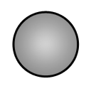
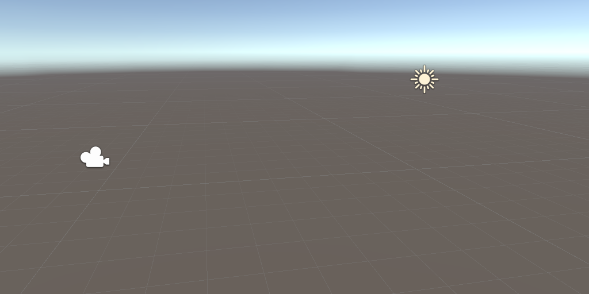
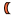
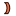

# Unity Editor Built-in Icons

Unity version: 2021.2.16f1

Icons what can load using `EditorGUIUtility.IconContent`

## File ID

You can change script icon by file id
1. Open `*.cs.meta` in Text Editor
2. Modify line `icon: {instanceID: 0}` to `icon: {fileID: <FILE ID>, guid: 0000000000000000d000000000000000, type: 0}`
3. Save and focus Unity Editor

| Icon | Name | File ID |
|------|------|---------|
|  | `_Help` | `6012202242263741038` |
|  | `_Help@2x` | `4169196540306420147` |
|  | `_Menu` | `4484009487905280788` |
|  | `_Menu@2x` | `-7134199221773064657` |
|  | `_Popup` | `-1238941053918525804` |
|  | `_Popup@2x` | `-1775921575863481085` |
|  | `aboutwindow.mainheader` | `7413624039758100214` |
|  | `aboutwindow.mainheader@2x` | `-6891246526051333256` |
|  | `ageialogo` | `142239856772769874` |
|  | `AlphabeticalSorting` | `385791893351368358` |
|  | `AlphabeticalSorting@2x` | `7687558349484904409` |
|  | `AnchorTransformTool On` | `-5941242636935399841` |
|  | `AnchorTransformTool On@2x` | `726274932638104148` |
|  | `AnchorTransformTool` | `723890132883790350` |
|  | `AnchorTransformTool@2x` | `-1760597073280235803` |
|  | `Animation.AddEvent` | `4137659740751492990` |
|  | `Animation.AddEvent@2x` | `4559771996658765653` |
|  | `Animation.AddKeyframe` | `1899560698203370934` |
|  | `Animation.AddKeyframe@2x` | `4928525775237636745` |
|  | `Animation.EventMarker` | `-9093604829510332455` |
|  | `Animation.EventMarker@2x` | `363374367590188809` |
|  | `Animation.FilterBySelection` | `4435535828786833316` |
|  | `Animation.FilterBySelection@2x` | `5496628722178675830` |
|  | `Animation.FirstKey` | `3024128271444096090` |
|  | `Animation.FirstKey@2x` | `-6182535885671000683` |
|  | `Animation.LastKey` | `-891300260708246628` |
|  | `Animation.LastKey@2x` | `-9094964329764419516` |
|  | `Animation.NextKey` | `-4388512538784373571` |
|  | `Animation.NextKey@2x` | `-6917890404064482732` |
|  | `Animation.Play` | `-5044339833078438672` |
|  | `Animation.Play@2x` | `1241623811056693672` |
|  | `Animation.PrevKey` | `2990535490684037521` |
|  | `Animation.PrevKey@2x` | `2404351936869365903` |
|  | `Animation.Record` | `3223261772366079321` |
|  | `Animation.Record@2x` | `-5824205243551370972` |
|  | `Animation.SequencerLink` | `4724545919325408663` |
|  | `animationanimated` | `3991419891476851759` |
|  | `animationanimated@2x` | `-3957402828522027677` |
|  | `animationdopesheetkeyframe` | `-726526387389776670` |
|  | `animationkeyframe` | `-129130776268707423` |
|  | `animationkeyframe@2x` | `54921030647317439` |
|  | `animationnocurve` | `-6874279867631124203` |
|  | `animationvisibilitytoggleoff` | `-8612809770818944968` |
|  | `animationvisibilitytoggleoff@2x` | `2084219579258176148` |
|  | `animationvisibilitytoggleon` | `-7566948067701445177` |
|  | `animationvisibilitytoggleon@2x` | `-3637143793055229142` |
|  | `AnimationWrapModeMenu` | `-811430376147227483` |
|  | `AssemblyLock` | `-7772047616066763351` |
|  | `Asset Store` | `357073275683767465` |
|  | `Asset Store@2x` | `-4391848389275900105` |
|  | `Unity-AssetStore-Originals-Logo-White` | `-8708281630871735944` |
|  | `Unity-AssetStore-Originals-Logo-White@2x` | `5141202327592148685` |
|  | `Audio Mixer` | `5436946869657106676` |
|  | `Audio Mixer@2x` | `923997255885558976` |
|  | `AutoLightbakingOff` | `3199249832511293691` |
|  | `AutoLightbakingOff@2x` | `-7393052276937929259` |
|  | `AutoLightbakingOn` | `-7832132671675705975` |
|  | `AutoLightbakingOn@2x` | `5360101526799613901` |
|  | `AvatarCompass` | `-4187170121413361579` |
|  | `AvatarController.Layer` | `-7416910222760410010` |
|  | `AvatarController.LayerHover` | `1060193532816808308` |
|  | `AvatarController.LayerSelected` | `3582037340827626199` |
|  | `BodyPartPicker` | `-3590433989099234366` |
|  | `BodySilhouette` | `-4451312289517108567` |
|  | `DotFill` | `-8233242210051104170` |
|  | `DotFrame` | `7869005827914783879` |
|  | `DotFrameDotted` | `-3148911654985173949` |
|  | `DotSelection` | `-3482997569041162315` |
|  | `Head` | `3170944555394327123` |
|  | `HeadIk` | `-1140323874079327623` |
|  | `HeadZoom` | `5257450994311700591` |
|  | `HeadZoomSilhouette` | `7762936895225980166` |
|  | `LeftArm` | `6123190672307434784` |
|  | `LeftFeetIk` | `7545747472747947336` |
|  | `LeftFingers` | `-1642451135284037380` |
|  | `LeftFingersIk` | `1748729859595675987` |
|  | `LeftHandZoom` | `1621456644947490004` |
|  | `LeftHandZoomSilhouette` | `8384039629936793124` |
|  | `LeftLeg` | `4921818627043158325` |
|  | `MaskEditor_Root` | `4804520092827026396` |
|  | `RightArm` | `1833656670869755110` |
|  | `RightFeetIk` | `3710563382436173543` |
|  | `RightFingers` | `-3389118511690339839` |
|  | `RightFingersIk` | `3975814432022212013` |
|  | `RightHandZoom` | `1596608304540055736` |
|  | `RightHandZoomSilhouette` | `4529296075431145259` |
|  | `RightLeg` | `-1476864603792500380` |
|  | `Torso` | `-8990505202146232379` |
|  | `AvatarPivot` | `-4773557929347618964` |
|  | `AvatarPivot@2x` | `-4221608646632983637` |
|  | `AvatarSelector` | `3140210110609189590` |
|  | `AvatarSelector@2x` | `1207210223992105847` |
|  | `back` | `320677636847005385` |
|  | `back@2x` | `-7499749373794679393` |
|  | `beginButton-On` | `-4324571489063779742` |
|  | `beginButton` | `-7576460149459046898` |
|  | `blendKey` | `6036928476410329760` |
|  | `blendKey@2x` | `-2397077918234679593` |
|  | `blendKeyOverlay` | `4617552029562368530` |
|  | `blendKeyOverlay@2x` | `958581468013483940` |
|  | `blendKeySelected` | `-1506858753398121587` |
|  | `blendKeySelected@2x` | `-5330284743984316167` |
|  | `blendSampler` | `7624220810582456138` |
|  | `blueGroove` | `-1206214115408343928` |
|  | `BuildSettings.Android On` | `-1878890260662668789` |
|  | `BuildSettings.Android On@2x` | `16334440819132706` |
|  | `BuildSettings.Android` | `-3225301215205586114` |
|  | `BuildSettings.Android.Small` | `-1166641788184234255` |
|  | `BuildSettings.Android.Small@2x` | `-5945452454175733588` |
|  | `BuildSettings.Android@2x` | `5734965202261760406` |
|  | `BuildSettings.Broadcom` | `-2611540343518146177` |
|  | `BuildSettings.DedicatedServer On` | `3297296290159596267` |
|  | `BuildSettings.DedicatedServer On@2x` | `5919977954002937266` |
|  | `BuildSettings.DedicatedServer` | `3815258833528828467` |
|  | `BuildSettings.DedicatedServer.Small` | `-7647273969673859249` |
|  | `BuildSettings.DedicatedServer.Small@2x` | `-6058522490286245110` |
|  | `BuildSettings.DedicatedServer@2x` | `6769625271997971160` |
|  | `BuildSettings.Editor` | `8400232691031406736` |
|  | `BuildSettings.Editor.Small` | `-6908710258048083175` |
|  | `BuildSettings.EmbeddedLinux On` | `7335244815113920615` |
|  | `BuildSettings.EmbeddedLinux On@2x` | `1354193150461728072` |
|  | `BuildSettings.EmbeddedLinux` | `-2896840256165816803` |
|  | `BuildSettings.EmbeddedLinux.Small` | `-3209210660937311089` |
|  | `BuildSettings.EmbeddedLinux.Small@2x` | `-3888723655212919763` |
|  | `BuildSettings.EmbeddedLinux@2x` | `-2157157522209226451` |
|  | `BuildSettings.Facebook On` | `-7859711678534788915` |
|  | `BuildSettings.Facebook On@2x` | `-1283358686002970987` |
|  | `BuildSettings.Facebook` | `-5485581235442607191` |
|  | `BuildSettings.Facebook.Small` | `5439670708184688316` |
|  | `BuildSettings.Facebook.Small@2x` | `9115517695639967145` |
|  | `BuildSettings.Facebook@2x` | `-2925270732012849750` |
|  | `BuildSettings.FlashPlayer` | `466988226579792567` |
|  | `BuildSettings.FlashPlayer.Small` | `4366120842335875659` |
|  | `BuildSettings.GameCoreScarlett On` | `4032073047827678025` |
|  | `BuildSettings.GameCoreScarlett On@2x` | `7612008437288004200` |
|  | `BuildSettings.GameCoreScarlett` | `438378150247721864` |
|  | `BuildSettings.GameCoreScarlett.Small` | `-9179897014072820805` |
|  | `BuildSettings.GameCoreScarlett.Small@2x` | `-7651910531202835751` |
|  | `BuildSettings.GameCoreScarlett@2x` | `-9106869091312449984` |
|  | `BuildSettings.GameCoreXboxOne On` | `7548485100206320310` |
|  | `BuildSettings.GameCoreXboxOne On@2x` | `991673151852721335` |
|  | `BuildSettings.GameCoreXboxOne` | `3068716228704556637` |
|  | `BuildSettings.GameCoreXboxOne.Small` | `4089031816727803355` |
|  | `BuildSettings.GameCoreXboxOne.Small@2x` | `2145091974174636302` |
|  | `BuildSettings.GameCoreXboxOne@2x` | `7098168344539396557` |
|  | `BuildSettings.iPhone On` | `5315025538136271434` |
|  | `BuildSettings.iPhone On@2x` | `3856988739857600585` |
|  | `BuildSettings.iPhone` | `3079519598310828125` |
|  | `BuildSettings.iPhone.Small` | `4345870033486632634` |
|  | `BuildSettings.iPhone.Small@2x` | `-5634524864065029246` |
|  | `BuildSettings.iPhone@2x` | `6987697712259842190` |
|  | `BuildSettings.Lumin On` | `-7421784102139658696` |
|  | `BuildSettings.Lumin On@2x` | `2998448140356953732` |
|  | `BuildSettings.Lumin` | `-5215224591671759445` |
|  | `BuildSettings.Lumin.small` | `8979687790990599924` |
|  | `BuildSettings.Lumin.small@2x` | `-731794183861421397` |
|  | `BuildSettings.Lumin@2x` | `-5166817344748110915` |
|  | `BuildSettings.Metro On` | `3455818660745422868` |
|  | `BuildSettings.Metro On@2x` | `6720285510691535691` |
|  | `BuildSettings.Metro` | `-4021004726003450232` |
|  | `BuildSettings.Metro.Small` | `8056438331138731872` |
|  | `BuildSettings.Metro.Small@2x` | `-8732235388156778990` |
|  | `BuildSettings.Metro@2x` | `-2311780035366954593` |
|  | `BuildSettings.N3DS On` | `6165003963721005565` |
|  | `BuildSettings.N3DS On@2x` | `8791219912215951517` |
|  | `BuildSettings.N3DS` | `-5908170440005314456` |
|  | `BuildSettings.N3DS.Small` | `-6066799282333214607` |
|  | `BuildSettings.N3DS.Small@2x` | `2057369963675073982` |
|  | `BuildSettings.N3DS@2x` | `-6430829192587231253` |
|  | `BuildSettings.PS4 On` | `-2446513153997903262` |
|  | `BuildSettings.PS4 On@2x` | `7838709373500781874` |
|  | `BuildSettings.PS4` | `55494050528514414` |
|  | `BuildSettings.PS4.Small` | `2298978507677022530` |
|  | `BuildSettings.PS4.Small@2x` | `-2413739408649156995` |
|  | `BuildSettings.PS4@2x` | `-6527979290361645938` |
|  | `BuildSettings.PS5 On` | `6012666984125897113` |
|  | `BuildSettings.PS5 On@2x` | `5021112018744779014` |
|  | `BuildSettings.PS5` | `-8144718789618191920` |
|  | `BuildSettings.PS5.Small` | `8521832537410238816` |
|  | `BuildSettings.PS5.Small@2x` | `7719912845452673205` |
|  | `BuildSettings.PS5@2x` | `373751416080676096` |
|  | `BuildSettings.PSM` | `-98090470861308492` |
|  | `BuildSettings.PSM.Small` | `-715787968158446526` |
|  | `BuildSettings.PSP2` | `9006858688270511880` |
|  | `BuildSettings.PSP2.Small` | `-2257309162268670159` |
|  | `BuildSettings.SelectedIcon` | `-3237302683924646227` |
|  | `BuildSettings.Stadia On` | `-583410931937435233` |
|  | `BuildSettings.Stadia On@2x` | `-2427937019371804007` |
|  | `BuildSettings.Stadia` | `-1059611258551044968` |
|  | `BuildSettings.Stadia.small` | `-1982176944817373238` |
|  | `BuildSettings.Stadia.Small@2x` | `8703136191750934175` |
|  | `BuildSettings.Stadia@2x` | `3805792301904044692` |
|  | `BuildSettings.Standalone On` | `-8032632311582345015` |
|  | `BuildSettings.Standalone On@2x` | `4576219794024598259` |
|  | `BuildSettings.Standalone` | `-9041251142560793768` |
|  | `BuildSettings.Standalone.Small` | `4297135980918140731` |
|  | `BuildSettings.Standalone.Small@2x` | `8897440368062136615` |
|  | `BuildSettings.Standalone@2x` | `3214811950287853606` |
|  | `BuildSettings.StandaloneBroadcom.Small` | `-8905343430035773069` |
|  | `BuildSettings.StandaloneGLES20Emu.Small` | `2723429009875258330` |
|  | `BuildSettings.StandaloneGLESEmu` | `-1310285349776098935` |
|  | `BuildSettings.StandaloneGLESEmu.Small` | `6677928742535971017` |
|  | `BuildSettings.Switch On` | `5706999980759659277` |
|  | `BuildSettings.Switch On@2x` | `-61262952020375652` |
|  | `BuildSettings.Switch` | `5517785097875794962` |
|  | `BuildSettings.Switch.Small` | `8765560747129780117` |
|  | `BuildSettings.Switch.Small@2x` | `-3990060041231824171` |
|  | `BuildSettings.Switch@2x` | `4203361953608673628` |
|  | `BuildSettings.tvOS On` | `-1883590773550481976` |
|  | `BuildSettings.tvOS On@2x` | `-2815775797557438328` |
|  | `BuildSettings.tvOS` | `-2604507406547028008` |
|  | `BuildSettings.tvOS.Small` | `2324412021468308913` |
|  | `BuildSettings.tvOS.Small@2x` | `9180157117389547636` |
|  | `BuildSettings.tvOS@2x` | `-1376627478172224437` |
|  | `BuildSettings.Web` | `-8073681927563260479` |
|  | `BuildSettings.Web.Small` | `-8502616656149400873` |
|  | `BuildSettings.WebGL On` | `4781758196249721453` |
|  | `BuildSettings.WebGL On@2x` | `-6184026389132908262` |
|  | `BuildSettings.WebGL` | `-4911556789970686505` |
|  | `BuildSettings.WebGL.Small` | `-3267170773426585699` |
|  | `BuildSettings.WebGL.Small@2x` | `7777299662375183282` |
|  | `BuildSettings.WebGL@2x` | `-596689760537875709` |
|  | `BuildSettings.WP8` | `8103707556279304917` |
|  | `BuildSettings.WP8.Small` | `-1021178350218690989` |
|  | `BuildSettings.Xbox360` | `-3037193308305438414` |
|  | `BuildSettings.Xbox360.Small` | `-1179187124510255440` |
|  | `BuildSettings.XboxOne On` | `-6576850163072677896` |
|  | `BuildSettings.XboxOne On@2x` | `7572160625161521045` |
|  | `BuildSettings.XboxOne` | `5149289017103940624` |
|  | `BuildSettings.XboxOne.Small` | `-245827484132217333` |
|  | `BuildSettings.XboxOne.Small@2x` | `389319431642934349` |
|  | `BuildSettings.XboxOne@2x` | `3546431289802905298` |
|  | `CacheServerConnected` | `6237473061563373096` |
|  | `CacheServerConnected@2x` | `5286386693594080902` |
|  | `CacheServerDisabled` | `1688511831137845510` |
|  | `CacheServerDisabled@2x` | `3350491704846691845` |
|  | `CacheServerDisconnected` | `185745745770690484` |
|  | `CacheServerDisconnected@2x` | `-3833278316657131349` |
|  | `CheckerFloor` | `-7297968518591046888` |
|  | `Clipboard` | `6367713590482950888` |
|  | `ClothInspector.PaintTool` | `1624265540036763281` |
|  | `ClothInspector.PaintValue` | `2134799571607069742` |
|  | `ClothInspector.SelectTool` | `9194464402604369906` |
|  | `ClothInspector.SettingsTool` | `-5509047954332065865` |
|  | `ClothInspector.ViewValue` | `-8688548480094122452` |
|  | `CloudConnect` | `1796978947134172663` |
|  | `CloudConnect@2x` | `-2753773498841969441` |
|  | `Collab.Build` | `-6191915706818861775` |
|  | `Collab.BuildFailed` | `-5437438620272192643` |
|  | `Collab.BuildSucceeded` | `5057284793689411865` |
|  | `Collab.FileAdded` | `6445321136183198910` |
|  | `Collab.FileConflict` | `4336985247694938811` |
|  | `Collab.FileDeleted` | `6324715908799697015` |
|  | `Collab.FileIgnored` | `5400097563507297522` |
|  | `Collab.FileMoved` | `-2730299386048139239` |
|  | `Collab.FileUpdated` | `1417162553530547262` |
|  | `Collab.FolderAdded` | `-1210278254150948088` |
|  | `Collab.FolderConflict` | `8903646916365696551` |
|  | `Collab.FolderDeleted` | `735796692002808257` |
|  | `Collab.FolderIgnored` | `-1970951285390588327` |
|  | `Collab.FolderMoved` | `8020716426326303056` |
|  | `Collab.FolderUpdated` | `-8335063640492715981` |
|  | `Collab.NoInternet` | `-6607641266460543220` |
|  | `Collab` | `-6158769726174120613` |
|  | `Collab.Warning` | `-7186489016682460555` |
|  | `Collab@2x` | `-204901687004141392` |
|  | `CollabConflict` | `7544789595935200320` |
|  | `CollabError` | `-8234132648094580814` |
|  | `CollabNew` | `-8705029441204933142` |
|  | `CollabOffline` | `8796122042331125716` |
|  | `CollabProgress` | `-5136566985977948126` |
|  | `CollabPull` | `-8487449939106475213` |
|  | `CollabPush` | `-4221040498047746133` |
|  | `ColorPicker.ColorCycle` | `886907316228417740` |
|  | `ColorPicker.CycleColor` | `-3564112748134886232` |
|  | `ColorPicker.CycleSlider` | `-3513833679861578334` |
|  | `ColorPicker.SliderCycle` | `-7083475956794908383` |
|  | `console.erroricon.inactive.sml` | `3590839462479323251` |
|  | `console.erroricon.inactive.sml@2x` | `-2994576740540915103` |
|  | `console.erroricon` | `1715859669443758926` |
|  | `console.erroricon.sml` | `-2005373149481181617` |
|  | `console.erroricon.sml@2x` | `8987726391556715404` |
|  | `console.erroricon@2x` | `6284689507932306902` |
|  | `console.infoicon.inactive.sml` | `-834181036293777854` |
|  | `console.infoicon.inactive.sml@2x` | `-7419826344962246451` |
|  | `console.infoicon` | `-7150409940516424707` |
|  | `console.infoicon.sml` | `5425037494185492166` |
|  | `console.infoicon.sml@2x` | `-5160543911401257732` |
|  | `console.infoicon@2x` | `-834399640629991296` |
|  | `console.warnicon.inactive.sml` | `2636775829707929427` |
|  | `console.warnicon.inactive.sml@2x` | `-3380099296471467840` |
|  | `console.warnicon` | `2655493458141633029` |
|  | `console.warnicon.sml` | `-5763820162405496800` |
|  | `console.warnicon.sml@2x` | `-3338366152654577817` |
|  | `console.warnicon@2x` | `3345359830406526867` |
|  | `CreateAddNew` | `5612988733227447382` |
|  | `CreateAddNew@2x` | `2537850299970768384` |
|  | `CrossIcon` | `-7991997088291664513` |
|  | `curvekeyframe` | `-5735313763964030175` |
|  | `curvekeyframe@2x` | `7341072774159052384` |
|  | `curvekeyframeselected` | `8557251948433319039` |
|  | `curvekeyframeselected@2x` | `4181363336114948910` |
|  | `curvekeyframeselectedoverlay` | `4691473716350331671` |
|  | `curvekeyframeselectedoverlay@2x` | `7875830917259516073` |
|  | `curvekeyframesemiselectedoverlay` | `-752352312952114710` |
|  | `curvekeyframesemiselectedoverlay@2x` | `7164663534835563533` |
|  | `curvekeyframeweighted` | `2608427245204659800` |
|  | `curvekeyframeweighted@2x` | `-4920033693090927328` |
|  | `CustomSorting` | `1223667551903327650` |
|  | `CustomTool` | `6092978192067049055` |
|  | `CustomTool@2x` | `7660263989159558545` |
|  | `d__Help` | `4574346317732048352` |
|  | `d__Help@2x` | `8209119591668177465` |
|  | `d__Menu` | `255284738923976659` |
|  | `d__Menu@2x` | `4417794529297650604` |
|  | `d__Popup` | `5527209713546761551` |
|  | `d__Popup@2x` | `3415297583445976952` |
|  | `d_aboutwindow.mainheader` | `-5261814007879969666` |
|  | `d_aboutwindow.mainheader@2x` | `-7537782773985232593` |
|  | `d_ageialogo` | `-4074805018749045636` |
|  | `d_AlphabeticalSorting` | `4704375340429805257` |
|  | `d_AlphabeticalSorting@2x` | `8188608333265313135` |
|  | `d_AnchorTransformTool On` | `2674281924599343872` |
|  | `d_AnchorTransformTool On@2x` | `-3292284930737090087` |
|  | `d_AnchorTransformTool` | `6856279758526228965` |
|  | `d_AnchorTransformTool@2x` | `4866097001312715500` |
|  | `d_Animation.AddEvent` | `5580871185958974552` |
|  | `d_Animation.AddEvent@2x` | `-7623869019956723390` |
|  | `d_Animation.AddKeyframe` | `-5868239735812553188` |
|  | `d_Animation.AddKeyframe@2x` | `-2776116734577802626` |
|  | `d_Animation.EventMarker` | `4865330878740040390` |
|  | `d_Animation.EventMarker@2x` | `-6803414926992170210` |
|  | `d_Animation.FilterBySelection` | `-3394420714319832911` |
|  | `d_Animation.FilterBySelection@2x` | `4939039871414479757` |
|  | `d_Animation.FirstKey` | `3960224646933354229` |
|  | `d_Animation.FirstKey@2x` | `-3708388552213529080` |
|  | `d_Animation.LastKey` | `-4115714495813998023` |
|  | `d_Animation.LastKey@2x` | `6052967016156083927` |
|  | `d_Animation.NextKey` | `5594613797062276571` |
|  | `d_Animation.NextKey@2x` | `5596665190693250607` |
|  | `d_Animation.Play` | `-8660489847922084980` |
|  | `d_Animation.Play@2x` | `5504932610587006541` |
|  | `d_Animation.PrevKey` | `7684763639276239761` |
|  | `d_Animation.PrevKey@2x` | `-6229856987248980021` |
|  | `d_Animation.Record` | `6569083827624595240` |
|  | `d_Animation.Record@2x` | `8982227325937526715` |
|  | `d_Animation.SequencerLink` | `1211459679570569961` |
|  | `d_animationanimated` | `-7467828229802735559` |
|  | `d_animationanimated@2x` | `-6671771345497075567` |
|  | `d_animationkeyframe` | `4997269261844303601` |
|  | `d_animationkeyframe@2x` | `6827032349305691703` |
|  | `d_animationnocurve` | `7669471596081897553` |
|  | `d_animationvisibilitytoggleoff` | `4907371712499317586` |
|  | `d_animationvisibilitytoggleoff@2x` | `-1080093472756764387` |
|  | `d_animationvisibilitytoggleon` | `-4628323394505387389` |
|  | `d_animationvisibilitytoggleon@2x` | `-2598023676157580243` |
|  | `d_AnimationWrapModeMenu` | `5158551771503169309` |
|  | `d_AS Badge Delete` | `301681052602819724` |
|  | `d_AS Badge New` | `-7220028169341326075` |
|  | `d_AssemblyLock` | `1997798467560094451` |
|  | `d_Asset Store` | `-8693916549880196297` |
|  | `d_Asset Store@2x` | `-7444545952099596278` |
|  | `d_Audio Mixer` | `2344599766593239149` |
|  | `d_Audio Mixer@2x` | `-3283902137440876849` |
|  | `d_AutoLightbakingOff` | `2955618777930367874` |
|  | `d_AutoLightbakingOff@2x` | `7639127569424470396` |
|  | `d_AutoLightbakingOn` | `-7351569177776282220` |
|  | `d_AutoLightbakingOn@2x` | `5223064176733806433` |
|  | `d_AvatarBlendBackground` | `-7740670662150012262` |
|  | `d_AvatarBlendLeft` | `6392251390363527398` |
|  | `d_AvatarBlendLeftA` | `1513400179016092070` |
|  | `d_AvatarBlendRight` | `-437346551407802260` |
|  | `d_AvatarBlendRightA` | `-6342677975472070947` |
|  | `d_AvatarCompass` | `9167206752844903456` |
|  | `d_AvatarPivot` | `2269904091327538262` |
|  | `d_AvatarPivot@2x` | `-933964196293086434` |
|  | `d_AvatarSelector` | `291972862006145974` |
|  | `d_AvatarSelector@2x` | `4374373771682133825` |
|  | `d_back` | `7491503434607560644` |
|  | `d_back@2x` | `9130732976430192545` |
|  | `d_beginButton-On` | `-1541906980972628192` |
|  | `d_beginButton` | `-8634218779858824612` |
|  | `d_blueGroove` | `3958074764286187482` |
|  | `d_BuildSettings.Android` | `-3446736307351038430` |
|  | `d_BuildSettings.Android.Small` | `6296815224293940132` |
|  | `d_BuildSettings.Android.Small@2x` | `-7220358749881951425` |
|  | `d_BuildSettings.Android@2x` | `-2004670820733268908` |
|  | `d_BuildSettings.Broadcom` | `-9008726449081888597` |
|  | `d_BuildSettings.DedicatedServer` | `2578505128784497995` |
|  | `d_BuildSettings.DedicatedServer.Small` | `-2134664407540065926` |
|  | `d_BuildSettings.DedicatedServer.Small@2x` | `3327166165389737355` |
|  | `d_BuildSettings.DedicatedServer@2x` | `5944582379227412270` |
|  | `d_BuildSettings.Facebook` | `4036877365744175712` |
|  | `d_BuildSettings.Facebook.Small` | `-1773235622925870077` |
|  | `d_BuildSettings.Facebook.Small@2x` | `-1523609404782003456` |
|  | `d_BuildSettings.Facebook@2x` | `1063348289580890539` |
|  | `d_BuildSettings.FlashPlayer` | `-2305605046842453662` |
|  | `d_BuildSettings.FlashPlayer.Small` | `731514638995218830` |
|  | `d_BuildSettings.GameCoreScarlett` | `-5955308897697106432` |
|  | `d_BuildSettings.GameCoreScarlett.Small` | `-6652521207947470784` |
|  | `d_BuildSettings.GameCoreScarlett.Small@2x` | `-6995364089635719962` |
|  | `d_BuildSettings.GameCoreScarlett@2x` | `-1108914255804725048` |
|  | `d_BuildSettings.GameCoreXboxOne` | `-832438869913387760` |
|  | `d_BuildSettings.GameCoreXboxOne.Small` | `1014862496525268134` |
|  | `d_BuildSettings.GameCoreXboxOne.Small@2x` | `5323906888130457667` |
|  | `d_BuildSettings.GameCoreXboxOne@2x` | `-8240390544447176125` |
|  | `d_BuildSettings.iPhone` | `-6259517079827926906` |
|  | `d_BuildSettings.iPhone.Small` | `-1080992744858828460` |
|  | `d_BuildSettings.iPhone.Small@2x` | `4152198871333242844` |
|  | `d_BuildSettings.iPhone@2x` | `-8260825193331817229` |
|  | `d_BuildSettings.Lumin` | `6535942805984192183` |
|  | `d_BuildSettings.Lumin.small` | `-2841579067038442323` |
|  | `d_BuildSettings.Lumin.small@2x` | `2381741023756229166` |
|  | `d_BuildSettings.Lumin@2x` | `-1524415034251050656` |
|  | `d_BuildSettings.Metro` | `3599409261634019790` |
|  | `d_BuildSettings.Metro.Small` | `1784067418094738445` |
|  | `d_BuildSettings.Metro.Small@2x` | `-1497910192269226091` |
|  | `d_BuildSettings.Metro@2x` | `889119860637441237` |
|  | `d_BuildSettings.N3DS` | `1548403576493293022` |
|  | `d_BuildSettings.N3DS.Small` | `5168174702038070723` |
|  | `d_BuildSettings.N3DS.Small@2x` | `-8843039746199640544` |
|  | `d_BuildSettings.N3DS@2x` | `-6180537394732015050` |
|  | `d_BuildSettings.PS4` | `9035645644763246296` |
|  | `d_BuildSettings.PS4.Small` | `-1326778436304736038` |
|  | `d_BuildSettings.PS4.Small@2x` | `-8641487154673754581` |
|  | `d_BuildSettings.PS4@2x` | `4572901898994548769` |
|  | `d_BuildSettings.PS5` | `-5292037846748931880` |
|  | `d_BuildSettings.PS5.Small` | `4660124725284368101` |
|  | `d_BuildSettings.PS5.Small@2x` | `5350496758064582428` |
|  | `d_BuildSettings.PS5@2x` | `-4374360490385192044` |
|  | `d_BuildSettings.PSP2` | `672497611671670674` |
|  | `d_BuildSettings.PSP2.Small` | `-5490013650174253100` |
|  | `d_BuildSettings.SelectedIcon` | `-5638162169307524054` |
|  | `d_BuildSettings.Stadia` | `41120884009361448` |
|  | `d_BuildSettings.Stadia.Small` | `6365604532169879272` |
|  | `d_BuildSettings.Stadia.Small@2x` | `-2916328454764905165` |
|  | `d_BuildSettings.Stadia@2x` | `-683160021736784701` |
|  | `d_BuildSettings.Standalone` | `-3581297997062639961` |
|  | `d_BuildSettings.Standalone.Small` | `382013416940812573` |
|  | `d_BuildSettings.Standalone.Small@2x` | `-2129607575182838650` |
|  | `d_BuildSettings.Standalone@2x` | `-1770062895102740351` |
|  | `d_BuildSettings.Switch` | `-6585269640543235773` |
|  | `d_BuildSettings.Switch.Small` | `2920198948148501075` |
|  | `d_BuildSettings.Switch.Small@2x` | `6822354511494598398` |
|  | `d_BuildSettings.Switch@2x` | `-1125836962778702150` |
|  | `d_BuildSettings.tvOS` | `3261360856959884992` |
|  | `d_BuildSettings.tvOS.Small` | `-4229590885225958408` |
|  | `d_BuildSettings.tvOS.Small@2x` | `-7889761708514874415` |
|  | `d_BuildSettings.tvOS@2x` | `9036554527568043497` |
|  | `d_BuildSettings.Web` | `169656382621208501` |
|  | `d_BuildSettings.Web.Small` | `-3074397474341108136` |
|  | `d_BuildSettings.WebGL` | `-4805328497058567814` |
|  | `d_BuildSettings.WebGL.Small` | `3315521960194682417` |
|  | `d_BuildSettings.WebGL.Small@2x` | `-3349758287006924090` |
|  | `d_BuildSettings.WebGL@2x` | `-6900537904881935172` |
|  | `d_BuildSettings.Xbox360` | `-2043457658809275335` |
|  | `d_BuildSettings.Xbox360.Small` | `3510589587984622768` |
|  | `d_BuildSettings.XboxOne` | `8529469165666183730` |
|  | `d_BuildSettings.XboxOne.Small` | `8220482464425789369` |
|  | `d_BuildSettings.XboxOne.Small@2x` | `-2957719757152438512` |
|  | `d_BuildSettings.XboxOne@2x` | `2654908836672212704` |
|  | `d_BuildSettings.Xiaomi` | `-6144129136269295938` |
|  | `d_BuildSettings.Xiaomi.Small` | `3928405084570541427` |
|  | `d_BuildSettings.Xiaomi.Small@2x` | `4005156709013535498` |
|  | `d_BuildSettings.Xiaomi@2x` | `3805764193246990354` |
|  | `d_CacheServerConnected` | `-3709775289237028813` |
|  | `d_CacheServerConnected@2x` | `8285689593283388110` |
|  | `d_CacheServerDisabled` | `-4185380870971124387` |
|  | `d_CacheServerDisabled@2x` | `-1894744329818022854` |
|  | `d_CacheServerDisconnected` | `462771044136129715` |
|  | `d_CacheServerDisconnected@2x` | `-560614279296114739` |
|  | `d_CheckerFloor` | `3488054696338013110` |
|  | `d_CloudConnect` | `2461709212557881423` |
|  | `d_CloudConnect@2x` | `-5339467531230289067` |
|  | `d_Collab.FileAdded` | `-6257073720136177559` |
|  | `d_Collab.FileConflict` | `7902632807435868239` |
|  | `d_Collab.FileDeleted` | `6049887228244754300` |
|  | `d_Collab.FileIgnored` | `-3716117597818073499` |
|  | `d_Collab.FileMoved` | `8389502801107628237` |
|  | `d_Collab.FileUpdated` | `-4535590531064895163` |
|  | `d_Collab.FolderAdded` | `8235436423499093705` |
|  | `d_Collab.FolderConflict` | `6781191672715281524` |
|  | `d_Collab.FolderDeleted` | `3132797155617530135` |
|  | `d_Collab.FolderIgnored` | `4476748674792936110` |
|  | `d_Collab.FolderMoved` | `-143210653946747314` |
|  | `d_Collab.FolderUpdated` | `2222360239620688078` |
|  | `d_Collab` | `-1852156573812982509` |
|  | `d_Collab@2x` | `4653114280351915588` |
|  | `d_ColorPicker.CycleColor` | `-4438168099941589078` |
|  | `d_ColorPicker.CycleSlider` | `-6127063465635223028` |
|  | `d_console.erroricon.inactive.sml` | `-1422735066093442274` |
|  | `d_console.erroricon.inactive.sml@2x` | `-1683012324619503922` |
|  | `d_console.erroricon` | `-9048625076807369346` |
|  | `d_console.erroricon.sml` | `8521385900707336378` |
|  | `d_console.erroricon.sml@2x` | `-6442799736734524024` |
|  | `d_console.erroricon@2x` | `8117322529516780618` |
|  | `d_console.infoicon.inactive.sml` | `-3276413875869322032` |
|  | `d_console.infoicon.inactive.sml@2x` | `-7670031800153505217` |
|  | `d_console.infoicon` | `-8466309453026419660` |
|  | `d_console.infoicon.sml` | `786882066299589297` |
|  | `d_console.infoicon.sml@2x` | `-4405542200666886037` |
|  | `d_console.infoicon@2x` | `-7943110704522483240` |
|  | `d_console.warnicon.inactive.sml` | `8751020510356332213` |
|  | `d_console.warnicon.inactive.sml@2x` | `-6520636669904382973` |
|  | `d_console.warnicon` | `8881090524650496746` |
|  | `d_console.warnicon.sml` | `-4166112459083603383` |
|  | `d_console.warnicon.sml@2x` | `8889457268015356735` |
|  | `d_console.warnicon@2x` | `385142089026517244` |
|  | `d_CreateAddNew` | `1812748973091573627` |
|  | `d_CreateAddNew@2x` | `2592344950612753479` |
|  | `d_curvekeyframe` | `5342509488035076654` |
|  | `d_curvekeyframe@2x` | `-688232900210362382` |
|  | `d_curvekeyframeselected` | `4350979343334187468` |
|  | `d_curvekeyframeselected@2x` | `-7868416356603583436` |
|  | `d_curvekeyframeselectedoverlay` | `7588837242874043407` |
|  | `d_curvekeyframeselectedoverlay@2x` | `3968257128542437649` |
|  | `d_curvekeyframesemiselectedoverlay` | `-6530874666569833345` |
|  | `d_curvekeyframesemiselectedoverlay@2x` | `-7094273229742421856` |
|  | `d_curvekeyframeweighted` | `8905559942646768812` |
|  | `d_curvekeyframeweighted@2x` | `6140112835163582435` |
|  | `d_CustomSorting` | `395480234370563609` |
|  | `d_CustomTool` | `5639368617152057657` |
|  | `d_CustomTool@2x` | `3919062399048514441` |
|  | `d_DebuggerAttached` | `5563126720994373707` |
|  | `d_DebuggerAttached@2x` | `1844289310244502933` |
|  | `d_DebuggerDisabled` | `-5458696979244044411` |
|  | `d_DebuggerDisabled@2x` | `3542560887663055117` |
|  | `d_DebuggerEnabled` | `-2102042193745376952` |
|  | `d_DebuggerEnabled@2x` | `54610517339055645` |
|  | `d_DefaultSorting` | `-7007298182136219932` |
|  | `d_DefaultSorting@2x` | `-7502076344271459185` |
|  | `d_DragArrow@2x` | `1646394057496694136` |
|  | `d_EditCollider` | `-560221908340507589` |
|  | `d_editcollision_16` | `-6557626779103690695` |
|  | `d_editcollision_16@2x` | `8845369254156353136` |
|  | `d_editcollision_32` | `-8231814896589588898` |
|  | `d_editconstraints_16` | `-3693818722149281418` |
|  | `d_editconstraints_16@2x` | `7339544473212849810` |
|  | `d_editconstraints_32` | `-9079786742084075774` |
|  | `d_editicon.sml` | `-1241212020868663418` |
|  | `d_endButton-On` | `3810875022365821714` |
|  | `d_endButton` | `-6462869565880638227` |
|  | `d_Exposure` | `3911045305965011867` |
|  | `d_Exposure@2x` | `-7053067109466291222` |
|  | `d_eyeDropper.Large` | `2093162046483104582` |
|  | `d_eyeDropper.Large@2x` | `-6408884465903604919` |
|  | `d_eyeDropper.sml` | `5535293865780846947` |
|  | `d_Favorite` | `6403350156513638414` |
|  | `d_Favorite@2x` | `8208000917413203914` |
|  | `d_FilterByLabel` | `-9055196687221778681` |
|  | `d_FilterByLabel@2x` | `-1673784058278515987` |
|  | `d_FilterByType` | `3147778976006948682` |
|  | `d_FilterByType@2x` | `5741433715250483933` |
|  | `d_FilterSelectedOnly` | `-6516198459129062285` |
|  | `d_FilterSelectedOnly@2x` | `1418106307674997700` |
|  | `d_forward` | `-9064726536009358814` |
|  | `d_forward@2x` | `7538205741505319679` |
|  | `d_FrameCapture` | `-4613876581785085335` |
|  | `d_FrameCapture@2x` | `4577274247496714266` |
|  | `d_GEAR` | `-5036357898621054360` |
|  | `d_GizmosToggle On` | `1271549576400595343` |
|  | `d_GizmosToggle On@2x` | `-6564463512198911524` |
|  | `d_GizmosToggle` | `8577862951845126185` |
|  | `d_GizmosToggle@2x` | `-7250623444466721990` |
|  | `d_Grid.BoxTool` | `-344943740643441785` |
|  | `d_Grid.BoxTool@2x` | `-1600691820090266399` |
|  | `d_Grid.Default` | `1069608246273552248` |
|  | `d_Grid.Default@2x` | `4249954606966202676` |
|  | `d_Grid.EraserTool` | `-3906651192056200450` |
|  | `d_Grid.EraserTool@2x` | `-4529165727302037272` |
|  | `d_Grid.FillTool` | `-3052415461247654607` |
|  | `d_Grid.FillTool@2x` | `143984297763390986` |
|  | `d_Grid.MoveTool` | `-5310791424171426395` |
|  | `d_Grid.MoveTool@2x` | `1148298343989445206` |
|  | `d_Grid.PaintTool` | `7266813162977989727` |
|  | `d_Grid.PaintTool@2x` | `6390878959879609722` |
|  | `d_Grid.PickingTool` | `7378396512500722431` |
|  | `d_Grid.PickingTool@2x` | `7165346143996055229` |
|  | `d_Groove` | `-5628198530706764212` |
|  | `d_HorizontalSplit` | `6300538257523189164` |
|  | `d_icon dropdown` | `-8803814024050117606` |
|  | `d_icon dropdown@2x` | `-4029445073156530774` |
|  | `d_Import` | `-6062748997451094969` |
|  | `d_Import@2x` | `-540142351572539542` |
|  | `d_InspectorLock` | `-2287267532218988703` |
|  | `d_Invalid` | `-6254598091745687312` |
|  | `d_Invalid@2x` | `-6746276532397667986` |
|  | `d_JointAngularLimits` | `2055165929574443600` |
|  | `d_leftBracket` | `7767883810485083697` |
|  | `d_Lighting` | `-1347227620855488341` |
|  | `d_Lighting@2x` | `-1477008817101679558` |
|  | `d_LightmapEditor.WindowTitle` | `-9217767230680498827` |
|  | `d_LightmapEditor.WindowTitle@2x` | `4113057386760552577` |
|  | `d_Linked` | `8717391706768293765` |
|  | `d_Linked@2x` | `9159644588079355192` |
|  | `d_MainStageView` | `500566344293810340` |
|  | `d_MainStageView@2x` | `-234771246099921279` |
|  | `d_Mirror` | `1200669419913028060` |
|  | `d_model large` | `-4151579237291548445` |
|  | `d_monologo` | `2024370742291596448` |
|  | `d_MoreOptions` | `229314162830439344` |
|  | `d_MoreOptions@2x` | `411964233765197720` |
|  | `d_MoveTool on` | `1097061428838518575` |
|  | `d_MoveTool On@2x` | `3500650182120335439` |
|  | `d_MoveTool` | `887304518092530642` |
|  | `d_MoveTool@2x` | `-4497096070357054744` |
|  | `d_Navigation` | `1087843850482249999` |
|  | `d_Occlusion` | `-3571815596324412722` |
|  | `d_Occlusion@2x` | `-6304520642066340446` |
|  | `d_Package Manager` | `-2824328813065806953` |
|  | `d_Package Manager@2x` | `5076950121296946556` |
|  | `d_Particle Effect` | `5771782372421417087` |
|  | `d_ParticleShapeTool On` | `-2490055883357134180` |
|  | `d_ParticleShapeTool On@2x` | `3209709000766459305` |
|  | `d_ParticleShapeTool On@3x` | `6072499746921704317` |
|  | `d_ParticleShapeTool` | `-6507076857732603520` |
|  | `d_ParticleShapeTool@2x` | `7734407232278247305` |
|  | `d_ParticleShapeTool@3x` | `8972950984554528606` |
|  | `d_PauseButton On` | `-973498369591615148` |
|  | `d_PauseButton On@2x` | `-1094549480319892696` |
|  | `d_PauseButton` | `-157328457287382343` |
|  | `d_PauseButton@2x` | `5104857897416931454` |
|  | `d_PlayButton On` | `-3809874325970553086` |
|  | `d_PlayButton On@2x` | `2500439415879940646` |
|  | `d_PlayButton` | `8119404038100594556` |
|  | `d_PlayButton@2x` | `-4819823979207714598` |
|  | `d_PlayButtonProfile On` | `1257828600702360869` |
|  | `d_PlayButtonProfile` | `-8046626215917028164` |
|  | `d_playLoopOff` | `318665147316921697` |
|  | `d_playLoopOn` | `6659501543657729554` |
|  | `d_preAudioAutoPlayOff` | `-789892869308303679` |
|  | `d_preAudioAutoPlayOff@2x` | `-4755659114434921155` |
|  | `d_preAudioAutoPlayOn` | `6992124700896504965` |
|  | `d_preAudioLoopOff` | `4177878259298178914` |
|  | `d_preAudioLoopOff@2x` | `8107005214570602525` |
|  | `d_preAudioLoopOn` | `-8448322007878352887` |
|  | `d_preAudioPlayOff` | `-4940265039149199715` |
|  | `d_preAudioPlayOn` | `6330601433602270759` |
|  | `d_PreMatCube` | `4963668328950458727` |
|  | `d_PreMatCube@2x` | `-75972919704443941` |
|  | `d_PreMatCylinder` | `-7226617611154474229` |
|  | `d_PreMatCylinder@2x` | `866970916475876282` |
|  | `d_PreMatLight0` | `-1945259441751596937` |
|  | `d_PreMatLight0@2x` | `-1701890779967931852` |
|  | `d_PreMatLight1` | `-380625847890886982` |
|  | `d_PreMatLight1@2x` | `1610942458273272326` |
|  | `d_PreMatQuad` | `4848250331040192703` |
|  | `d_PreMatQuad@2x` | `3343070717676370588` |
|  | `d_PreMatSphere` | `252860475409480837` |
|  | `d_PreMatSphere@2x` | `-1669113664096939030` |
|  | `d_PreMatTorus` | `4683423234777854641` |
|  | `d_PreMatTorus@2x` | `6026626136071251619` |
|  | `d_Preset.Context` | `-7987359591204857063` |
|  | `d_Preset.Context@2x` | `-4818530072447904267` |
|  | `d_PreTexA` | `7632835222734365967` |
|  | `d_PreTexA@2x` | `-1926211739393515375` |
|  | `d_PreTexB` | `5079224787941795564` |
|  | `d_PreTexB@2x` | `5974784371795290094` |
|  | `d_PreTexG` | `-4971360785712303266` |
|  | `d_PreTexG@2x` | `2204046562616517693` |
|  | `d_PreTexR` | `5735497499000957771` |
|  | `d_PreTexR@2x` | `5002290883785906145` |
|  | `d_PreTexRGB` | `-3698057716840329173` |
|  | `d_PreTexRGB@2x` | `-5114238059335211639` |
|  | `d_PreTextureAlpha` | `-3157848010053115858` |
|  | `d_PreTextureMipMapHigh` | `3543029727608300790` |
|  | `d_PreTextureMipMapLow` | `8854688391959382100` |
|  | `d_PreTextureRGB` | `-7366084334261073295` |
|  | `d_Profiler.Audio` | `-562467101068280041` |
|  | `d_Profiler.Audio@2x` | `-1724589160592844358` |
|  | `d_Profiler.CPU` | `6318610627759634659` |
|  | `d_Profiler.CPU@2x` | `1465108915573023449` |
|  | `d_Profiler.Custom` | `8644936328217283950` |
|  | `d_Profiler.Custom@2x` | `-1589288358861240189` |
|  | `d_Profiler.FirstFrame` | `3362450475174513823` |
|  | `d_Profiler.GlobalIllumination` | `-4487867878065485569` |
|  | `d_Profiler.GlobalIllumination@2x` | `1407345384548418524` |
|  | `d_Profiler.GPU` | `-4509557850814624509` |
|  | `d_Profiler.GPU@2x` | `-3627773931424168081` |
|  | `d_Profiler.LastFrame` | `1156741976402795997` |
|  | `d_Profiler.Memory` | `-4451796808612405346` |
|  | `d_Profiler.Memory@2x` | `6899869724690319097` |
|  | `d_Profiler.Network` | `5938926803166097124` |
|  | `d_Profiler.NetworkMessages` | `7855334776489544202` |
|  | `d_Profiler.NetworkMessages@2x` | `-2037852890972606901` |
|  | `d_Profiler.NetworkOperations` | `3346445059416804343` |
|  | `d_Profiler.NetworkOperations@2x` | `-5220521966090024607` |
|  | `d_Profiler.NextFrame` | `-7433698056413564813` |
|  | `d_Profiler.Open` | `8520121654172952750` |
|  | `d_Profiler.Open@2x` | `9170675756192270696` |
|  | `d_Profiler.Physics` | `-14112535770407334` |
|  | `d_Profiler.Physics2D` | `2210237403609355899` |
|  | `d_Profiler.Physics2D@2x` | `-3232397485418273802` |
|  | `d_Profiler.Physics@2x` | `9076475276266678525` |
|  | `d_Profiler.PrevFrame` | `1189885843623048564` |
|  | `d_Profiler.Record` | `5014591224172978528` |
|  | `d_Profiler.Rendering` | `-1121320922046616461` |
|  | `d_Profiler.Rendering@2x` | `-8531880013172322318` |
|  | `d_Profiler.UI` | `-4371440437764676778` |
|  | `d_Profiler.UI@2x` | `-6830019465850980371` |
|  | `d_Profiler.UIDetails` | `2333416111286726795` |
|  | `d_Profiler.UIDetails@2x` | `9149478254149279762` |
|  | `d_Profiler.Video` | `3536098652246358673` |
|  | `d_Profiler.Video@2x` | `-4765946172409673153` |
|  | `d_Profiler.VirtualTexturing` | `-7535359465505183856` |
|  | `d_Profiler.VirtualTexturing@2x` | `-8897157260961263381` |
|  | `d_ProfilerColumn.WarningCount` | `-5161429177145976760` |
|  | `d_Progress` | `8142386356158188468` |
|  | `d_Progress@2x` | `6636489078914771903` |
|  | `d_Project` | `-5467254957812901981` |
|  | `d_Project@2x` | `-5179483145760003458` |
|  | `d_Record Off` | `-4426769082850307119` |
|  | `d_Record Off@2x` | `-3114417486998244059` |
|  | `d_Record On` | `-6865134418605253402` |
|  | `d_Record On@2x` | `6498687645821137866` |
|  | `d_RectTool On` | `-1184618488162704965` |
|  | `d_RectTool On@2x` | `-364124398708526985` |
|  | `d_RectTool` | `-4775378067382821976` |
|  | `d_RectTool@2x` | `-9130624343394379811` |
|  | `d_RectTransformBlueprint` | `-7092392679310191003` |
|  | `d_RectTransformRaw` | `261028769251843280` |
|  | `d_redGroove` | `5972235673456810952` |
|  | `d_ReflectionProbeSelector` | `-7067623766649443779` |
|  | `d_ReflectionProbeSelector@2x` | `-8494432123982237986` |
|  | `d_Refresh` | `5313143563260175306` |
|  | `d_Refresh@2x` | `8815869999013920796` |
|  | `d_rightBracket` | `-4916741683038362039` |
|  | `d_RotateTool On` | `-5784064337410130985` |
|  | `d_RotateTool On@2x` | `-3781600029101913557` |
|  | `d_RotateTool` | `-884787280140238455` |
|  | `d_RotateTool@2x` | `8027094801851720001` |
|  | `d_SaveAs` | `5698028109680057803` |
|  | `d_SaveAs@2x` | `-8440776694992983928` |
|  | `d_ScaleTool On` | `8127765477191694456` |
|  | `d_ScaleTool On@2x` | `7775916351347549205` |
|  | `d_ScaleTool` | `-8309042981607308294` |
|  | `d_ScaleTool@2x` | `-3818617102614430489` |
|  | `d_Scene` | `2727480576448286891` |
|  | `d_Scene@2x` | `-5280412695858446811` |
|  | `d_scenepicking_notpickable-mixed` | `1345688505442826507` |
|  | `d_scenepicking_notpickable-mixed@2x` | `2726475240577701949` |
|  | `d_scenepicking_notpickable-mixed_hover` | `2947891202215600997` |
|  | `d_scenepicking_notpickable-mixed_hover@2x` | `9185018949423274174` |
|  | `d_scenepicking_notpickable` | `6313090202799444802` |
|  | `d_scenepicking_notpickable@2x` | `3194198111900066150` |
|  | `d_scenepicking_notpickable_hover` | `-8083865232103998779` |
|  | `d_scenepicking_notpickable_hover@2x` | `-3705688081712756380` |
|  | `d_scenepicking_pickable-mixed` | `906836699973209161` |
|  | `d_scenepicking_pickable-mixed@2x` | `8487399371163767942` |
|  | `d_scenepicking_pickable-mixed_hover` | `2587317674444199029` |
|  | `d_scenepicking_pickable-mixed_hover@2x` | `-8621361855829124081` |
|  | `d_scenepicking_pickable` | `-2011439508453615441` |
|  | `d_scenepicking_pickable@2x` | `-6244006619687045507` |
|  | `d_scenepicking_pickable_hover` | `961036335595100380` |
|  | `d_scenepicking_pickable_hover@2x` | `-6416461356461061450` |
|  | `d_SceneView2D On` | `4282494027651760341` |
|  | `d_SceneView2D On@2x` | `-8639581246078304990` |
|  | `d_SceneView2D` | `5585625871878311761` |
|  | `d_SceneView2D@2x` | `-4803168346691062969` |
|  | `d_SceneViewAlpha` | `5852310185524866069` |
|  | `d_SceneViewAudio On` | `7967182057222393119` |
|  | `d_SceneViewAudio On@2x` | `6162737255602335043` |
|  | `d_SceneViewAudio` | `5793056515904932867` |
|  | `d_SceneViewAudio@2x` | `-5997701993775962491` |
|  | `d_SceneViewCamera` | `4374603736546719859` |
|  | `d_SceneViewCamera@2x` | `-3029137089513132433` |
|  | `d_SceneViewFx On` | `5851696042570751733` |
|  | `d_SceneViewFX On@2x` | `-4213460222744013977` |
|  | `d_SceneViewFx` | `2109362922743127443` |
|  | `d_SceneViewFX@2x` | `-976224214725393938` |
|  | `d_SceneViewLighting On` | `-3402184066134468744` |
|  | `d_SceneViewLighting On@2x` | `3581646967942900699` |
|  | `d_SceneViewLighting` | `-2039896852630029315` |
|  | `d_SceneViewLighting@2x` | `-1108800813049456072` |
|  | `d_SceneViewOrtho` | `5153128777763766899` |
|  | `d_SceneViewRGB` | `-4395245879842824607` |
|  | `d_SceneViewTools` | `6380571991878966436` |
|  | `d_SceneViewTools@2x` | `-515035524211713703` |
|  | `d_SceneViewVisibility On` | `-8826385305044964620` |
|  | `d_SceneViewVisibility On@2x` | `1961391669297307520` |
|  | `d_SceneViewVisibility` | `-8014697249703758512` |
|  | `d_SceneViewVisibility@2x` | `-6731205782113901468` |
|  | `d_scenevis_hidden-mixed` | `-367818062997572119` |
|  | `d_scenevis_hidden-mixed@2x` | `-7373678000268837389` |
|  | `d_scenevis_hidden-mixed_hover` | `-900996951579032977` |
|  | `d_scenevis_hidden-mixed_hover@2x` | `55377904738520260` |
|  | `d_scenevis_hidden` | `5809236672930321531` |
|  | `d_scenevis_hidden@2x` | `-7515556761660754019` |
|  | `d_scenevis_hidden_hover` | `1499207288317143069` |
|  | `d_scenevis_hidden_hover@2x` | `4735919219770554792` |
|  | `d_scenevis_scene_hover` | `-3572185108349636266` |
|  | `d_scenevis_scene_hover@2x` | `-1672863458383159008` |
|  | `d_scenevis_visible-mixed` | `-7480247175525136850` |
|  | `d_scenevis_visible-mixed@2x` | `-7545399465389356179` |
|  | `d_scenevis_visible-mixed_hover` | `-4581269737643806485` |
|  | `d_scenevis_visible-mixed_hover@2x` | `3968629940296874996` |
|  | `d_scenevis_visible` | `-5333196500445959777` |
|  | `d_scenevis_visible@2x` | `-3849592399274969638` |
|  | `d_scenevis_visible_hover` | `7253020486146380094` |
|  | `d_scenevis_visible_hover@2x` | `-6427026658306835562` |
|  | `d_ScrollShadow` | `1763600831050966060` |
|  | `d_Settings` | `-5712115415447495865` |
|  | `d_Settings@2x` | `866346219090771560` |
|  | `d_SettingsIcon` | `5381480092998778614` |
|  | `d_SettingsIcon@2x` | `6486885048923350559` |
|  | `d_ShowPanels` | `2295183597677556822` |
|  | `d_SocialNetworks.FacebookShare` | `2049154809568945525` |
|  | `d_SocialNetworks.LinkedInShare` | `-4940098468753614169` |
|  | `d_SocialNetworks.Tweet` | `2360951554312685488` |
|  | `d_SocialNetworks.UDNOpen` | `6139137094072441570` |
|  | `d_SpeedScale` | `4653327244346953892` |
|  | `d_StepButton On` | `4014904564705991832` |
|  | `d_StepButton On@2x` | `-3453935173509006897` |
|  | `d_StepButton` | `7606677459205826508` |
|  | `d_StepButton@2x` | `7481816853378517098` |
|  | `d_StepLeftButton-On` | `-3932087793021272969` |
|  | `d_StepLeftButton` | `8785071916037024806` |
|  | `d_tab_next` | `-6574784532474579880` |
|  | `d_tab_next@2x` | `730228441494581919` |
|  | `d_tab_prev` | `1520363512747001854` |
|  | `d_tab_prev@2x` | `-2565729208000026050` |
|  | `d_TerrainInspector.TerrainToolAdd` | `4007539108572525436` |
|  | `d_TerrainInspector.TerrainToolAdd@2x` | `-2585016000710295292` |
|  | `d_TerrainInspector.TerrainToolLower On` | `-7018870706256041083` |
|  | `d_TerrainInspector.TerrainToolLowerAlt` | `-8280841837321782853` |
|  | `d_TerrainInspector.TerrainToolPlants On` | `7964355670572157738` |
|  | `d_TerrainInspector.TerrainToolPlants` | `-1025051059034027230` |
|  | `d_TerrainInspector.TerrainToolPlants@2x` | `-7189217926114634306` |
|  | `d_TerrainInspector.TerrainToolPlantsAlt On` | `695185396480600495` |
|  | `d_TerrainInspector.TerrainToolPlantsAlt` | `9102541166709075363` |
|  | `d_TerrainInspector.TerrainToolRaise On` | `-7101164592867190886` |
|  | `d_TerrainInspector.TerrainToolRaise` | `-8105909042350411446` |
|  | `d_TerrainInspector.TerrainToolSetheight On` | `-8900889475685537841` |
|  | `d_TerrainInspector.TerrainToolSetheight` | `-4890987159883832499` |
|  | `d_TerrainInspector.TerrainToolSetheightAlt On` | `7248580639401813216` |
|  | `d_TerrainInspector.TerrainToolSetheightAlt` | `8467571569567794528` |
|  | `d_TerrainInspector.TerrainToolSettings On` | `4049206959827259428` |
|  | `d_TerrainInspector.TerrainToolSettings` | `-6973837421056443143` |
|  | `d_TerrainInspector.TerrainToolSettings@2x` | `-4788678860681484553` |
|  | `d_TerrainInspector.TerrainToolSmoothHeight On` | `6590753734117813735` |
|  | `d_TerrainInspector.TerrainToolSmoothHeight` | `-6913608102063742031` |
|  | `d_TerrainInspector.TerrainToolSplat On` | `-5494605685755294509` |
|  | `d_TerrainInspector.TerrainToolSplat` | `7491197737728525215` |
|  | `d_TerrainInspector.TerrainToolSplat@2x` | `4072899499628455992` |
|  | `d_TerrainInspector.TerrainToolSplatAlt On` | `-548509776208534379` |
|  | `d_TerrainInspector.TerrainToolSplatAlt` | `5474546866240586385` |
|  | `d_TerrainInspector.TerrainToolTrees On` | `-4674422272229835484` |
|  | `d_TerrainInspector.TerrainToolTrees` | `9144015468752333222` |
|  | `d_TerrainInspector.TerrainToolTrees@2x` | `-2576579250321257178` |
|  | `d_TerrainInspector.TerrainToolTreesAlt On` | `-7485767978317427188` |
|  | `d_TerrainInspector.TerrainToolTreesAlt` | `-8995306044925429599` |
|  | `d_ToggleUVOverlay` | `-5754544812250024037` |
|  | `d_ToggleUVOverlay@2x` | `8890116857778231823` |
|  | `d_Toolbar Minus` | `-8887860103969893004` |
|  | `d_Toolbar Minus@2x` | `-1421885110104602859` |
|  | `d_Toolbar Plus More` | `-2213165035764607753` |
|  | `d_Toolbar Plus More@2x` | `2554409044035794638` |
|  | `d_Toolbar Plus` | `-2898646326628310891` |
|  | `d_Toolbar Plus@2x` | `-602025719189319611` |
|  | `d_ToolHandleCenter` | `-8217431242342725957` |
|  | `d_ToolHandleCenter@2x` | `-8240261483234487822` |
|  | `d_ToolHandleGlobal` | `-8756003553683572175` |
|  | `d_ToolHandleGlobal@2x` | `-2467842395677528527` |
|  | `d_ToolHandleLocal` | `-7099525877738355008` |
|  | `d_ToolHandleLocal@2x` | `-5824083545108327042` |
|  | `d_ToolHandlePivot` | `-1006384048708293121` |
|  | `d_ToolHandlePivot@2x` | `2969558182079956279` |
|  | `d_ToolsIcon` | `-1132492110180558443` |
|  | `d_tranp` | `3696117970163896625` |
|  | `d_TransformTool On` | `6919197376143957669` |
|  | `d_TransformTool On@2x` | `-5801705656505186811` |
|  | `d_TransformTool` | `-8640484275250894197` |
|  | `d_TransformTool@2x` | `-1030793656625170183` |
|  | `d_tree_icon` | `-3389468806786834333` |
|  | `d_tree_icon_branch` | `3140734145585297598` |
|  | `d_tree_icon_branch_frond` | `1245402215010373504` |
|  | `d_tree_icon_frond` | `4397212793807811582` |
|  | `d_tree_icon_leaf` | `-6339206214482627575` |
|  | `d_TreeEditor.AddBranches` | `-3161676579122055006` |
|  | `d_TreeEditor.AddLeaves` | `-970854246939229116` |
|  | `d_TreeEditor.Branch On` | `-8853154858397655543` |
|  | `d_TreeEditor.Branch` | `-8722198914562977115` |
|  | `d_TreeEditor.BranchFreeHand On` | `7618930606506348096` |
|  | `d_TreeEditor.BranchFreeHand` | `-6128833036810023724` |
|  | `d_TreeEditor.BranchRotate On` | `735432558237851804` |
|  | `d_TreeEditor.BranchRotate` | `5194201409507740346` |
|  | `d_TreeEditor.BranchScale On` | `-2929725025985644648` |
|  | `d_TreeEditor.BranchScale` | `-50002816216971943` |
|  | `d_TreeEditor.BranchTranslate On` | `3602842976205812021` |
|  | `d_TreeEditor.BranchTranslate` | `-2433709507772431412` |
|  | `d_TreeEditor.Distribution On` | `-1041983670440554654` |
|  | `d_TreeEditor.Distribution` | `-6209399669475687377` |
|  | `d_TreeEditor.Duplicate` | `-6233489530057464607` |
|  | `d_TreeEditor.Geometry On` | `-3451546583001403165` |
|  | `d_TreeEditor.Geometry` | `4033106655989306628` |
|  | `d_TreeEditor.Leaf On` | `-8926089315991301564` |
|  | `d_TreeEditor.Leaf` | `1380581288001008139` |
|  | `d_TreeEditor.LeafFreeHand On` | `-2138146232929022181` |
|  | `d_TreeEditor.LeafFreeHand` | `1704694028236549567` |
|  | `d_TreeEditor.LeafRotate On` | `-6419064971963233203` |
|  | `d_TreeEditor.LeafRotate` | `5652028150649124548` |
|  | `d_TreeEditor.LeafScale On` | `-2491663927799231673` |
|  | `d_TreeEditor.LeafScale` | `-5262619807025421859` |
|  | `d_TreeEditor.LeafTranslate On` | `8873277973026539042` |
|  | `d_TreeEditor.LeafTranslate` | `-7970162492754696072` |
|  | `d_TreeEditor.Material On` | `5185264627557807277` |
|  | `d_TreeEditor.Material` | `7462113005024948280` |
|  | `d_TreeEditor.Refresh` | `-8645155574314553585` |
|  | `d_TreeEditor.Trash` | `-513469070796835333` |
|  | `d_TreeEditor.Wind On` | `-5948080704082544443` |
|  | `d_TreeEditor.Wind` | `-6605443991349060836` |
|  | `d_UndoHistory` | `5959028705685729133` |
|  | `d_UndoHistory@2x` | `3045442782115910999` |
|  | `d_UnityEditor.AnimationWindow` | `-8166618308981325432` |
|  | `d_UnityEditor.AnimationWindow@2x` | `-3237396543322336831` |
|  | `d_UnityEditor.ConsoleWindow` | `-4327648978806127646` |
|  | `d_UnityEditor.ConsoleWindow@2x` | `-4950941429401207979` |
|  | `d_UnityEditor.DebugInspectorWindow` | `-3941822883218600027` |
|  | `d_UnityEditor.DeviceSimulation.SimulatorWindow` | `8720083202187608617` |
|  | `d_UnityEditor.DeviceSimulation.SimulatorWindow@2x` | `3038311277492192215` |
|  | `d_UnityEditor.FindDependencies` | `7216898103529819720` |
|  | `d_UnityEditor.GameView` | `-6423792434712278376` |
|  | `d_UnityEditor.GameView@2x` | `4621777727084837110` |
|  | `d_UnityEditor.Graphs.AnimatorControllerTool` | `-1673928668082335149` |
|  | `d_UnityEditor.Graphs.AnimatorControllerTool@2x` | `1711060831702674872` |
|  | `d_UnityEditor.HierarchyWindow` | `4110793017640982004` |
|  | `d_UnityEditor.HistoryWindow` | `-8654612648804037319` |
|  | `d_UnityEditor.HistoryWindow@2x` | `-1608452002797687582` |
|  | `d_UnityEditor.InspectorWindow` | `-2667387946076563598` |
|  | `d_UnityEditor.InspectorWindow@2x` | `-440750813802333266` |
|  | `d_UnityEditor.ProfilerWindow` | `-1089619856830078684` |
|  | `d_UnityEditor.ProfilerWindow@2x` | `2169972056302973491` |
|  | `d_UnityEditor.SceneHierarchyWindow` | `7966133145522015247` |
|  | `d_UnityEditor.SceneHierarchyWindow@2x` | `-3734745235275155857` |
|  | `d_UnityEditor.SceneView` | `2593428753322112591` |
|  | `d_UnityEditor.SceneView@2x` | `8634526014445323508` |
|  | `d_UnityEditor.Timeline.TimelineWindow` | `-9173288242387172643` |
|  | `d_UnityEditor.Timeline.TimelineWindow@2x` | `-5401195905404635996` |
|  | `d_UnityEditor.VersionControl` | `1103693779275574025` |
|  | `d_UnityEditor.VersionControl@2x` | `568883795182493604` |
|  | `d_UnityLogo` | `7123690520299862052` |
|  | `d_Unlinked` | `-3229942486024715916` |
|  | `d_Unlinked@2x` | `-235294023168959309` |
|  | `d_Valid` | `1579723343033342750` |
|  | `d_Valid@2x` | `-1311383952902672002` |
|  | `d_VerticalSplit` | `5489641135604499956` |
|  | `d_ViewToolMove On` | `2212978449242124751` |
|  | `d_ViewToolMove On@2x` | `-4062358878467075745` |
|  | `d_ViewToolMove` | `1675631543789428847` |
|  | `d_ViewToolMove@2x` | `4173692700232024533` |
|  | `d_ViewToolOrbit On` | `7706891218075793074` |
|  | `d_ViewToolOrbit On@2x` | `-2081127361458044492` |
|  | `d_ViewToolOrbit` | `-516446903078688516` |
|  | `d_ViewToolOrbit@2x` | `-4832323505033991861` |
|  | `d_ViewToolZoom On` | `-1051375143800908876` |
|  | `d_ViewToolZoom On@2x` | `6789617363726658630` |
|  | `d_ViewToolZoom` | `-5345237920460187022` |
|  | `d_ViewToolZoom@2x` | `-3298639432403203932` |
|  | `d_VisibilityOff` | `3795127435614206635` |
|  | `d_VisibilityOn` | `-7094240123405023973` |
|  | `d_VUMeterTextureHorizontal` | `-5604046849013387335` |
|  | `d_VUMeterTextureVertical` | `-2600449814269487935` |
|  | `d_WaitSpin00` | `-3701465445597994196` |
|  | `d_WaitSpin01` | `3487487167340928589` |
|  | `d_WaitSpin02` | `3994821228243246118` |
|  | `d_WaitSpin03` | `2445815309160976959` |
|  | `d_WaitSpin04` | `5630226589167411438` |
|  | `d_WaitSpin05` | `1942373528053885550` |
|  | `d_WaitSpin06` | `7988277252511183877` |
|  | `d_WaitSpin07` | `8337090045493876137` |
|  | `d_WaitSpin08` | `-3293272779344301347` |
|  | `d_WaitSpin09` | `6775081708837701133` |
|  | `d_WaitSpin10` | `-6684797453558232295` |
|  | `d_WaitSpin11` | `-3409402888062814874` |
|  | `d_WelcomeScreen.AssetStoreLogo` | `-1267765922707722170` |
|  | `d_winbtn_graph` | `-1439542687132942355` |
|  | `d_winbtn_graph_close_h` | `7776592995050265503` |
|  | `d_winbtn_graph_max_h` | `-5514221545814077692` |
|  | `d_winbtn_graph_min_h` | `-5882145016691025815` |
|  | `d_winbtn_mac_close` | `3678389013930215374` |
|  | `d_winbtn_mac_close@2x` | `705647830567767348` |
|  | `d_winbtn_mac_close_a` | `-3419918338035193121` |
|  | `d_winbtn_mac_close_a@2x` | `-2836579278060744806` |
|  | `d_winbtn_mac_close_h` | `-1784904896016990627` |
|  | `d_winbtn_mac_close_h@2x` | `-3547415433513946701` |
|  | `d_winbtn_mac_inact` | `-1264402055048774367` |
|  | `d_winbtn_mac_max` | `-4603091085154494538` |
|  | `d_winbtn_mac_max@2x` | `-1050733075554916517` |
|  | `d_winbtn_mac_max_a` | `-3239566959505666115` |
|  | `d_winbtn_mac_max_a@2x` | `8635464379948010316` |
|  | `d_winbtn_mac_max_h` | `-765815425439167122` |
|  | `d_winbtn_mac_max_h@2x` | `6030802695818188037` |
|  | `d_winbtn_mac_min` | `-2599742679246014366` |
|  | `d_winbtn_mac_min@2x` | `1455755320244255718` |
|  | `d_winbtn_mac_min_a` | `-1015464695701247494` |
|  | `d_winbtn_mac_min_a@2x` | `-3451167446656906705` |
|  | `d_winbtn_mac_min_h` | `4861383281978811999` |
|  | `d_winbtn_mac_min_h@2x` | `-4628750459184691190` |
|  | `d_winbtn_win_close` | `-8821531954670160345` |
|  | `d_winbtn_win_close@2x` | `-2467725707433140759` |
|  | `d_winbtn_win_close_a` | `-8774013062699000440` |
|  | `d_winbtn_win_close_a@2x` | `8957208253269266074` |
|  | `d_winbtn_win_close_h` | `6294861487111759252` |
|  | `d_winbtn_win_close_h@2x` | `7628254593273414979` |
|  | `d_winbtn_win_max` | `-3967505837208059917` |
|  | `d_winbtn_win_max@2x` | `-3100346485037607728` |
|  | `d_winbtn_win_max_a` | `-6152097538558009164` |
|  | `d_winbtn_win_max_a@2x` | `8991905412592662415` |
|  | `d_winbtn_win_max_h` | `6736861501064453716` |
|  | `d_winbtn_win_max_h@2x` | `4983574832302751489` |
|  | `d_winbtn_win_min` | `6526218710746035121` |
|  | `d_winbtn_win_min_a` | `-5394976062888765721` |
|  | `d_winbtn_win_min_h` | `6090924663360798466` |
|  | `d_winbtn_win_rest` | `8432667383545876044` |
|  | `d_winbtn_win_rest_a` | `7404350904221215148` |
|  | `d_winbtn_win_rest_h` | `7380522951247917617` |
|  | `d_winbtn_win_restore` | `8841654322603786048` |
|  | `d_winbtn_win_restore@2x` | `2855237309553095572` |
|  | `d_winbtn_win_restore_a` | `-5612725913911443698` |
|  | `d_winbtn_win_restore_a@2x` | `-1241931799402032679` |
|  | `d_winbtn_win_restore_h` | `3921458495664336126` |
|  | `d_winbtn_win_restore_h@2x` | `2540937109819858409` |
|  | `DebuggerAttached` | `-7170190017073639716` |
|  | `DebuggerAttached@2x` | `-5504019084107374268` |
|  | `DebuggerDisabled` | `-6752520531078645004` |
|  | `DebuggerDisabled@2x` | `7357184545928555412` |
|  | `DebuggerEnabled` | `8475363573266764733` |
|  | `DebuggerEnabled@2x` | `-4502338348980926644` |
|  | `DefaultSorting` | `6248398737729433369` |
|  | `DefaultSorting@2x` | `328606683810477776` |
|  | `DragArrow@2x` | `4054076942599893293` |
|  | `EditCollider` | `3062233825073640527` |
|  | `editcollision_16` | `5799996980918471266` |
|  | `editcollision_16@2x` | `3350208835365332795` |
|  | `editcollision_32` | `-7396395346997249558` |
|  | `editconstraints_16` | `-3670145392805940398` |
|  | `editconstraints_16@2x` | `346246803618484247` |
|  | `editconstraints_32` | `-6653826369513442129` |
|  | `editicon.sml` | `-3595506641705146835` |
|  | `endButton-On` | `7333210581000447131` |
|  | `endButton` | `-3723338368306162341` |
|  | `Exposure` | `4855708316991231517` |
|  | `Exposure@2x` | `-3790738517592712546` |
|  | `eyeDropper.Large` | `-8510552059963263117` |
|  | `eyeDropper.Large@2x` | `-4219858151163914732` |
|  | `eyeDropper.sml` | `-5323962665676680884` |
|  | `Favorite` | `-175816127591506612` |
|  | `Favorite@2x` | `-4346750932637707470` |
|  | `FilterByLabel` | `-8291520698594614439` |
|  | `FilterByLabel@2x` | `-4801494262727041811` |
|  | `FilterByType` | `-7425893098507633474` |
|  | `FilterByType@2x` | `-5636305882183512083` |
|  | `FilterSelectedOnly` | `-1326304706695572111` |
|  | `FilterSelectedOnly@2x` | `4255200989265145760` |
|  | `forward` | `-6568470661219336839` |
|  | `forward@2x` | `-6511785837501005249` |
|  | `FrameCapture On` | `7685827182630506593` |
|  | `FrameCapture On@2x` | `1191872746093516458` |
|  | `FrameCapture` | `-7831586651656842828` |
|  | `FrameCapture@2x` | `631677252826075006` |
|  | `GEAR` | `-2604678844943948956` |
|  | `GizmosToggle On` | `4754131122683343772` |
|  | `GizmosToggle On@2x` | `7701343433342206296` |
|  | `GizmosToggle` | `7202653460388006389` |
|  | `GizmosToggle@2x` | `3823531632482580487` |
|  | `Grid.BoxTool` | `-5470262736211965078` |
|  | `Grid.BoxTool@2x` | `6450220969105345974` |
|  | `Grid.Default` | `-7036483092075925500` |
|  | `Grid.Default@2x` | `-3831664911619843614` |
|  | `Grid.EraserTool` | `-2230402226522707323` |
|  | `Grid.EraserTool@2x` | `8662319474526129088` |
|  | `Grid.FillTool` | `4459545966167170145` |
|  | `Grid.FillTool@2x` | `5406547563542848234` |
|  | `Grid.MoveTool` | `3938945288623598814` |
|  | `Grid.MoveTool@2x` | `-8482776701497344590` |
|  | `Grid.PaintTool` | `4311092434086980044` |
|  | `Grid.PaintTool@2x` | `4681095314397999575` |
|  | `Grid.PickingTool` | `-2181022926894969760` |
|  | `Grid.PickingTool@2x` | `-742276554209047569` |
|  | `Groove` | `2929066317406839552` |
|  | `align_horizontally` | `-8205893325853371123` |
|  | `align_horizontally_center` | `1239805442360563159` |
|  | `align_horizontally_center_active` | `5354474306189974614` |
|  | `align_horizontally_left` | `-3615912257155059854` |
|  | `align_horizontally_left_active` | `8575156096697886247` |
|  | `align_horizontally_right` | `-1365039562544946640` |
|  | `align_horizontally_right_active` | `1772206217235000161` |
|  | `align_vertically` | `5248561625420407272` |
|  | `align_vertically_bottom` | `1312695177700740348` |
|  | `align_vertically_bottom_active` | `6407092635398360469` |
|  | `align_vertically_center` | `-1707639690392287884` |
|  | `align_vertically_center_active` | `-1320261786938130832` |
|  | `align_vertically_top` | `-8550469583405674909` |
|  | `align_vertically_top_active` | `-8790467300232962722` |
|  | `d_align_horizontally` | `6383862883606243145` |
|  | `d_align_horizontally_center` | `-2775737829945577630` |
|  | `d_align_horizontally_center_active` | `-6349957642079964836` |
|  | `d_align_horizontally_left` | `-6355841540353639021` |
|  | `d_align_horizontally_left_active` | `-730693292407146041` |
|  | `d_align_horizontally_right` | `-5255287662862396319` |
|  | `d_align_horizontally_right_active` | `6914772228775924292` |
|  | `d_align_vertically` | `-4604239600133596583` |
|  | `d_align_vertically_bottom` | `2643638410002921691` |
|  | `d_align_vertically_bottom_active` | `6924616339316597485` |
|  | `d_align_vertically_center` | `-919638550638716555` |
|  | `d_align_vertically_center_active` | `-8802132952529447826` |
|  | `d_align_vertically_top` | `384705459098737317` |
|  | `d_align_vertically_top_active` | `1464074894016521029` |
|  | `HorizontalSplit` | `-4435309529036413705` |
|  | `icon dropdown` | `3330941069740306283` |
|  | `icon dropdown@2x` | `-2422836270288356527` |
|  | `Import` | `202702680418688184` |
|  | `Import@2x` | `-442897235730570523` |
|  | `InspectorLock` | `-8729048956793927418` |
|  | `Invalid` | `-2837632134304592923` |
|  | `Invalid@2x` | `7798105442249816217` |
|  | `JointAngularLimits` | `1169701992620337331` |
|  | `KnobCShape` | `6104152958405969099` |
|  | `KnobCShapeMini` | `-5536043694101708221` |
|  | `leftBracket` | `-175689630301374587` |
|  | `Lighting` | `8394858894532624064` |
|  | `Lighting@2x` | `4345591932164060902` |
|  | `LightmapEditor.WindowTitle` | `6532003565976252547` |
|  | `LightmapEditor.WindowTitle@2x` | `126879011974522002` |
|  | `Lightmapping` | `-3351127871323511696` |
|  | `d_greenLight` | `2158857582549356844` |
|  | `d_lightOff` | `-8764360548624135429` |
|  | `d_lightRim` | `8245576631637741613` |
|  | `d_orangeLight` | `-8167136607454143530` |
|  | `d_redLight` | `-3646618881647911098` |
|  | `greenLight` | `-4352610217062901812` |
|  | `lightOff` | `5681784110904456585` |
|  | `lightRim` | `2228402035362692230` |
|  | `orangeLight` | `-4922244468336006861` |
|  | `redLight` | `-678386006895754224` |
|  | `Linked` | `2255985163011602147` |
|  | `Linked@2x` | `1818164797828020291` |
|  | `LockIcon-On` | `-6794972709259673207` |
|  | `LockIcon` | `4182018128144966475` |
|  | `loop` | `-2200085055269470160` |
|  | `MainStageView` | `3941239396516042914` |
|  | `MainStageView@2x` | `-1712647720307149611` |
|  | `Mirror` | `-1939442913395969536` |
|  | `monologo` | `7143736379703623404` |
|  | `MoreOptions` | `-396104207779788434` |
|  | `MoreOptions@2x` | `-6105829090472715468` |
|  | `MoveTool on` | `-2322508416891747092` |
|  | `MoveTool On@2x` | `2460247270128132024` |
|  | `MoveTool` | `-195777091071594156` |
|  | `MoveTool@2x` | `6772457180101594644` |
|  | `Navigation` | `7874161543223113035` |
|  | `Occlusion` | `-2243944637213960084` |
|  | `Occlusion@2x` | `-85077433961444196` |
|  | `CameraPreview` | `-3682675918830112238` |
|  | `CameraPreview@2x` | `8526432084837784107` |
|  | `d_CameraPreview` | `4569326774554763843` |
|  | `d_CameraPreview@2x` | `2472485302921922708` |
|  | `d_GridAndSnap` | `-6553166050642390328` |
|  | `d_GridAndSnap@2x` | `-3162080030483174924` |
|  | `d_OrientationGizmo` | `-6135209065953748294` |
|  | `d_OrientationGizmo@2x` | `-8277229073386864955` |
|  | `d_SearchOverlay` | `-6981028259998604918` |
|  | `d_SearchOverlay@2x` | `-4302525445083531785` |
|  | `d_StandardTools` | `-1386623868000654542` |
|  | `d_StandardTools@2x` | `-1093825279684502929` |
|  | `d_ToolSettings` | `-7496162414698775660` |
|  | `d_ToolSettings@2x` | `-7492443965407369068` |
|  | `d_ToolsToggle` | `2941579056883168123` |
|  | `d_ToolsToggle@2x` | `-6782229574576267889` |
|  | `d_ViewOptions` | `-5261421315042111363` |
|  | `d_ViewOptions@2x` | `-5844602889527387302` |
|  | `GridAndSnap` | `-2513294603516114829` |
|  | `GridAndSnap@2x` | `-3718842038914706136` |
|  | `Grip_HorizontalContainer` | `1324884463102540922` |
|  | `Grip_VerticalContainer` | `3168940985355905689` |
|  | `HoverBar_Down` | `6708792951804490289` |
|  | `HoverBar_LeftRight` | `-1153194198751683936` |
|  | `HoverBar_Up` | `8791734007862775158` |
|  | `Locked` | `7135903581281949910` |
|  | `Locked@2x` | `4335956379683032050` |
|  | `OrientationGizmo` | `-7183629658564907559` |
|  | `OrientationGizmo@2x` | `6250355048641800988` |
|  | `SearchOverlay` | `-6312600171252480386` |
|  | `SearchOverlay@2x` | `982733137689226552` |
|  | `StandardTools` | `-891387126945643926` |
|  | `StandardTools@2x` | `335000613040045122` |
|  | `ToolSettings` | `9060049500849984820` |
|  | `ToolSettings@2x` | `-2864933165721975125` |
|  | `ToolsToggle` | `5963308004888477059` |
|  | `ToolsToggle@2x` | `6693242737727472969` |
|  | `Unlocked` | `2906772725347426950` |
|  | `Unlocked@2x` | `5716910961467918088` |
|  | `ViewOptions` | `5632879930038042197` |
|  | `ViewOptions@2x` | `1061509240269847317` |
|  | `Package Manager` | `2532104554704294423` |
|  | `Package Manager@2x` | `6524541947987886810` |
|  | `PackageBadgeDelete` | `-2798753978473889812` |
|  | `PackageBadgeNew` | `4733447884700736996` |
|  | `Feature-Selected` | `-9191798353000785765` |
|  | `Feature-Selected@2x` | `-2049177008327960789` |
|  | `Feature` | `9171591155536988804` |
|  | `Feature@2x` | `5184974230601062466` |
|  | `Quickstart` | `-4527450301414172766` |
|  | `Quickstart@2x` | `2238250649249875563` |
|  | `Add-Available` | `-7882975406637044975` |
|  | `Add-Available@2x` | `-7282774869484643807` |
|  | `Custom` | `-5519664601237801743` |
|  | `Custom@2x` | `-9112991058904505087` |
|  | `Customized` | `-973903703320449542` |
|  | `Customized@2x` | `-439116481690803077` |
|  | `Download-Available` | `-2331844027922037381` |
|  | `Download-Available@2x` | `-2590167648247948394` |
|  | `Error` | `-1206932700789720667` |
|  | `Error@2x` | `1995842370011243426` |
|  | `Git` | `-1629283815751451662` |
|  | `Git@2x` | `-7086370932160537091` |
|  | `Import-Available` | `611378381105475874` |
|  | `Import-Available@2x` | `4872573081524212748` |
|  | `Info` | `2291483119394662503` |
|  | `Info@2x` | `5727283608739328112` |
|  | `Installed` | `949714065580955838` |
|  | `Installed@2x` | `-7917458367904284656` |
|  | `Link` | `-3570544528375002184` |
|  | `Link@2x` | `-5376768356681808108` |
|  | `Loading` | `1321084300985579115` |
|  | `Loading@2x` | `1174200599957708458` |
|  | `Locked` | `-4374447511723320068` |
|  | `Locked@2x` | `-2399821670699442862` |
|  | `Refresh` | `-447942956131276855` |
|  | `Refresh@2x` | `-4282781367899890149` |
|  | `Unlocked` | `1425154519526530328` |
|  | `Unlocked@2x` | `7577816002164503134` |
|  | `Update-Available` | `7401877450436430954` |
|  | `Update-Available@2x` | `-727690455639994639` |
|  | `Warning` | `-7822711946518049310` |
|  | `Warning@2x` | `-627304555572474643` |
|  | `Add-Available` | `-3266479738145358097` |
|  | `Add-Available@2x` | `-8792854135393958103` |
|  | `Custom` | `8192115626559006272` |
|  | `Custom@2x` | `8279358381794498049` |
|  | `Customized` | `-5009145360731223040` |
|  | `Customized@2x` | `878492355646121427` |
|  | `Download-Available` | `-4941979212973664135` |
|  | `Download-Available@2x` | `-3108495770648099554` |
|  | `Error` | `-1093292119200880466` |
|  | `Error@2x` | `9101795644835239609` |
|  | `Git` | `-4265854456175031340` |
|  | `Git@2x` | `-1223207897777109905` |
|  | `Import-Available` | `-7288747722630960557` |
|  | `Import-Available@2x` | `7454823751365766647` |
|  | `Info` | `-2993408683385858028` |
|  | `Info@2x` | `7480619891111737119` |
|  | `Installed` | `-7463781148177919167` |
|  | `Installed@2x` | `6223114327627550440` |
|  | `Link` | `4096703549728609393` |
|  | `Link@2x` | `-5272558681500094245` |
|  | `Loading` | `380806179118873212` |
|  | `Loading@2x` | `4345216535031777781` |
|  | `Locked` | `1525486278179658202` |
|  | `Locked@2x` | `771862435094109860` |
|  | `Refresh` | `-6247896602299869858` |
|  | `Refresh@2x` | `-8840061074903248347` |
|  | `Unlocked` | `7393907806995991002` |
|  | `Unlocked@2x` | `8715723167080169131` |
|  | `Update-Available` | `-4662347354767015544` |
|  | `Update-Available@2x` | `3940122558328331918` |
|  | `Warning` | `2726919792208691281` |
|  | `Warning@2x` | `-6093991948104476032` |
|  | `Particle Effect` | `-3708470382322310263` |
|  | `ParticleShapeTool On` | `-197514649296174668` |
|  | `ParticleShapeTool On@2x` | `8621169622347992546` |
|  | `ParticleShapeTool On@3x` | `-8169987881957978157` |
|  | `ParticleShapeTool` | `-5440957207209922157` |
|  | `ParticleShapeTool@2x` | `8544796609258685962` |
|  | `ParticleShapeTool@3x` | `-3347790399583174707` |
|  | `PauseButton On` | `2393772363912626266` |
|  | `PauseButton On@2x` | `-1125545430847002150` |
|  | `PauseButton` | `461084198665957024` |
|  | `PauseButton@2x` | `-1070116189790665407` |
|  | `PlayButton On` | `6800979619225139861` |
|  | `PlayButton On@2x` | `-7582931478423895185` |
|  | `PlayButton` | `-6456408286484392453` |
|  | `PlayButton@2x` | `-6523958329189635091` |
|  | `PlayButtonProfile On` | `7440788987092985216` |
|  | `PlayButtonProfile` | `-6646970236458273354` |
|  | `playLoopOff` | `-3242863084168820064` |
|  | `playLoopOn` | `-8704230745159471572` |
|  | `playSpeed` | `-8353139027405236758` |
|  | `preAudioAutoPlayOff` | `-1657305085237661301` |
|  | `preAudioAutoPlayOff@2x` | `4327669099792540201` |
|  | `preAudioAutoPlayOn` | `2311378828796091682` |
|  | `preAudioLoopOff` | `8374986689902457806` |
|  | `preAudioLoopOff@2x` | `7272805956704072891` |
|  | `preAudioLoopOn` | `-8442295984470096286` |
|  | `preAudioPlayOff` | `-1164700616123813223` |
|  | `preAudioPlayOn` | `4799295070752914978` |
|  | `PreMatCube` | `-4176855899218501181` |
|  | `PreMatCube@2x` | `402876103614817647` |
|  | `PreMatCylinder` | `-5761841381980235979` |
|  | `PreMatCylinder@2x` | `-7496678325399726006` |
|  | `PreMatLight0` | `3364532926769606096` |
|  | `PreMatLight0@2x` | `-107342617715925658` |
|  | `PreMatLight1` | `-2496858024509757497` |
|  | `PreMatLight1@2x` | `9058255855648411734` |
|  | `PreMatQuad` | `4703181895710152794` |
|  | `PreMatQuad@2x` | `-932132707889750855` |
|  | `PreMatSphere` | `3303841103410983472` |
|  | `PreMatSphere@2x` | `8968407494066740625` |
|  | `PreMatTorus` | `8224787959106745992` |
|  | `PreMatTorus@2x` | `-967819472494828476` |
|  | `Preset.Context` | `-2114209684518766023` |
|  | `Preset.Context@2x` | `2252240335459056903` |
|  | `PreTexA` | `1424101846035757749` |
|  | `PreTexA@2x` | `388533461934695245` |
|  | `PreTexB` | `867309423262214311` |
|  | `PreTexB@2x` | `-4895120849157306359` |
|  | `PreTexG` | `-5479243477282444999` |
|  | `PreTexG@2x` | `-8825091264775996627` |
|  | `PreTexR` | `-3257346081796659712` |
|  | `PreTexR@2x` | `-4312792526757047117` |
|  | `PreTexRGB` | `-6141360836384260547` |
|  | `PreTexRGB@2x` | `-5380321908329270156` |
|  | `PreTextureAlpha` | `1483695743490325179` |
|  | `PreTextureArrayFirstSlice` | `7396426441817864781` |
|  | `PreTextureArrayLastSlice` | `-2860003758114304722` |
|  | `PreTextureMipMapHigh` | `-623722872190889328` |
|  | `PreTextureMipMapLow` | `6692696569407264862` |
|  | `PreTextureRGB` | `-8226932071337485379` |
|  | `PreviewPackageInUse` | `-7456185506090946560` |
|  | `PreviewPackageInUse@2x` | `7780749099549934811` |
|  | `AreaLight Gizmo` | `-2573216478758362733` |
|  | `AreaLight Icon` | `-4194169916671584015` |
|  | `Assembly Icon` | `8837923381442833745` |
|  | `AssetStore Icon` | `6635635470466451846` |
|  | `AudioMixerView Icon` | `-3835914084241576571` |
|  | `AudioSource Gizmo` | `-6468954903327631397` |
|  | `boo Script Icon` | `-6842353155106088922` |
|  | `Camera Gizmo` | `-9002153236391373477` |
|  | `ChorusFilter Icon` | `3893684679439407891` |
|  | `CollabChanges Icon` | `5187983385517473621` |
|  | `CollabChangesConflict Icon` | `-265852191932686208` |
|  | `CollabChangesDeleted Icon` | `3381995709097239257` |
|  | `CollabConflict Icon` | `2604151647233808468` |
|  | `CollabCreate Icon` | `-2372696830806711602` |
|  | `CollabDeleted Icon` | `-9089933133884277664` |
|  | `CollabEdit Icon` | `6085536064946281551` |
|  | `CollabExclude Icon` | `4174785850088061828` |
|  | `CollabMoved Icon` | `-6089022396039802066` |
|  | `cs Script Icon` | `8647890191352912404` |
|  | `d_AreaLight Icon` | `-2462194805134264945` |
|  | `d_Assembly Icon` | `1958022779231644424` |
|  | `d_AssetStore Icon` | `7616459355074188391` |
|  | `d_AudioMixerView Icon` | `-249489971731125324` |
|  | `d_boo Script Icon` | `-8211497569017520131` |
|  | `d_CollabChanges Icon` | `-2382690059879092655` |
|  | `d_CollabChangesConflict Icon` | `6115135379033539657` |
|  | `d_CollabChangesDeleted Icon` | `-403734839009078261` |
|  | `d_CollabConflict Icon` | `-2970941187324684125` |
|  | `d_CollabCreate Icon` | `-1048323504863061434` |
|  | `d_CollabDeleted Icon` | `-2741389331091330280` |
|  | `d_CollabEdit Icon` | `5842349693460343841` |
|  | `d_CollabExclude Icon` | `-487018736972462228` |
|  | `d_CollabMoved Icon` | `6342948363972431474` |
|  | `d_cs Script Icon` | `-8204150473280056172` |
|  | `d_DirectionalLight Icon` | `-2268488020772222307` |
|  | `d_Favorite Icon` | `-1684237209172799180` |
|  | `d_Favorite On Icon` | `-4808714455096377212` |
|  | `d_Folder Icon` | `3764734208316478041` |
|  | `d_Folder On Icon` | `-2176269106185134516` |
|  | `d_FolderEmpty Icon` | `4387052765368226613` |
|  | `d_FolderEmpty On Icon` | `1502299789800141446` |
|  | `d_FolderFavorite Icon` | `4616454996492591864` |
|  | `d_FolderFavorite On Icon` | `-4702170027897083325` |
|  | `d_FolderOpened Icon` | `6115457227726860241` |
|  | `d_GridLayoutGroup Icon` | `2056358806909196784` |
|  | `d_HorizontalLayoutGroup Icon` | `-390021763743789519` |
|  | `d_Js Script Icon` | `-5070142324346296034` |
|  | `d_LightingDataAssetParent Icon` | `6555462542680580205` |
|  | `d_Microphone Icon` | `985111829274883151` |
|  | `d_Prefab Icon` | `7853449062886713960` |
|  | `d_Prefab On Icon` | `3872058662842477159` |
|  | `d_PrefabModel Icon` | `-5093997336329155648` |
|  | `d_PrefabModel On Icon` | `-8774780724442719666` |
|  | `d_PrefabVariant Icon` | `8597360482269930223` |
|  | `d_PrefabVariant On Icon` | `1343395264645340971` |
|  | `d_RaycastCollider Icon` | `5953260147515872911` |
|  | `d_Search Icon` | `-4275338088796684673` |
|  | `d_Search On Icon` | `4676957229003264484` |
|  | `d_SearchJump Icon` | `-2682774173913503324` |
|  | `d_Settings Icon` | `-7091189297874557998` |
|  | `d_Shortcut Icon` | `-1083641351377831587` |
|  | `d_Spotlight Icon` | `-2733580587900965755` |
|  | `d_VerticalLayoutGroup Icon` | `-5624943568508024518` |
|  | `DefaultSlate Icon` | `5517444954225309242` |
|  | `DirectionalLight Gizmo` | `-2108776713216651144` |
|  | `DirectionalLight Icon` | `-791439193150167295` |
|  | `DiscLight Gizmo` | `-3204273358697481177` |
|  | `DiscLight Icon` | `4811048563826522785` |
|  | `dll Script Icon` | `-7543127908959577191` |
|  | `EchoFilter Icon` | `1065156068217698526` |
|  | `Favorite Icon` | `-7038881719495870386` |
|  | `Favorite On Icon` | `7344518296451947588` |
|  | `Folder Icon` | `-1463847995985908582` |
|  | `Folder On Icon` | `4281298531306990141` |
|  | `FolderEmpty Icon` | `-4754548720146850911` |
|  | `FolderEmpty On Icon` | `2215272700893972756` |
|  | `FolderFavorite Icon` | `-6501989091332931580` |
|  | `FolderFavorite On Icon` | `3659450386279456890` |
|  | `FolderOpened Icon` | `8877592106801268082` |
|  | `FolderOpened On Icon` | `-7953589416335112240` |
|  | `GameManager Icon` | `8872333681490167307` |
|  | `GridBrush Icon` | `-2732163608369849191` |
|  | `HighPassFilter Icon` | `-4751106719705251448` |
|  | `HorizontalLayoutGroup Icon` | `-5236986556230904095` |
|  | `Js Script Icon` | `-8880260186236085558` |
|  | `LensFlare Gizmo` | `-1857618895025058835` |
|  | `LightingDataAssetParent Icon` | `-7437585863220954093` |
|  | `LightProbeGroup Gizmo` | `8637817332950654064` |
|  | `LightProbeProxyVolume Gizmo` | `6344356362672100751` |
|  | `LowPassFilter Icon` | `814636869089941991` |
|  | `Main Light Gizmo` | `-8968581649184562224` |
|  | `MetaFile Icon` | `4439639508505168805` |
|  | `Microphone Icon` | `2898133194146117804` |
|  | `MuscleClip Icon` | `-10527802030364122` |
|  | `ParticleSystem Gizmo` | `7081114796348156166` |
|  | `ParticleSystemForceField Gizmo` | `-1148536854455764822` |
|  | `PointLight Gizmo` | `5814078034323187814` |
|  | `Prefab Icon` | `-6840528455795640641` |
|  | `Prefab On Icon` | `7155731870476728767` |
|  | `PrefabModel Icon` | `2654186429131687520` |
|  | `PrefabModel On Icon` | `2580859953510165701` |
|  | `PrefabOverlayAdded Icon` | `-639656901546412945` |
|  | `PrefabOverlayModified Icon` | `1380900709905499297` |
|  | `PrefabOverlayRemoved Icon` | `-3867367055818222277` |
|  | `PrefabVariant Icon` | `484455839441822243` |
|  | `PrefabVariant On Icon` | `6945598456504471001` |
|  | `Projector Gizmo` | `6930349229683914701` |
|  | `RaycastCollider Icon` | `1448756166716794280` |
|  | `ReflectionProbe Gizmo` | `-2889492238381746287` |
|  | `ReverbFilter Icon` | `410458467150176819` |
|  | `SceneSet Icon` | `5498606499726036565` |
|  | `Search Icon` | `-8633937305663748817` |
|  | `Search On Icon` | `-6032198184000218170` |
|  | `SearchJump Icon` | `-7171221174593750589` |
|  | `Settings Icon` | `4513919876257789293` |
|  | `Shortcut Icon` | `-5774887566319663647` |
|  | `SoftlockProjectBrowser Icon` | `-8060569002003055703` |
|  | `SpeedTreeModel Icon` | `-8238028006302236665` |
|  | `SpotLight Gizmo` | `6898835964336841926` |
|  | `Spotlight Icon` | `-6481134315813425601` |
|  | `SpriteCollider Icon` | `-9198082872582506341` |
|  | `sv_icon_dot0_pix16_gizmo` | `7866945982896999795` |
|  | `sv_icon_dot10_pix16_gizmo` | `8418204508859773708` |
|  | `sv_icon_dot11_pix16_gizmo` | `-5487077368411116049` |
|  | `sv_icon_dot12_pix16_gizmo` | `1206586993520771344` |
|  | `sv_icon_dot13_pix16_gizmo` | `2488908585195742037` |
|  | `sv_icon_dot14_pix16_gizmo` | `7174288486110832750` |
|  | `sv_icon_dot15_pix16_gizmo` | `6519382022992737161` |
|  | `sv_icon_dot1_pix16_gizmo` | `4422084297763085224` |
|  | `sv_icon_dot2_pix16_gizmo` | `7422848464349959988` |
|  | `sv_icon_dot3_pix16_gizmo` | `3306451490063965843` |
|  | `sv_icon_dot4_pix16_gizmo` | `3443629218296621865` |
|  | `sv_icon_dot5_pix16_gizmo` | `7148428337604731935` |
|  | `sv_icon_dot6_pix16_gizmo` | `-5442936267250999957` |
|  | `sv_icon_dot7_pix16_gizmo` | `-5938655980376293919` |
|  | `sv_icon_dot8_pix16_gizmo` | `4162164826716764455` |
|  | `sv_icon_dot9_pix16_gizmo` | `-5397416234189338067` |
|  | `AnimatorController Icon` | `7898662586513280550` |
|  | `AnimatorController On Icon` | `2858590674961572832` |
|  | `AnimatorState Icon` | `5097474569951106133` |
|  | `AnimatorStateMachine Icon` | `-7997457369567893724` |
|  | `AnimatorStateTransition Icon` | `4404973977065508142` |
|  | `BlendTree Icon` | `2102892506424248975` |
|  | `d_AnimatorController Icon` | `-5540264361198448834` |
|  | `d_AnimatorController On Icon` | `-3053917515446043358` |
|  | `d_AnimatorState Icon` | `1891504476101499824` |
|  | `d_AnimatorStateMachine Icon` | `2896540490006829773` |
|  | `d_AnimatorStateTransition Icon` | `3920131678736184407` |
|  | `d_BlendTree Icon` | `160919518743690994` |
|  | `AnimationWindowEvent Icon` | `5147616647799805467` |
|  | `AudioMixerController Icon` | `6744158477067907578` |
|  | `AudioMixerController On Icon` | `827341911852898409` |
|  | `d_AudioMixerController Icon` | `3189075063946049329` |
|  | `d_AudioMixerController On Icon` | `1427734817712014639` |
|  | `AudioImporter Icon` | `-7676848457520724502` |
|  | `d_AudioImporter Icon` | `475581496394372984` |
|  | `d_DefaultAsset Icon` | `8779834242249542326` |
|  | `d_Filter Icon` | `-7272029224546066077` |
|  | `d_IHVImageFormatImporter Icon` | `2932872421347966843` |
|  | `d_LightingDataAsset Icon` | `-812644171410056009` |
|  | `d_LightmapParameters Icon` | `638205964342421953` |
|  | `d_LightmapParameters On Icon` | `-4051653371513232070` |
|  | `d_ModelImporter Icon` | `-6573054015446215400` |
|  | `d_SceneAsset Icon` | `985423054452513129` |
|  | `d_ShaderImporter Icon` | `-706649550805383058` |
|  | `d_ShaderInclude Icon` | `9085003821108405150` |
|  | `d_TextScriptImporter Icon` | `8570931702132301090` |
|  | `d_TextureImporter Icon` | `1135788996153965270` |
|  | `d_TrueTypeFontImporter Icon` | `7119975202891760197` |
|  | `DefaultAsset Icon` | `8719354022047557850` |
|  | `EditorSettings Icon` | `555089729179892492` |
|  | `Filter Icon` | `-6292024651731497822` |
|  | `AnyStateNode Icon` | `-7283136511196215611` |
|  | `d_AnyStateNode Icon` | `-2730717010093432685` |
|  | `HumanTemplate Icon` | `2078995878536835517` |
|  | `IHVImageFormatImporter Icon` | `-3345001512857149683` |
|  | `LightingDataAsset Icon` | `-6779083353247404643` |
|  | `LightmapParameters Icon` | `4013884910206294973` |
|  | `LightmapParameters On Icon` | `-5202768846691997418` |
|  | `ModelImporter Icon` | `-7355328654173945635` |
|  | `Preset Icon` | `-794394174736493003` |
|  | `SceneAsset Icon` | `-4890957673588117743` |
|  | `SceneAsset On Icon` | `4633537267211664313` |
|  | `SceneTemplateAsset Icon` | `2963021738852806425` |
|  | `d_SearchDatabase Icon` | `4052330951446046200` |
|  | `d_SearchQuery Icon` | `3202154770640139386` |
|  | `d_SearchQueryAsset Icon` | `1079896648771558699` |
|  | `SearchDatabase Icon` | `3089770856460897455` |
|  | `SearchQuery Icon` | `4450720721819067096` |
|  | `SearchQueryAsset Icon` | `-4429863685609879072` |
|  | `ShaderImporter Icon` | `7370389109812713363` |
|  | `ShaderInclude Icon` | `-6603036978392797848` |
|  | `SpeedTreeImporter Icon` | `4416480341130527481` |
|  | `SubstanceArchive Icon` | `-4584988995237359071` |
|  | `TextScriptImporter Icon` | `5554711927370159895` |
|  | `TextureImporter Icon` | `-5085678970554643034` |
|  | `TrueTypeFontImporter Icon` | `-5208916250456842993` |
|  | `d_SpriteAtlasAsset Icon` | `-6416366940944881821` |
|  | `d_SpriteAtlasImporter Icon` | `-5004883337106718996` |
|  | `SpriteAtlasAsset Icon` | `5880570601193067351` |
|  | `SpriteAtlasImporter Icon` | `-7646251099529493452` |
|  | `d_VisualEffectSubgraphBlock Icon` | `-2262833497286184379` |
|  | `d_VisualEffectSubgraphOperator Icon` | `4513562946221440183` |
|  | `VisualEffectSubgraphBlock Icon` | `595846514908821980` |
|  | `VisualEffectSubgraphOperator Icon` | `-1579803408976814062` |
|  | `VideoClipImporter Icon` | `-6567075461705774110` |
|  | `AssemblyDefinitionAsset Icon` | `-5767812303953593571` |
|  | `AssemblyDefinitionReferenceAsset Icon` | `-9196122640317675498` |
|  | `d_AssemblyDefinitionAsset Icon` | `-2043537854490963205` |
|  | `d_AssemblyDefinitionReferenceAsset Icon` | `2102022498324207057` |
|  | `d_NavMeshAgent Icon` | `3897814842762760142` |
|  | `d_NavMeshData Icon` | `-1526951116105809391` |
|  | `d_NavMeshObstacle Icon` | `-5015426118682326553` |
|  | `d_OffMeshLink Icon` | `-1543109780647302783` |
|  | `NavMeshAgent Icon` | `-129792923033476268` |
|  | `NavMeshData Icon` | `6619040034916734573` |
|  | `NavMeshObstacle Icon` | `5909026947298629088` |
|  | `OffMeshLink Icon` | `8983077705596183227` |
|  | `AnalyticsTracker Icon` | `-2954336186880279871` |
|  | `d_AnalyticsTracker Icon` | `8222942760083641148` |
|  | `Animation Icon` | `-2455898091624290219` |
|  | `AnimationClip Icon` | `4551485860617614474` |
|  | `AnimationClip On Icon` | `-9098236502219751019` |
|  | `AimConstraint Icon` | `-6936120004838481029` |
|  | `d_AimConstraint Icon` | `1499262648515748108` |
|  | `d_LookAtConstraint Icon` | `369954582749368496` |
|  | `d_ParentConstraint Icon` | `581906182735090199` |
|  | `d_PositionConstraint Icon` | `-7343420614739014117` |
|  | `d_RotationConstraint Icon` | `-7485488908267385562` |
|  | `d_ScaleConstraint Icon` | `5163284692623341358` |
|  | `LookAtConstraint Icon` | `7593723892036308658` |
|  | `ParentConstraint Icon` | `-7720822084779754186` |
|  | `PositionConstraint Icon` | `5858363638836017136` |
|  | `RotationConstraint Icon` | `5090713146915199189` |
|  | `ScaleConstraint Icon` | `1503343693133474942` |
|  | `Animator Icon` | `-1152793010576909465` |
|  | `AnimatorOverrideController Icon` | `-8484931351154235993` |
|  | `AnimatorOverrideController On Icon` | `-4007062626885469974` |
|  | `AreaEffector2D Icon` | `3769282528709171822` |
|  | `ArticulationBody Icon` | `-6379934706875125041` |
|  | `AudioMixerGroup Icon` | `-8434901110682651104` |
|  | `AudioMixerSnapshot Icon` | `6371941889199318621` |
|  | `AudioSpatializerMicrosoft Icon` | `-1329997003893270728` |
|  | `d_AudioMixerGroup Icon` | `-195685948978104519` |
|  | `d_AudioMixerSnapshot Icon` | `3661916649902466135` |
|  | `d_AudioSpatializerMicrosoft Icon` | `2022702399471630698` |
|  | `AudioChorusFilter Icon` | `-8645521606511801614` |
|  | `AudioClip Icon` | `6209032750877799845` |
|  | `AudioClip On Icon` | `2788870070341080359` |
|  | `AudioDistortionFilter Icon` | `5450634392104148629` |
|  | `AudioEchoFilter Icon` | `-1134031616354535451` |
|  | `AudioHighPassFilter Icon` | `-5445590352378728594` |
|  | `AudioListener Icon` | `-5004290452012795762` |
|  | `AudioLowPassFilter Icon` | `7044192529978410414` |
|  | `AudioReverbFilter Icon` | `6351911890074273382` |
|  | `AudioReverbZone Icon` | `-3084292971091638358` |
|  | `AudioSource Icon` | `-8414379710084360250` |
|  | `Avatar Icon` | `-1841772380485182325` |
|  | `AvatarMask Icon` | `-1123978968931220871` |
|  | `AvatarMask On Icon` | `7725219734519795450` |
|  | `BillboardAsset Icon` | `1891557530211960592` |
|  | `BillboardRenderer Icon` | `4178672035153780976` |
|  | `BoxCollider Icon` | `-7623331114112058359` |
|  | `BoxCollider2D Icon` | `1706795317245217625` |
|  | `BuoyancyEffector2D Icon` | `-6898902690099029743` |
|  | `Camera Icon` | `6338563257489195420` |
|  | `Canvas Icon` | `6306084427664839857` |
|  | `CanvasGroup Icon` | `8297801400378968857` |
|  | `CanvasRenderer Icon` | `3999945985152639599` |
|  | `CapsuleCollider Icon` | `4594085694400661279` |
|  | `CapsuleCollider2D Icon` | `8554585349213561080` |
|  | `CharacterController Icon` | `5046000976985291195` |
|  | `CharacterJoint Icon` | `4305743021053951431` |
|  | `CircleCollider2D Icon` | `-3132178102796813455` |
|  | `Cloth Icon` | `4028416209732898687` |
|  | `CompositeCollider2D Icon` | `-3267281512571320770` |
|  | `ComputeShader Icon` | `-5220361967728829550` |
|  | `ConfigurableJoint Icon` | `4991140454903510664` |
|  | `ConstantForce Icon` | `-801216066870577310` |
|  | `ConstantForce2D Icon` | `-4699259778804629707` |
|  | `Cubemap Icon` | `-4862932982434963122` |
|  | `CustomCollider2D Icon` | `839877395022437811` |
|  | `d_Animation Icon` | `-6866312847677126049` |
|  | `d_AnimationClip Icon` | `-3945805152363740611` |
|  | `d_AnimationClip On Icon` | `4861009683584775453` |
|  | `d_Animator Icon` | `6921884248723262640` |
|  | `d_AnimatorOverrideController Icon` | `-1603474379312980081` |
|  | `d_AnimatorOverrideController On Icon` | `4259339615959974135` |
|  | `d_AreaEffector2D Icon` | `-65116092203058140` |
|  | `d_ArticulationBody Icon` | `4173395557176138114` |
|  | `d_AudioChorusFilter Icon` | `7705900795600745325` |
|  | `d_AudioClip Icon` | `7613635659260235171` |
|  | `d_AudioClip On Icon` | `-5460207398793011420` |
|  | `d_AudioDistortionFilter Icon` | `6187360391509861248` |
|  | `d_AudioEchoFilter Icon` | `3210512224881905367` |
|  | `d_AudioHighPassFilter Icon` | `3593955179366978122` |
|  | `d_AudioListener Icon` | `-3250772413011610475` |
|  | `d_AudioLowPassFilter Icon` | `8657486829949679400` |
|  | `d_AudioReverbFilter Icon` | `-7400320414999350075` |
|  | `d_AudioReverbZone Icon` | `-6004528207235747473` |
|  | `d_AudioSource Icon` | `5988843443690612340` |
|  | `d_Avatar Icon` | `-3795152337350425143` |
|  | `d_AvatarMask Icon` | `-1971303579780900023` |
|  | `d_AvatarMask On Icon` | `-1373319184545818984` |
|  | `d_BillboardAsset Icon` | `5075870892678296141` |
|  | `d_BillboardRenderer Icon` | `9071035496130155718` |
|  | `d_BoxCollider Icon` | `5725305819640465133` |
|  | `d_BoxCollider2D Icon` | `2230726447646993015` |
|  | `d_BuoyancyEffector2D Icon` | `3491322054811378011` |
|  | `d_Camera Icon` | `7226769568068977144` |
|  | `d_Canvas Icon` | `6918890264710435130` |
|  | `d_CanvasGroup Icon` | `5779557562189929939` |
|  | `d_CanvasRenderer Icon` | `-3593279590788295529` |
|  | `d_CapsuleCollider Icon` | `4324838011611431935` |
|  | `d_CapsuleCollider2D Icon` | `-2692084220489661059` |
|  | `d_CharacterController Icon` | `1265989506976873869` |
|  | `d_CharacterJoint Icon` | `1875044191613582765` |
|  | `d_CircleCollider2D Icon` | `7882515739285264159` |
|  | `d_Cloth Icon` | `-4589857841803046298` |
|  | `d_CompositeCollider2D Icon` | `-2004682403923740574` |
|  | `d_ComputeShader Icon` | `7292308944435659976` |
|  | `d_ConfigurableJoint Icon` | `-8365020397241257277` |
|  | `d_ConstantForce Icon` | `-3622910732158155974` |
|  | `d_ConstantForce2D Icon` | `-5712622568368013079` |
|  | `d_Cubemap Icon` | `1713685931136977409` |
|  | `d_DistanceJoint2D Icon` | `6664071900287422854` |
|  | `d_EdgeCollider2D Icon` | `-4574213285256128959` |
|  | `d_FixedJoint Icon` | `-7056137702951936110` |
|  | `d_Flare Icon` | `4058739119320582626` |
|  | `d_Flare On Icon` | `-6972875126009830671` |
|  | `d_FlareLayer Icon` | `553123917656048335` |
|  | `d_Font Icon` | `700968415227373761` |
|  | `d_Font On Icon` | `-5768468130109008018` |
|  | `d_FrictionJoint2D Icon` | `4037354640048256451` |
|  | `d_GameObject Icon` | `-7606759526039521141` |
|  | `d_Grid Icon` | `2925954276054455316` |
|  | `d_GUISkin Icon` | `-5787505426856470801` |
|  | `d_GUISkin On Icon` | `-7147959027845547391` |
|  | `d_Halo Icon` | `-8865706849611605747` |
|  | `d_HingeJoint Icon` | `-7049302993581372179` |
|  | `d_HingeJoint2D Icon` | `4952710011494502320` |
|  | `d_Light Icon` | `1992151432481503067` |
|  | `d_LightingSettings Icon` | `-8091151636713800588` |
|  | `d_LightProbeGroup Icon` | `5291011532517828589` |
|  | `d_LightProbeProxyVolume Icon` | `2525626458380159087` |
|  | `d_LightProbes Icon` | `-1933036960013795040` |
|  | `d_LineRenderer Icon` | `-503134899462992896` |
|  | `d_LODGroup Icon` | `1135309718888394834` |
|  | `d_Material Icon` | `5596697988196858232` |
|  | `d_Material On Icon` | `8419841339899887785` |
|  | `d_Mesh Icon` | `5243786984396574768` |
|  | `d_MeshCollider Icon` | `8799233773559208360` |
|  | `d_MeshFilter Icon` | `2244882685325231567` |
|  | `d_MeshRenderer Icon` | `-7633815037825259808` |
|  | `d_Motion Icon` | `-7525120611300304164` |
|  | `d_OcclusionArea Icon` | `-3461654150298456965` |
|  | `d_OcclusionPortal Icon` | `3019109544264522428` |
|  | `d_ParticleSystem Icon` | `5776347336122012858` |
|  | `d_ParticleSystemForceField Icon` | `-1815927437859194943` |
|  | `d_PhysicMaterial Icon` | `-1218883958213205822` |
|  | `d_PhysicMaterial On Icon` | `7807985838462196795` |
|  | `d_PhysicsMaterial2D Icon` | `2086867310453074094` |
|  | `d_PhysicsMaterial2D On Icon` | `6891474295407785881` |
|  | `d_PlatformEffector2D Icon` | `-4280463815080762487` |
|  | `d_PointEffector2D Icon` | `1754417221992040693` |
|  | `d_PolygonCollider2D Icon` | `-6584174250388574261` |
|  | `d_ProceduralMaterial Icon` | `-4981542250972756107` |
|  | `d_Projector Icon` | `7136189600330326936` |
|  | `d_RayTracingShader Icon` | `2802724785993203538` |
|  | `d_RectTransform Icon` | `-1575620288787673585` |
|  | `d_ReflectionProbe Icon` | `-1426863774865177168` |
|  | `d_RelativeJoint2D Icon` | `-757332629082491613` |
|  | `d_RenderTexture Icon` | `-4189084624433949143` |
|  | `d_RenderTexture On Icon` | `-4355331614040158115` |
|  | `d_Rigidbody Icon` | `-614948363165286231` |
|  | `d_Rigidbody2D Icon` | `8723023343561652918` |
|  | `d_ScriptableObject Icon` | `2376468200823113483` |
|  | `d_ScriptableObject On Icon` | `-267956487659557890` |
|  | `d_Shader Icon` | `-5962505394399907832` |
|  | `d_ShaderVariantCollection Icon` | `803127877848589045` |
|  | `d_SkinnedMeshRenderer Icon` | `2088456810220743861` |
|  | `d_Skybox Icon` | `3993571464490012678` |
|  | `d_SliderJoint2D Icon` | `-6545432660917278511` |
|  | `d_SphereCollider Icon` | `-1388254251988990271` |
|  | `d_SpringJoint Icon` | `4359275413600591929` |
|  | `d_SpringJoint2D Icon` | `8675268643918541391` |
|  | `d_Sprite Icon` | `-7488892736546010119` |
|  | `d_SpriteMask Icon` | `8245622534036519826` |
|  | `d_SpriteRenderer Icon` | `5134774851033864187` |
|  | `d_StreamingController Icon` | `415356531041165513` |
|  | `d_SurfaceEffector2D Icon` | `-8048572862003724531` |
|  | `d_TargetJoint2D Icon` | `4215790347392998379` |
|  | `d_Terrain Icon` | `-4247661333715606840` |
|  | `d_TerrainCollider Icon` | `8812993143395379715` |
|  | `d_TerrainData Icon` | `2601119426399001557` |
|  | `d_TextAsset Icon` | `8316842575475577922` |
|  | `d_Texture Icon` | `-8501793024224444664` |
|  | `d_Texture2D Icon` | `-8040923677820102779` |
|  | `d_TrailRenderer Icon` | `-7359199552984332046` |
|  | `d_Transform Icon` | `148978298399363526` |
|  | `d_WheelCollider Icon` | `-6885338036142599965` |
|  | `d_WheelJoint2D Icon` | `6192141092834927191` |
|  | `d_WindZone Icon` | `-4233099713785801186` |
|  | `DistanceJoint2D Icon` | `-8288645575784615157` |
|  | `EdgeCollider2D Icon` | `-498268397035745762` |
|  | `d_EventSystem Icon` | `-4387529911086606607` |
|  | `d_EventTrigger Icon` | `4845907150990230842` |
|  | `d_HoloLensInputModule Icon` | `3304865507257195212` |
|  | `d_Physics2DRaycaster Icon` | `8958925463535290616` |
|  | `d_PhysicsRaycaster Icon` | `1529634331152352985` |
|  | `d_StandaloneInputModule Icon` | `8653171293167480952` |
|  | `d_TouchInputModule Icon` | `3692903559170857379` |
|  | `EventSystem Icon` | `8243625018350272124` |
|  | `EventTrigger Icon` | `-4695386353926679422` |
|  | `HoloLensInputModule Icon` | `1796364527556711725` |
|  | `Physics2DRaycaster Icon` | `-2741236321553841809` |
|  | `PhysicsRaycaster Icon` | `-6497842815594163040` |
|  | `StandaloneInputModule Icon` | `-542281249927820872` |
|  | `TouchInputModule Icon` | `-8184303886447460516` |
|  | `d_RaytracingShader Icon` | `2918531395169107095` |
|  | `RayTracingShader Icon` | `-9056816370870501821` |
|  | `FixedJoint Icon` | `-2830969579504933425` |
|  | `FixedJoint2D Icon` | `8963634120372581356` |
|  | `Flare Icon` | `-1825006340795800494` |
|  | `Flare On Icon` | `-6033664526919130708` |
|  | `FlareLayer Icon` | `3273132064349067909` |
|  | `Font Icon` | `1623537155730312880` |
|  | `Font On Icon` | `-2491310405513395194` |
|  | `FrictionJoint2D Icon` | `2132736810685111631` |
|  | `GameObject Icon` | `5203165878028906046` |
|  | `GameObject On Icon` | `-2214521050582775001` |
|  | `Grid Icon` | `-6189111279697128761` |
|  | `GUILayer Icon` | `-8989577626867943746` |
|  | `GUISkin Icon` | `8094543333924179240` |
|  | `GUISkin On Icon` | `8494595985132040766` |
|  | `GUIText Icon` | `521260042654867974` |
|  | `GUITexture Icon` | `2087722127769867499` |
|  | `Halo Icon` | `-7825213776457033889` |
|  | `HingeJoint Icon` | `-4500897216260885023` |
|  | `HingeJoint2D Icon` | `-8158877947750718090` |
|  | `LensFlare Icon` | `7794051059240042548` |
|  | `Light Icon` | `-6398683131212242302` |
|  | `LightingSettings Icon` | `2754498295270904143` |
|  | `LightProbeGroup Icon` | `221059808270465561` |
|  | `LightProbeProxyVolume Icon` | `8983092018639339818` |
|  | `LightProbes Icon` | `-4113687293306332832` |
|  | `LineRenderer Icon` | `-3392925548217032927` |
|  | `LODGroup Icon` | `7693131001325658024` |
|  | `Material Icon` | `6121920372263969469` |
|  | `Material On Icon` | `5201407874984792172` |
|  | `Mesh Icon` | `6390435935779439466` |
|  | `MeshCollider Icon` | `5751836871710099725` |
|  | `MeshFilter Icon` | `6874961550238867527` |
|  | `MeshRenderer Icon` | `4397238243149536692` |
|  | `Motion Icon` | `-6202094893148056794` |
|  | `MovieTexture Icon` | `-9214130649181184212` |
|  | `d_NetworkAnimator Icon` | `-7774420183299114337` |
|  | `d_NetworkDiscovery Icon` | `-9025628307000211571` |
|  | `d_NetworkIdentity Icon` | `-8480682062772300766` |
|  | `d_NetworkLobbyManager Icon` | `-319621844504274724` |
|  | `d_NetworkLobbyPlayer Icon` | `5453513536048816775` |
|  | `d_NetworkManager Icon` | `5586426421348142992` |
|  | `d_NetworkManagerHUD Icon` | `-1752657935599258187` |
|  | `d_NetworkMigrationManager Icon` | `-8882130507070609808` |
|  | `d_NetworkProximityChecker Icon` | `6568253325333265056` |
|  | `d_NetworkStartPosition Icon` | `2412054650234499923` |
|  | `d_NetworkTransform Icon` | `4972336257229102636` |
|  | `d_NetworkTransformChild Icon` | `969221978476820656` |
|  | `d_NetworkTransformVisualizer Icon` | `-1182715973117025401` |
|  | `NetworkAnimator Icon` | `1788530897942679062` |
|  | `NetworkDiscovery Icon` | `-5816082511156025716` |
|  | `NetworkIdentity Icon` | `-6712587550163671158` |
|  | `NetworkLobbyManager Icon` | `2503657223658808397` |
|  | `NetworkLobbyPlayer Icon` | `8470211802447199141` |
|  | `NetworkManager Icon` | `-7485273014078501068` |
|  | `NetworkManagerHUD Icon` | `-5781802289224155397` |
|  | `NetworkMigrationManager Icon` | `-1150161563826500304` |
|  | `NetworkProximityChecker Icon` | `-3855380401853643883` |
|  | `NetworkStartPosition Icon` | `-7156414087385811704` |
|  | `NetworkTransform Icon` | `4983861924774258628` |
|  | `NetworkTransformChild Icon` | `-6141017820154370073` |
|  | `NetworkTransformVisualizer Icon` | `-8577261112403451339` |
|  | `NetworkView Icon` | `4848012447929653673` |
|  | `OcclusionArea Icon` | `8659041198154485960` |
|  | `OcclusionPortal Icon` | `-5782365924120474625` |
|  | `ParticleSystem Icon` | `3605962843800585900` |
|  | `ParticleSystemForceField Icon` | `1767418240525480930` |
|  | `PhysicMaterial Icon` | `-7604889123351049638` |
|  | `PhysicMaterial On Icon` | `6884088341521367838` |
|  | `PhysicsMaterial2D Icon` | `2478309920755340106` |
|  | `PhysicsMaterial2D On Icon` | `6627435901786192133` |
|  | `PlatformEffector2D Icon` | `201999883758500202` |
|  | `d_PlayableDirector Icon` | `-803061714574223827` |
|  | `PlayableDirector Icon` | `-7419989374102571955` |
|  | `PointEffector2D Icon` | `589648768491136598` |
|  | `PolygonCollider2D Icon` | `5142314164890503837` |
|  | `ProceduralMaterial Icon` | `5262252122280761226` |
|  | `Projector Icon` | `4510377810129717186` |
|  | `RayTracingShader Icon` | `-4615260312705550583` |
|  | `RectTransform Icon` | `7455145437453758670` |
|  | `ReflectionProbe Icon` | `-3076085332970660798` |
|  | `RelativeJoint2D Icon` | `-9163754048066453853` |
|  | `d_SortingGroup Icon` | `943103792077196548` |
|  | `SortingGroup Icon` | `-3139516078901744449` |
|  | `RenderTexture Icon` | `5653909352214903723` |
|  | `RenderTexture On Icon` | `67309570266591731` |
|  | `Rigidbody Icon` | `5326581857693104265` |
|  | `Rigidbody2D Icon` | `8380556064904572528` |
|  | `ScriptableObject Icon` | `-2871447564015461581` |
|  | `ScriptableObject On Icon` | `-335226744064694903` |
|  | `Shader Icon` | `8236649756644403728` |
|  | `ShaderVariantCollection Icon` | `-6283853016205586828` |
|  | `SkinnedMeshRenderer Icon` | `-4497036205118453748` |
|  | `Skybox Icon` | `8976915229514748513` |
|  | `SliderJoint2D Icon` | `-8350450766395354914` |
|  | `TrackedPoseDriver Icon` | `3851939743327886901` |
|  | `SphereCollider Icon` | `1840295920753766348` |
|  | `SpringJoint Icon` | `6279872623304165257` |
|  | `SpringJoint2D Icon` | `-7564017252030128846` |
|  | `Sprite Icon` | `4998403706015125745` |
|  | `SpriteMask Icon` | `5750710370767426130` |
|  | `SpriteRenderer Icon` | `4610808305388042383` |
|  | `StreamingController Icon` | `3538215636151026258` |
|  | `SurfaceEffector2D Icon` | `-8924908731338389093` |
|  | `TargetJoint2D Icon` | `4837669114309707714` |
|  | `Terrain Icon` | `3099466108739435423` |
|  | `TerrainCollider Icon` | `1751753703425374902` |
|  | `TerrainData Icon` | `656655089447870219` |
|  | `TextAsset Icon` | `1831301468445745894` |
|  | `TextMesh Icon` | `5246181342486455390` |
|  | `Texture Icon` | `4663949997957880924` |
|  | `Texture2D Icon` | `2964569609108149060` |
|  | `d_Tile Icon` | `-3633255215815038627` |
|  | `d_Tilemap Icon` | `2338214685650053188` |
|  | `d_TilemapCollider2D Icon` | `2301944674211680541` |
|  | `d_TilemapRenderer Icon` | `6407684334232237893` |
|  | `Tile Icon` | `1192063019172009464` |
|  | `Tilemap Icon` | `8939985285943990618` |
|  | `TilemapCollider2D Icon` | `1182033840900481947` |
|  | `TilemapRenderer Icon` | `-8893579420449532881` |
|  | `d_SignalAsset Icon` | `-4846043782543513945` |
|  | `d_SignalEmitter Icon` | `-2584772909214898680` |
|  | `d_SignalReceiver Icon` | `-7098612008054524421` |
|  | `d_TimelineAsset Icon` | `-7883461357976443370` |
|  | `d_TimelineAsset On Icon` | `6753511611592841517` |
|  | `SignalAsset Icon` | `381380967448882263` |
|  | `SignalEmitter Icon` | `-7208649984540925430` |
|  | `SignalReceiver Icon` | `2779972769913709792` |
|  | `TimelineAsset Icon` | `3293809255816361454` |
|  | `TimelineAsset On Icon` | `-208610388790907306` |
|  | `TrailRenderer Icon` | `5133939134348957270` |
|  | `Transform Icon` | `-5978376505060993461` |
|  | `Tree Icon` | `349475642118232294` |
|  | `d_SpriteAtlas Icon` | `8714319771344428160` |
|  | `d_SpriteAtlas On Icon` | `863600071063726587` |
|  | `d_SpriteShapeRenderer Icon` | `8268226678086403780` |
|  | `SpriteAtlas Icon` | `-6378924487366744537` |
|  | `SpriteAtlas On Icon` | `-6491603305203484813` |
|  | `SpriteShapeRenderer Icon` | `-2157141190589350021` |
|  | `AspectRatioFitter Icon` | `-2149385086842617983` |
|  | `Button Icon` | `6355525250253861150` |
|  | `CanvasScaler Icon` | `1430608953724808672` |
|  | `ContentSizeFitter Icon` | `-385548011631775140` |
|  | `d_AspectRatioFitter Icon` | `7654256260859955071` |
|  | `d_Button Icon` | `-2246836292574321313` |
|  | `d_CanvasScaler Icon` | `-887349828233423966` |
|  | `d_ContentSizeFitter Icon` | `4969335261883791727` |
|  | `d_Dropdown Icon` | `-6461178775694354662` |
|  | `d_FreeformLayoutGroup Icon` | `-2660986596006838811` |
|  | `d_GraphicRaycaster Icon` | `9024548081079956670` |
|  | `d_GridLayoutGroup Icon` | `485006632639120110` |
|  | `d_HorizontalLayoutGroup Icon` | `7334568976493443608` |
|  | `d_Image Icon` | `-7820287865973605492` |
|  | `d_InputField Icon` | `3200498630532453672` |
|  | `d_LayoutElement Icon` | `-7943610116366264489` |
|  | `d_Mask Icon` | `-8771417457546892725` |
|  | `d_Outline Icon` | `8117220494676001570` |
|  | `d_PhysicalResolution Icon` | `-7120965505878067182` |
|  | `d_PositionAsUV1 Icon` | `8460860396361312155` |
|  | `d_RawImage Icon` | `8791087986535517480` |
|  | `d_RectMask2D Icon` | `5601005728230766229` |
|  | `d_Scrollbar Icon` | `4466185209652466306` |
|  | `d_ScrollRect Icon` | `-687345984184418926` |
|  | `d_ScrollViewArea Icon` | `2122346191443691580` |
|  | `d_Selectable Icon` | `1621476896225587395` |
|  | `d_SelectionList Icon` | `-7705363290839773873` |
|  | `d_SelectionListItem Icon` | `-9025782951813179121` |
|  | `d_SelectionListTemplate Icon` | `1305597026415055149` |
|  | `d_Shadow Icon` | `-3014997550705089454` |
|  | `d_Slider Icon` | `-1631483326681689804` |
|  | `d_Text Icon` | `1940253149899617895` |
|  | `d_Toggle Icon` | `6450898422665745200` |
|  | `d_ToggleGroup Icon` | `-785950009248020962` |
|  | `d_VerticalLayoutGroup Icon` | `3922097781858013310` |
|  | `Dropdown Icon` | `-6022152695219369192` |
|  | `FreeformLayoutGroup Icon` | `-1465194095038887121` |
|  | `GraphicRaycaster Icon` | `-5517977232949126016` |
|  | `GridLayoutGroup Icon` | `-4744454673356923046` |
|  | `HorizontalLayoutGroup Icon` | `8377579732635165496` |
|  | `Image Icon` | `442822075502377251` |
|  | `InputField Icon` | `3823979315032016401` |
|  | `LayoutElement Icon` | `7518471575754125003` |
|  | `Mask Icon` | `-5557649324293814156` |
|  | `Outline Icon` | `-8876579548772443697` |
|  | `PositionAsUV1 Icon` | `-1996164791951770614` |
|  | `RawImage Icon` | `-6507938474708602768` |
|  | `RectMask2D Icon` | `-8651892580378633289` |
|  | `Scrollbar Icon` | `-423515050303474391` |
|  | `ScrollRect Icon` | `-2272557510330483260` |
|  | `Selectable Icon` | `-958105477048633779` |
|  | `Shadow Icon` | `-2128909984820757557` |
|  | `Slider Icon` | `-632671796230222846` |
|  | `Text Icon` | `-7046665063266895104` |
|  | `Toggle Icon` | `1358287907116865370` |
|  | `ToggleGroup Icon` | `-6311728414725311754` |
|  | `VerticalLayoutGroup Icon` | `5454122261806390073` |
|  | `d_PanelSettings Icon` | `5053277230963252596` |
|  | `d_PanelSettings On Icon` | `5485310683545462255` |
|  | `d_StyleSheet Icon` | `6189365082779402583` |
|  | `d_UIDocument Icon` | `261565190497387942` |
|  | `d_VisualTreeAsset Icon` | `3150968282029640868` |
|  | `PanelSettings Icon` | `-7740402879210975047` |
|  | `PanelSettings On Icon` | `7421521709716721239` |
|  | `StyleSheet Icon` | `5153532147187264368` |
|  | `UIDocument Icon` | `988104714312075573` |
|  | `VisualTreeAsset Icon` | `-1113042662600692791` |
|  | `d_VisualEffect Icon` | `-3348444960227508024` |
|  | `d_VisualEffectAsset Icon` | `-2188985500900811719` |
|  | `VisualEffect Icon` | `-4948905422494596884` |
|  | `VisualEffectAsset Icon` | `1959221459709369685` |
|  | `d_VideoPlayer Icon` | `-6566028036854811640` |
|  | `VideoClip Icon` | `-8462782666828804213` |
|  | `VideoPlayer Icon` | `8975972243180925910` |
|  | `VisualEffect Icon` | `5167932683419749228` |
|  | `VisualEffectAsset Icon` | `1355533134241731086` |
|  | `WheelCollider Icon` | `-929739889217992850` |
|  | `WheelJoint2D Icon` | `1708099298358537599` |
|  | `WindZone Icon` | `4978307288704543194` |
|  | `d_SpatialMappingCollider Icon` | `-2569138496374245740` |
|  | `SpatialMappingCollider Icon` | `-2746038756767647376` |
|  | `SpatialMappingRenderer Icon` | `6697769057954352400` |
|  | `WorldAnchor Icon` | `6464314000809136859` |
|  | `UssScript Icon` | `-5799180857743404268` |
|  | `UxmlScript Icon` | `1987952608867368060` |
|  | `VerticalLayoutGroup Icon` | `-6257839366180883323` |
|  | `VideoEffect Icon` | `-4267639810550178581` |
|  | `VisualEffect Gizmo` | `2220025264489876575` |
|  | `VisualEffectAsset Icon` | `3374781034239659328` |
|  | `WindZone Gizmo` | `5391742782404463314` |
|  | `Profiler.Audio` | `-3281827571834466372` |
|  | `Profiler.Audio@2x` | `6304663895152359167` |
|  | `Profiler.CPU` | `847059877472631423` |
|  | `Profiler.CPU@2x` | `-106814588353482428` |
|  | `Profiler.Custom` | `-6324519988180847008` |
|  | `Profiler.Custom@2x` | `-4709270636982363119` |
|  | `Profiler.FirstFrame` | `-6675485916173740846` |
|  | `Profiler.GlobalIllumination` | `2747009707081852999` |
|  | `Profiler.GlobalIllumination@2x` | `3720187156646522540` |
|  | `Profiler.GPU` | `-4630950965082138234` |
|  | `Profiler.GPU@2x` | `-3014814277244489008` |
|  | `Profiler.Instrumentation` | `4325833759877436353` |
|  | `Profiler.LastFrame` | `-2576007357578586329` |
|  | `Profiler.Memory` | `4619991025431214223` |
|  | `Profiler.Memory@2x` | `7208249292173671622` |
|  | `Profiler.NetworkMessages` | `3816689439724054780` |
|  | `Profiler.NetworkMessages@2x` | `7981104561883728060` |
|  | `Profiler.NetworkOperations` | `-8518905245467075094` |
|  | `Profiler.NetworkOperations@2x` | `5054688361009510351` |
|  | `Profiler.NextFrame` | `-2659894972466941889` |
|  | `Profiler.Open` | `6407004755290274392` |
|  | `Profiler.Open@2x` | `-7719654580969434796` |
|  | `Profiler.Physics` | `-7480568322180981302` |
|  | `Profiler.Physics2D` | `-3033950566538932169` |
|  | `Profiler.Physics2D@2x` | `-5921132832395374948` |
|  | `Profiler.Physics@2x` | `-2249923835933890752` |
|  | `Profiler.PrevFrame` | `2022595674726365639` |
|  | `Profiler.Record` | `-2130089168486001092` |
|  | `Profiler.Rendering` | `4482062168134953962` |
|  | `Profiler.Rendering@2x` | `7980616472827049353` |
|  | `Profiler.UI` | `3850580038410936325` |
|  | `Profiler.UI@2x` | `-1757536619275986456` |
|  | `Profiler.UIDetails` | `-7135300958361011667` |
|  | `Profiler.UIDetails@2x` | `-1384498160642233151` |
|  | `Profiler.Video` | `-8081596534669742335` |
|  | `Profiler.Video@2x` | `2229296686351444486` |
|  | `Profiler.VirtualTexturing` | `3317883283363178034` |
|  | `Profiler.VirtualTexturing@2x` | `9201695249737732162` |
|  | `ProfilerColumn.WarningCount` | `-8021192726745117861` |
|  | `Progress` | `1017641753739630653` |
|  | `Progress@2x` | `3576491509143227979` |
|  | `Project` | `-7501376956915960154` |
|  | `Project@2x` | `-2032128904892744680` |
|  | `d_DragArrow` | `591153839205004347` |
|  | `d_GridView On` | `2267178308786527981` |
|  | `d_GridView On@2x` | `-4985483269759438643` |
|  | `d_GridView` | `428303316488443320` |
|  | `d_GridView@2x` | `7543952691616514813` |
|  | `d_Help` | `6495184532524560252` |
|  | `d_Help@2x` | `6338754450918422937` |
|  | `d_ListView On` | `-350584302363878524` |
|  | `d_ListView On@2x` | `433845722668318675` |
|  | `d_ListView` | `-3247604283601689922` |
|  | `d_ListView@2x` | `5760531443600419595` |
|  | `d_more` | `5916302036801745291` |
|  | `d_more@2x` | `-7422087095206698823` |
|  | `d_SearchWindow` | `-2697246297817819012` |
|  | `d_SearchWindow@2x` | `-7008343138469552579` |
|  | `d_SyncSearch On` | `-8445512585859030121` |
|  | `d_SyncSearch On@2x` | `6982060522349916816` |
|  | `d_SyncSearch` | `991412098047641162` |
|  | `d_SyncSearch@2x` | `-6199781620543570897` |
|  | `d_TableView On` | `1712243946557807844` |
|  | `d_TableView On@2x` | `-5103326049475667005` |
|  | `d_TableView` | `-2215711203353636740` |
|  | `d_TableView@2x` | `2064172817900962885` |
|  | `DragArrow` | `-5930013473078603601` |
|  | `GridView On` | `9139020366912908220` |
|  | `GridView On@2x` | `-3015362411406793397` |
|  | `GridView` | `-3611339562729042634` |
|  | `GridView@2x` | `-6388344852146140992` |
|  | `Help` | `4523312239868388153` |
|  | `Help@2x` | `8845824595915486143` |
|  | `ListView On` | `-3167519137208584932` |
|  | `ListView On@2x` | `4006006463270689972` |
|  | `ListView` | `-7190487491453770838` |
|  | `ListView@2x` | `1916951299319821333` |
|  | `more` | `-5726667875224149780` |
|  | `more@2x` | `-3994334363330133483` |
|  | `package_installed` | `3339317917481934939` |
|  | `package_update` | `-2037856988749769631` |
|  | `SearchWindow` | `-2315994489811792174` |
|  | `SearchWindow@2x` | `6707060085778304275` |
|  | `SyncSearch On` | `-7292867992887997717` |
|  | `SyncSearch On@2x` | `-1580486872841577181` |
|  | `SyncSearch` | `3092139438960069621` |
|  | `SyncSearch@2x` | `5158243193495129700` |
|  | `TableView On` | `-8657283666015989543` |
|  | `TableView On@2x` | `3118896018684961726` |
|  | `TableView` | `-2198604310576556772` |
|  | `TableView@2x` | `622256516570211331` |
|  | `Record Off` | `4130220542115129580` |
|  | `Record Off@2x` | `2371552221223987612` |
|  | `Record On` | `476737588137909023` |
|  | `Record On@2x` | `5010750444327070796` |
|  | `RectTool On` | `-2848812998872186303` |
|  | `RectTool On@2x` | `5039120569757844772` |
|  | `RectTool` | `8039183111592521945` |
|  | `RectTool@2x` | `1311568651470747945` |
|  | `RectTransformBlueprint` | `5658267890315449551` |
|  | `RectTransformRaw` | `-3624008667825300195` |
|  | `redGroove` | `-1005785555132408287` |
|  | `ReflectionProbeSelector` | `-7841344063128471968` |
|  | `ReflectionProbeSelector@2x` | `-2036986913871927550` |
|  | `Refresh` | `4379493371988143661` |
|  | `Refresh@2x` | `-3757939985368333147` |
|  | `RepaintDot` | `-6700053517184074715` |
|  | `RepaintDot@2x` | `1793313804112720323` |
|  | `rightBracket` | `-1696682410296517178` |
|  | `RotateTool On` | `-6515323896029808930` |
|  | `RotateTool On@2x` | `4326513675025459713` |
|  | `RotateTool` | `3985795808195786511` |
|  | `RotateTool@2x` | `-5891326485836018977` |
|  | `SaveActive` | `6038088105759262131` |
|  | `SaveAs` | `-6565955851961214072` |
|  | `SaveAs@2x` | `-6979725181263756379` |
|  | `SaveFromPlay` | `-4294685355428988184` |
|  | `SavePassive` | `2759555229076241877` |
|  | `ScaleTool On` | `-4055267407992294793` |
|  | `ScaleTool On@2x` | `-583619183747266694` |
|  | `ScaleTool` | `3934544089499413844` |
|  | `ScaleTool@2x` | `3847936436455699715` |
|  | `Scene` | `-5240557991193983209` |
|  | `Scene@2x` | `-5425808098719752954` |
|  | `SceneLoadIn` | `7570741272064372929` |
|  | `SceneLoadOut` | `6865683272194755403` |
|  | `scenepicking_notpickable-mixed` | `5057692745573479746` |
|  | `scenepicking_notpickable-mixed@2x` | `-6645499845318849821` |
|  | `scenepicking_notpickable-mixed_hover` | `-9174569271556923784` |
|  | `scenepicking_notpickable-mixed_hover@2x` | `-5878529878903609056` |
|  | `scenepicking_notpickable` | `7113824030276724114` |
|  | `scenepicking_notpickable@2x` | `-6977665243695843647` |
|  | `scenepicking_notpickable_hover` | `8422410483951310873` |
|  | `scenepicking_notpickable_hover@2x` | `-447582647614089688` |
|  | `scenepicking_pickable-mixed` | `1317542991066582104` |
|  | `scenepicking_pickable-mixed@2x` | `-6875611401495199692` |
|  | `scenepicking_pickable-mixed_hover` | `-4323684932445618386` |
|  | `scenepicking_pickable-mixed_hover@2x` | `6982693227466480599` |
|  | `scenepicking_pickable` | `-5617411589947195307` |
|  | `scenepicking_pickable@2x` | `1685996581148479899` |
|  | `scenepicking_pickable_hover` | `9014272083852881945` |
|  | `scenepicking_pickable_hover@2x` | `-6319514019899584481` |
|  | `SceneSave` | `1761094280599554161` |
|  | `SceneSaveGrey` | `7933853465265390049` |
|  | `pin` | `7528216437304365170` |
|  | `pin@2x` | `-8029060660813470183` |
|  | `pinned` | `526548446981368317` |
|  | `pinned@2x` | `6079344324050947838` |
|  | `scene-template-2d-scene` | `-5986177892837080118` |
|  | `scene-template-3d-scene` | `2529414749046269722` |
|  | `scene-template-dark` | `534737069514820371` |
|  | `scene-template-default-scene` | `-3637947222343254162` |
|  | `scene-template-empty-scene` | `3992035881212708034` |
|  | `scene-template-light` | `2683368874343056341` |
|  | `scene-template` | `-6437304943566517026` |
|  | `SceneView2D On` | `3327486073730277370` |
|  | `SceneView2D On@2x` | `9063348847983390165` |
|  | `SceneView2D` | `3960849712080902755` |
|  | `SceneView2D@2x` | `7251748999787415244` |
|  | `SceneViewAlpha` | `5689812610135952391` |
|  | `SceneViewAudio On` | `-1855887340124226924` |
|  | `SceneViewAudio On@2x` | `5298482500624334904` |
|  | `SceneViewAudio` | `-6761891539824510027` |
|  | `SceneViewAudio@2x` | `-5860017013100478350` |
|  | `SceneViewCamera On` | `-3609094814043450959` |
|  | `SceneViewCamera On@2x` | `2609252422137685321` |
|  | `SceneViewCamera` | `6164537384866057818` |
|  | `SceneViewCamera@2x` | `6098402095322209489` |
|  | `SceneViewFx On` | `2041832284544196338` |
|  | `SceneViewFX On@2x` | `4566906942901907517` |
|  | `SceneViewFx` | `-679019844569198169` |
|  | `SceneViewFX@2x` | `4735610303393324495` |
|  | `SceneViewLighting On` | `8042945662163104045` |
|  | `SceneViewLighting On@2x` | `4621051629831616670` |
|  | `SceneViewLighting` | `779243408823671581` |
|  | `SceneViewLighting@2x` | `-7730601604658104748` |
|  | `SceneViewOrtho` | `5218964644330248966` |
|  | `SceneViewRGB` | `-669422765859573873` |
|  | `SceneViewTools On` | `3841085240681098494` |
|  | `SceneViewTools On@2x` | `-7016652049618953830` |
|  | `SceneViewTools` | `3498394059004316920` |
|  | `SceneViewTools@2x` | `-3598911045728338588` |
|  | `SceneViewVisibility On` | `-3817573173973801965` |
|  | `SceneViewVisibility On@2x` | `2805868763339442127` |
|  | `SceneViewVisibility` | `1115520048876784990` |
|  | `SceneViewVisibility@2x` | `-6465297425902743651` |
|  | `scenevis_hidden-mixed` | `-9041905306969597308` |
|  | `scenevis_hidden-mixed@2x` | `-7114856475659649666` |
|  | `scenevis_hidden-mixed_hover` | `-1933348898012526175` |
|  | `scenevis_hidden-mixed_hover@2x` | `-6266092565388586575` |
|  | `scenevis_hidden` | `-1944762684538695769` |
|  | `scenevis_hidden@2x` | `-5394326339421314687` |
|  | `scenevis_hidden_hover` | `4365635848704492183` |
|  | `scenevis_hidden_hover@2x` | `7165994208974521964` |
|  | `scenevis_scene_hover` | `-1595402743363474394` |
|  | `scenevis_scene_hover@2x` | `2353864357118860143` |
|  | `scenevis_visible-mixed` | `-671340560672971494` |
|  | `scenevis_visible-mixed@2x` | `-5088704603705702142` |
|  | `scenevis_visible-mixed_hover` | `2888031992770382194` |
|  | `scenevis_visible-mixed_hover@2x` | `-6951413846669302999` |
|  | `scenevis_visible` | `-5101257020879810508` |
|  | `scenevis_visible@2x` | `-5630158440911199216` |
|  | `scenevis_visible_hover` | `-4180820770892488128` |
|  | `scenevis_visible_hover@2x` | `-7762550503118966912` |
|  | `ScrollShadow` | `4429385992787889437` |
|  | `Settings` | `8487775502441791945` |
|  | `Settings@2x` | `-6304849327172165113` |
|  | `SettingsIcon` | `-8357550699441550182` |
|  | `SettingsIcon@2x` | `8868202711969325298` |
|  | `alertDialog` | `8881787222340032348` |
|  | `alertDialog@2x` | `-6615351830516591686` |
|  | `conflict-icon` | `2155508246414328611` |
|  | `conflict-icon@2x` | `4801364389599207699` |
|  | `ShowPanels` | `-5588570970787893127` |
|  | `d_GridAxisX On` | `8173462382329874327` |
|  | `d_GridAxisX On@2x` | `-5597532949003394407` |
|  | `d_GridAxisX` | `8628061220370430234` |
|  | `d_GridAxisX@2x` | `1423497896086314541` |
|  | `d_GridAxisY On` | `3331059496135492895` |
|  | `d_GridAxisY On@2x` | `3787904358199808113` |
|  | `d_GridAxisY` | `6788851426607384518` |
|  | `d_GridAxisY@2x` | `-1314729304487622773` |
|  | `d_GridAxisZ On` | `-3245055230125295621` |
|  | `d_GridAxisZ On@2x` | `5626174339626604502` |
|  | `d_GridAxisZ` | `-2269336164150139224` |
|  | `d_GridAxisZ@2x` | `1107210821043730753` |
|  | `d_SceneViewSnap On` | `-6971537138911135220` |
|  | `d_SceneViewSnap On@2x` | `-5954500525399504335` |
|  | `d_SceneViewSnap` | `2695188436310849051` |
|  | `d_SceneViewSnap@2x` | `8845395792777453499` |
|  | `d_SnapIncrement` | `-8876324286363581691` |
|  | `d_SnapIncrement@2x` | `2399664779587895451` |
|  | `GridAxisX On` | `-2520860198865968446` |
|  | `GridAxisX On@2x` | `-3273505052056268661` |
|  | `GridAxisX` | `-807926089104016953` |
|  | `GridAxisX@2x` | `1362205765458450855` |
|  | `GridAxisY On` | `5129570934565381586` |
|  | `GridAxisY On@2x` | `-1244613471275864392` |
|  | `GridAxisY` | `8966026723649066940` |
|  | `GridAxisY@2x` | `8318360647484028179` |
|  | `GridAxisZ On` | `-4110599411628875377` |
|  | `GridAxisZ On@2x` | `694080396175501490` |
|  | `GridAxisZ` | `1815507447293151749` |
|  | `GridAxisZ@2x` | `-8507534909753589858` |
|  | `SceneViewSnap On` | `-3022659396356282041` |
|  | `SceneViewSnap On@2x` | `5517403738136141742` |
|  | `SceneViewSnap` | `3036161070686330959` |
|  | `SceneViewSnap@2x` | `-7415950834163874332` |
|  | `SnapIncrement` | `6159598401094336691` |
|  | `SnapIncrement@2x` | `-9149772773056149092` |
|  | `SocialNetworks.FacebookShare` | `-4914776468993522805` |
|  | `SocialNetworks.LinkedInShare` | `-4302222837364986894` |
|  | `SocialNetworks.Tweet` | `-5542159704555682732` |
|  | `SocialNetworks.UDNLogo` | `7973869797197511313` |
|  | `SocialNetworks.UDNOpen` | `-8125897408249306263` |
|  | `SoftlockInline` | `-3436628529539616178` |
|  | `SpeedScale` | `-6214210273595407243` |
|  | `StateMachineEditor.ArrowTip` | `7749778010348648036` |
|  | `StateMachineEditor.ArrowTipSelected` | `4700225720483472657` |
|  | `StateMachineEditor.Background` | `1283703306145647540` |
|  | `StateMachineEditor.State` | `-2498257422076009537` |
|  | `StateMachineEditor.StateHover` | `6651725969123511595` |
|  | `StateMachineEditor.StateSelected` | `5504624127996412900` |
|  | `StateMachineEditor.StateSub` | `-6846459076406744578` |
|  | `StateMachineEditor.StateSubHover` | `7968081007673387299` |
|  | `StateMachineEditor.StateSubSelected` | `-2619676175295628718` |
|  | `StateMachineEditor.UpButton` | `7594305862489939688` |
|  | `StateMachineEditor.UpButtonHover` | `1580295123302876717` |
|  | `StepButton On` | `-3124502276902401420` |
|  | `StepButton On@2x` | `-6722421725739106499` |
|  | `StepButton` | `8058772314410976910` |
|  | `StepButton@2x` | `-5433546027840450104` |
|  | `StepLeftButton-On` | `-2011953112110610501` |
|  | `StepLeftButton` | `-8983739182623984941` |
|  | `sv_icon_dot0_sml` | `-1852958945275035103` |
|  | `sv_icon_dot10_sml` | `-7212902865190176595` |
|  | `sv_icon_dot11_sml` | `2222350287466812449` |
|  | `sv_icon_dot12_sml` | `7137473090074043530` |
|  | `sv_icon_dot13_sml` | `408315542758243262` |
|  | `sv_icon_dot14_sml` | `-6468625602989856505` |
|  | `sv_icon_dot15_sml` | `-4788206278268923522` |
|  | `sv_icon_dot1_sml` | `-1072665210962886420` |
|  | `sv_icon_dot2_sml` | `1777224716415355536` |
|  | `sv_icon_dot3_sml` | `4070028476727247493` |
|  | `sv_icon_dot4_sml` | `-6861806574729942327` |
|  | `sv_icon_dot5_sml` | `2860686844604528909` |
|  | `sv_icon_dot6_sml` | `8487625137779298168` |
|  | `sv_icon_dot7_sml` | `-3783406597322001887` |
|  | `sv_icon_dot8_sml` | `6077879297295136865` |
|  | `sv_icon_dot9_sml` | `4067669608263693878` |
|  | `sv_icon_name0` | `4044085125364520688` |
|  | `sv_icon_name1` | `413091808455525890` |
|  | `sv_icon_name2` | `7285742739966276716` |
|  | `sv_icon_name3` | `-2763745338608398711` |
|  | `sv_icon_name4` | `-5739959903446492384` |
|  | `sv_icon_name5` | `7176646197226206351` |
|  | `sv_icon_name6` | `-1282333051292340922` |
|  | `sv_icon_name7` | `6198528111662015703` |
|  | `sv_icon_none` | `6747498294819732817` |
|  | `sv_label_0` | `7250588514170254948` |
|  | `sv_label_1` | `-964228994112308473` |
|  | `sv_label_2` | `419385456094870383` |
|  | `sv_label_3` | `3936346786652291628` |
|  | `sv_label_4` | `5721338939258241955` |
|  | `sv_label_5` | `2974397684917235467` |
|  | `sv_label_6` | `5132851093641282708` |
|  | `sv_label_7` | `-1412012063857583412` |
|  | `tab_next` | `-3461556652943806375` |
|  | `tab_next@2x` | `6030528346762443643` |
|  | `tab_prev` | `8704490849504006089` |
|  | `tab_prev@2x` | `-159957740310558955` |
|  | `TabToFilter` | `1925550680873022729` |
|  | `TerrainInspector.TerrainToolAdd` | `-5376142569766219044` |
|  | `TerrainInspector.TerrainToolAdd@2x` | `8966507024544154243` |
|  | `TerrainInspector.TerrainToolLower On` | `-6373790185862407523` |
|  | `TerrainInspector.TerrainToolLower` | `7056494625428851679` |
|  | `TerrainInspector.TerrainToolLowerAlt` | `-3684383560467712795` |
|  | `TerrainInspector.TerrainToolPlants On` | `581467295152286321` |
|  | `TerrainInspector.TerrainToolPlants` | `-541423827089468693` |
|  | `TerrainInspector.TerrainToolPlants@2x` | `-1426737500757280449` |
|  | `TerrainInspector.TerrainToolPlantsAlt On` | `1031813628663945415` |
|  | `TerrainInspector.TerrainToolPlantsAlt` | `6825263047799482202` |
|  | `TerrainInspector.TerrainToolRaise On` | `7549381679316832558` |
|  | `TerrainInspector.TerrainToolRaise` | `-7499244911019970043` |
|  | `TerrainInspector.TerrainToolSculpt On` | `-4241833168835969722` |
|  | `TerrainInspector.TerrainToolSculpt` | `-2718302962089406407` |
|  | `TerrainInspector.TerrainToolSetheight On` | `3788309337437793877` |
|  | `TerrainInspector.TerrainToolSetheight` | `-557919359683148509` |
|  | `TerrainInspector.TerrainToolSetheightAlt On` | `6817539183589701602` |
|  | `TerrainInspector.TerrainToolSetheightAlt` | `-1137078281275876038` |
|  | `TerrainInspector.TerrainToolSettings On` | `5773048485922427088` |
|  | `TerrainInspector.TerrainToolSettings` | `-2479784359703785162` |
|  | `TerrainInspector.TerrainToolSettings@2x` | `7859757531259970742` |
|  | `TerrainInspector.TerrainToolSmoothHeight On` | `-7667889650217292502` |
|  | `TerrainInspector.TerrainToolSmoothHeight` | `620024927150426360` |
|  | `TerrainInspector.TerrainToolSplat On` | `-7624083770623325932` |
|  | `TerrainInspector.TerrainToolSplat` | `9035750095450478374` |
|  | `TerrainInspector.TerrainToolSplat@2x` | `8928258472956052864` |
|  | `TerrainInspector.TerrainToolSplatAlt On` | `7274201389689433895` |
|  | `TerrainInspector.TerrainToolSplatAlt` | `438543483212171371` |
|  | `TerrainInspector.TerrainToolTrees On` | `5385273911300107368` |
|  | `TerrainInspector.TerrainToolTrees` | `857182629647394685` |
|  | `TerrainInspector.TerrainToolTrees@2x` | `7515126942933362902` |
|  | `TerrainInspector.TerrainToolTreesAlt On` | `-7298128010069352509` |
|  | `TerrainInspector.TerrainToolTreesAlt` | `4970411688533644079` |
|  | `TestFailed` | `-8757205970630009471` |
|  | `TestIgnored` | `-3941378333303756677` |
|  | `TestInconclusive` | `6568026431948285535` |
|  | `TestNormal` | `-8626873277415353341` |
|  | `TestPassed` | `3364580505226664849` |
|  | `TestStopwatch` | `-128826586439827436` |
|  | `ToggleUVOverlay` | `5889963864836784091` |
|  | `ToggleUVOverlay@2x` | `3579602582377262670` |
|  | `Toolbar Minus` | `1349231537942917075` |
|  | `Toolbar Minus@2x` | `8349078689336759792` |
|  | `Toolbar Plus More` | `2438583746582323504` |
|  | `Toolbar Plus More@2x` | `7441048114445810637` |
|  | `Toolbar Plus` | `-6960027283707972181` |
|  | `Toolbar Plus@2x` | `-8948798686857558559` |
|  | `d_debug` | `-3384471482737966691` |
|  | `d_debug@2x` | `2130249966799336080` |
|  | `d_ObjectMode` | `4335160693621527741` |
|  | `d_ObjectMode@2x` | `-1117284923508590898` |
|  | `d_SceneViewTools On` | `2478425817099136270` |
|  | `d_SceneViewTools On@2x` | `-7868303588877521626` |
|  | `d_Shaded` | `-2055810594170377367` |
|  | `d_Shaded@2x` | `-6908447927109323105` |
|  | `d_ShadedWireframe` | `-1475878056229199497` |
|  | `d_ShadedWireframe@2x` | `3013561078941410556` |
|  | `d_wireframe` | `-482950874457942151` |
|  | `d_wireframe@2x` | `-1708852979755619693` |
|  | `debug On` | `3988006027364870726` |
|  | `debug On@2x` | `8764772362251317312` |
|  | `debug` | `5004067745930573347` |
|  | `debug@2x` | `-7820523610177783197` |
|  | `ObjectMode` | `-745044653765655726` |
|  | `ObjectMode@2x` | `9184897336972049728` |
|  | `Shaded` | `8220381278078555614` |
|  | `Shaded@2x` | `1429300702107172597` |
|  | `ShadedWireframe` | `3902512150274825982` |
|  | `ShadedWireframe@2x` | `6741691189157913161` |
|  | `wireframe` | `4283371367039345114` |
|  | `wireframe@2x` | `-3645303498653477971` |
|  | `ToolHandleCenter` | `8279117908398966581` |
|  | `ToolHandleCenter@2x` | `753092093297246897` |
|  | `ToolHandleGlobal` | `4791829111723653622` |
|  | `ToolHandleGlobal@2x` | `3151905959017096996` |
|  | `ToolHandleLocal` | `129492653445761205` |
|  | `ToolHandleLocal@2x` | `1879158855386611963` |
|  | `ToolHandlePivot` | `8334826727641600070` |
|  | `ToolHandlePivot@2x` | `1469241111287952846` |
|  | `ToolsIcon` | `7288249624215659050` |
|  | `tranp` | `-4811691087537865639` |
|  | `TransformTool On` | `-8507952420120366994` |
|  | `TransformTool On@2x` | `-5407412842886498927` |
|  | `TransformTool` | `-9193019800004332964` |
|  | `TransformTool@2x` | `2496772458845887343` |
|  | `tree_icon` | `2721569675949544129` |
|  | `tree_icon_branch` | `668920116080220527` |
|  | `tree_icon_branch_frond` | `-706583213579529426` |
|  | `tree_icon_frond` | `-7550621281397595591` |
|  | `tree_icon_leaf` | `6461588976966412269` |
|  | `TreeEditor.AddBranches` | `-458704950887860461` |
|  | `TreeEditor.AddLeaves` | `8165006297954331976` |
|  | `TreeEditor.Branch On` | `-8387470863034259354` |
|  | `TreeEditor.Branch` | `-6168712821175564165` |
|  | `TreeEditor.BranchFreeHand On` | `-4165606376781383473` |
|  | `TreeEditor.BranchFreeHand` | `6650521074937941036` |
|  | `TreeEditor.BranchRotate On` | `-5784820501234785511` |
|  | `TreeEditor.BranchRotate` | `-3333845361408702179` |
|  | `TreeEditor.BranchScale On` | `6544597199510772669` |
|  | `TreeEditor.BranchScale` | `-191300762515263327` |
|  | `TreeEditor.BranchTranslate On` | `-8506420838141003975` |
|  | `TreeEditor.BranchTranslate` | `-825382362089134608` |
|  | `TreeEditor.Distribution On` | `8347294690994617590` |
|  | `TreeEditor.Distribution` | `6930158366105535527` |
|  | `TreeEditor.Duplicate` | `1888757724751404861` |
|  | `TreeEditor.Geometry On` | `-9083777081504910403` |
|  | `TreeEditor.Geometry` | `-6692219426523639854` |
|  | `TreeEditor.Leaf On` | `-1642286057984732138` |
|  | `TreeEditor.Leaf` | `7570325087247728064` |
|  | `TreeEditor.LeafFreeHand On` | `-7111582242658356474` |
|  | `TreeEditor.LeafFreeHand` | `1557152188643070629` |
|  | `TreeEditor.LeafRotate On` | `3349841134249920118` |
|  | `TreeEditor.LeafRotate` | `4359984446881610633` |
|  | `TreeEditor.LeafScale On` | `-9177410177553248628` |
|  | `TreeEditor.LeafScale` | `-1172771817984738044` |
|  | `TreeEditor.LeafTranslate On` | `-5358624952115853185` |
|  | `TreeEditor.LeafTranslate` | `-2576603564266665359` |
|  | `TreeEditor.Material On` | `8960372831454346372` |
|  | `TreeEditor.Material` | `-712385724839295987` |
|  | `TreeEditor.Refresh` | `-8641404690824475773` |
|  | `TreeEditor.Trash` | `338905440603424887` |
|  | `TreeEditor.Wind On` | `5620299530693367365` |
|  | `TreeEditor.Wind` | `360081928888330922` |
|  | `UndoHistory` | `-1016843573505417654` |
|  | `UndoHistory@2x` | `-2685236767990123400` |
|  | `UnityEditor.AnimationWindow` | `1561878555887300916` |
|  | `UnityEditor.AnimationWindow@2x` | `-8967370667835289719` |
|  | `UnityEditor.ConsoleWindow` | `111653112392082826` |
|  | `UnityEditor.ConsoleWindow@2x` | `-3303252850963283158` |
|  | `UnityEditor.DebugInspectorWindow` | `1767231226239737562` |
|  | `UnityEditor.DeviceSimulation.SimulatorWindow` | `50727941134254362` |
|  | `UnityEditor.DeviceSimulation.SimulatorWindow@2x` | `2705349480177846937` |
|  | `UnityEditor.FindDependencies` | `-982621810526125377` |
|  | `UnityEditor.GameView` | `-2087823869225018852` |
|  | `UnityEditor.GameView@2x` | `257045534191678443` |
|  | `UnityEditor.Graphs.AnimatorControllerTool` | `663490763026382308` |
|  | `UnityEditor.Graphs.AnimatorControllerTool@2x` | `-6973158847631862895` |
|  | `UnityEditor.HierarchyWindow` | `-3367076638639332536` |
|  | `UnityEditor.HierarchyWindow@2x` | `6799206942100270434` |
|  | `UnityEditor.HistoryWindow` | `5636176020996279901` |
|  | `UnityEditor.HistoryWindow@2x` | `-7109777279418080712` |
|  | `UnityEditor.InspectorWindow` | `-6905738622615590433` |
|  | `UnityEditor.InspectorWindow@2x` | `8356117983803934776` |
|  | `UnityEditor.ProfilerWindow` | `248956144125838126` |
|  | `UnityEditor.ProfilerWindow@2x` | `-3113586994723608586` |
|  | `UnityEditor.SceneHierarchyWindow` | `-590624980919486359` |
|  | `UnityEditor.SceneHierarchyWindow@2x` | `-9000905672528348964` |
|  | `UnityEditor.SceneView` | `2318424515335265636` |
|  | `UnityEditor.SceneView@2x` | `-131512000283675692` |
|  | `UnityEditor.Timeline.TimelineWindow` | `2263789160270303489` |
|  | `UnityEditor.Timeline.TimelineWindow@2x` | `8078211333007136352` |
|  | `UnityEditor.VersionControl` | `897598055310200762` |
|  | `UnityEditor.VersionControl@2x` | `505782130778258106` |
|  | `UnityLogo` | `6599072492111524596` |
|  | `UnityLogoLarge` | `1683457679284534893` |
|  | `UnLinked` | `-7888564508347488308` |
|  | `UnLinked@2x` | `-4349621476256454588` |
|  | `UpArrow` | `-624697150232901407` |
|  | `Valid` | `-4824601385504796693` |
|  | `Valid@2x` | `-4646625092451700947` |
|  | `d_File` | `-5255250646071666814` |
|  | `d_File@2x` | `8217808543477737786` |
|  | `d_Incoming Icon` | `-6929765411710862846` |
|  | `d_Incoming Icon@2x` | `6560294596684693484` |
|  | `d_Outgoing Icon@` | `-5915923243989003043` |
|  | `d_Outgoing Icon@2x` | `-1692416276883628230` |
|  | `d_P4_AddedLocal` | `185638535201216595` |
|  | `d_P4_AddedLocal@2x` | `-315851098439596412` |
|  | `d_P4_AddedRemote` | `8225633020114518358` |
|  | `d_P4_AddedRemote@2x` | `-8386792360055345557` |
|  | `d_P4_BlueLeftParenthesis` | `-7929108402224177668` |
|  | `d_P4_BlueLeftParenthesis@2x` | `938741222974544787` |
|  | `d_P4_BlueRightParenthesis` | `3788557283674318552` |
|  | `d_P4_BlueRightParenthesis@2x` | `1162112573058619276` |
|  | `d_P4_CheckOutLocal` | `1208993044663778314` |
|  | `d_P4_CheckOutLocal@2x` | `-8255647352187270842` |
|  | `d_P4_CheckOutRemote` | `-8189472621134237969` |
|  | `d_P4_CheckOutRemote@2x` | `6217127218212737101` |
|  | `d_P4_Conflicted` | `6597924048584632063` |
|  | `d_P4_Conflicted@2x` | `324962897138038127` |
|  | `d_P4_DeletedLocal` | `-3495553412702425607` |
|  | `d_P4_DeletedLocal@2x` | `-4661326504849901285` |
|  | `d_P4_DeletedRemote` | `969323107892665433` |
|  | `d_P4_DeletedRemote@2x` | `8011815521839046922` |
|  | `d_P4_Local` | `671348443364563135` |
|  | `d_P4_Local@2x` | `-7730071888508992364` |
|  | `d_P4_LockedLocal` | `-2992529792142036164` |
|  | `d_P4_LockedLocal@2x` | `-4368110158054943964` |
|  | `d_P4_LockedRemote` | `6012121804394684961` |
|  | `d_P4_LockedRemote@2x` | `1374622433497541611` |
|  | `d_P4_Offline` | `-2625565338185087946` |
|  | `d_P4_Offline@2x` | `-8514261257530310137` |
|  | `d_P4_OutOfSync` | `-3215544047609609536` |
|  | `d_P4_OutOfSync@2x` | `7222901381575533392` |
|  | `d_P4_RedLeftParenthesis` | `2953464062042480912` |
|  | `d_P4_RedLeftParenthesis@2x` | `5716826163153920491` |
|  | `d_P4_RedRightParenthesis` | `-4149990955986231043` |
|  | `d_P4_RedRightParenthesis@2x` | `5400627537799825871` |
|  | `d_P4_Updating` | `8580184149102180753` |
|  | `d_P4_Updating@2x` | `7385598848905330868` |
|  | `File` | `3858037597011408310` |
|  | `File@2x` | `-6819127355162787404` |
|  | `Incoming Icon` | `5128309118987909605` |
|  | `Incoming Icon@2x` | `-6900169435088868877` |
|  | `Incoming On Icon` | `8778037731951249735` |
|  | `Incoming On Icon@2x` | `1125047869085055329` |
|  | `Outgoing Icon` | `-5050746741923789090` |
|  | `Outgoing Icon@2x` | `-4807562648786450917` |
|  | `P4_AddedLocal` | `4765303998412163880` |
|  | `P4_AddedLocal@2x` | `-8000581401865746659` |
|  | `P4_AddedRemote` | `-1823805025174069233` |
|  | `P4_AddedRemote@2x` | `1460004667823469469` |
|  | `P4_BlueLeftParenthesis` | `3671266808051621922` |
|  | `P4_BlueLeftParenthesis@2x` | `-4325598756273789962` |
|  | `P4_BlueRightParenthesis` | `9221719683936078042` |
|  | `P4_BlueRightParenthesis@2x` | `4609409797125686835` |
|  | `P4_CheckOutLocal` | `-7000818116428710010` |
|  | `P4_CheckOutLocal@2x` | `-7128877792465503086` |
|  | `P4_CheckOutRemote` | `-3985908577969031525` |
|  | `P4_CheckOutRemote@2x` | `939053834956898532` |
|  | `P4_Conflicted` | `-3935018159260607434` |
|  | `P4_Conflicted@2x` | `3662103105791407576` |
|  | `P4_DeletedLocal` | `4924442353259380349` |
|  | `P4_DeletedLocal@2x` | `-8322037022406320028` |
|  | `P4_DeletedRemote` | `-5312117956536942440` |
|  | `P4_DeletedRemote@2x` | `5290902167236670372` |
|  | `P4_Local` | `-9156365771431448045` |
|  | `P4_Local@2x` | `39264673613421781` |
|  | `P4_LockedLocal` | `1533564877825707700` |
|  | `P4_LockedLocal@2x` | `8214538453251941691` |
|  | `P4_LockedRemote` | `1354922076438937704` |
|  | `P4_LockedRemote@2x` | `-6454771180476430967` |
|  | `P4_Offline` | `-2748705397403989189` |
|  | `P4_Offline@2x` | `4076454685690322458` |
|  | `P4_OutOfSync` | `5493248104964016461` |
|  | `P4_OutOfSync@2x` | `-6110013737644561542` |
|  | `P4_RedLeftParenthesis` | `4771119153046814134` |
|  | `P4_RedLeftParenthesis@2x` | `7590627289768690259` |
|  | `P4_RedRightParenthesis` | `5321997505704549116` |
|  | `P4_RedRightParenthesis@2x` | `-7526699980288680009` |
|  | `P4_Updating` | `8394483602546222157` |
|  | `P4_Updating@2x` | `1152264094133192238` |
|  | `VerticalSplit` | `-7136896110875638734` |
|  | `ViewToolMove On` | `-7374773410288620344` |
|  | `ViewToolMove On@2x` | `-5122163773695881357` |
|  | `ViewToolMove` | `7060311470062207288` |
|  | `ViewToolMove@2x` | `4593333534914988625` |
|  | `ViewToolOrbit On` | `-5924372442543358264` |
|  | `ViewToolOrbit On@2x` | `3356546887426091576` |
|  | `ViewToolOrbit` | `-8695585549448396156` |
|  | `ViewToolOrbit@2x` | `8935562820995615664` |
|  | `ViewToolZoom On` | `1046158696650768187` |
|  | `ViewToolZoom On@2x` | `365465449419660824` |
|  | `ViewToolZoom` | `-3605054262027545263` |
|  | `ViewToolZoom@2x` | `7469032882714426660` |
|  | `VisibilityOff` | `7150048286184752995` |
|  | `VisibilityOn` | `7186839043715182813` |
|  | `VUMeterTextureHorizontal` | `-1523762453005817639` |
|  | `VUMeterTextureVertical` | `-711995501051180505` |
|  | `WaitSpin00` | `-3702066783001481460` |
|  | `WaitSpin01` | `-1511354911279575845` |
|  | `WaitSpin02` | `4966413342499863360` |
|  | `WaitSpin03` | `2462350321636718706` |
|  | `WaitSpin04` | `5185015029542960531` |
|  | `WaitSpin05` | `4240756340829668803` |
|  | `WaitSpin06` | `6276662312533832920` |
|  | `WaitSpin07` | `7675493365514201812` |
|  | `WaitSpin08` | `-2406040531098071455` |
|  | `WaitSpin09` | `-4661020615662315668` |
|  | `WaitSpin10` | `2077474049748005856` |
|  | `WaitSpin11` | `-1224747830716771365` |
|  | `WelcomeScreen.AssetStoreLogo` | `6547625871261253184` |
|  | `winbtn_graph` | `-6181712325412664997` |
|  | `winbtn_graph_close_h` | `-6137511187296634793` |
|  | `winbtn_graph_max_h` | `-3557277000790907015` |
|  | `winbtn_graph_min_h` | `5710308306682282451` |
|  | `winbtn_mac_close` | `-1865134730797294769` |
|  | `winbtn_mac_close@2x` | `6084025363960548082` |
|  | `winbtn_mac_close_a` | `-4356199046810493497` |
|  | `winbtn_mac_close_a@2x` | `498584664283811330` |
|  | `winbtn_mac_close_h` | `-2647372364481843609` |
|  | `winbtn_mac_close_h@2x` | `-7408931227040216471` |
|  | `winbtn_mac_inact` | `7621731839674880053` |
|  | `winbtn_mac_inact@2x` | `4631036061508753511` |
|  | `winbtn_mac_max` | `882304349240534922` |
|  | `winbtn_mac_max@2x` | `7302486926126617348` |
|  | `winbtn_mac_max_a` | `1164975180049306259` |
|  | `winbtn_mac_max_a@2x` | `-5006998928921065896` |
|  | `winbtn_mac_max_h` | `-3103808070141201385` |
|  | `winbtn_mac_max_h@2x` | `-1349503607130469760` |
|  | `winbtn_mac_min` | `7922649496294028999` |
|  | `winbtn_mac_min@2x` | `8628772062083094934` |
|  | `winbtn_mac_min_a` | `3545580860988697579` |
|  | `winbtn_mac_min_a@2x` | `3854827752313416410` |
|  | `winbtn_mac_min_h` | `1803803539938898449` |
|  | `winbtn_mac_min_h@2x` | `-2334356554192913524` |
|  | `winbtn_win_close` | `5692466967435527465` |
|  | `winbtn_win_close@2x` | `4218497249673459875` |
|  | `winbtn_win_close_a` | `4409593125144712530` |
|  | `winbtn_win_close_a@2x` | `7136502128278415340` |
|  | `winbtn_win_close_h` | `-7077406281445691259` |
|  | `winbtn_win_close_h@2x` | `2529056104274576045` |
|  | `winbtn_win_max` | `-4734577261032170469` |
|  | `winbtn_win_max@2x` | `2759910499578539819` |
|  | `winbtn_win_max_a` | `-995509754105182210` |
|  | `winbtn_win_max_a@2x` | `-8831010006054106219` |
|  | `winbtn_win_max_h` | `-4383857938172547286` |
|  | `winbtn_win_max_h@2x` | `-6749782052205060590` |
|  | `winbtn_win_min` | `-5092529253694260721` |
|  | `winbtn_win_min_a` | `-7301325722770485025` |
|  | `winbtn_win_min_h` | `-2578909454360712222` |
|  | `winbtn_win_rest` | `-5193976978146370240` |
|  | `winbtn_win_rest_a` | `-7092260963925514078` |
|  | `winbtn_win_rest_h` | `7455576188119157666` |
|  | `winbtn_win_restore` | `4283243243946235411` |
|  | `winbtn_win_restore@2x` | `-1966477563678806930` |
|  | `winbtn_win_restore_a` | `-3412890308983826131` |
|  | `winbtn_win_restore_a@2x` | `-7515870742963457447` |
|  | `winbtn_win_restore_h` | `8745138491008991967` |
|  | `winbtn_win_restore_h@2x` | `-41516893163921869` |
